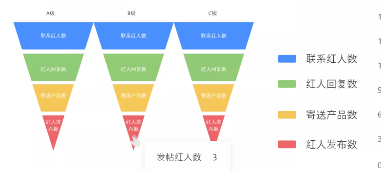
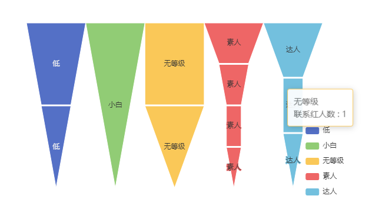
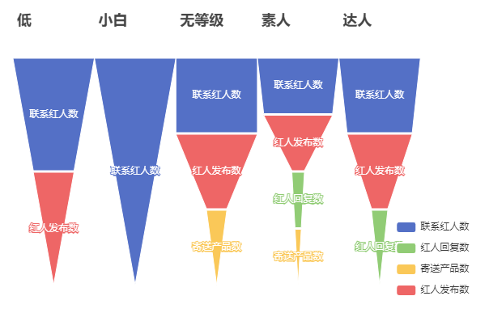

<!--
 * @Date: 2022-07-28 17:16:29
 * @LastEditors: Lq
 * @LastEditTime: 2022-08-16 14:28:15
 * @FilePath: \learnningNotes\charts\echarts.md
-->

### 文档

1. [官方文档](https://echarts.apache.org/handbook/zh/get-started)

2. [常见问题](https://echarts.apache.org/zh/faq.html)

3. [示例集合](https://echarts.apache.org/examples/zh/index.html)

4. [术语速查手册](https://echarts.apache.org/zh/cheat-sheet.html)

   组件的基本概念，看这个图基本就清楚了

### 开始

#### 入门 demo（vue）

    ```html
    <template>
      <div class="container">
        <h2>红人数据看板</h2>
        <div id="main"></div>
      </div>
    </template>

    <script>
      // 引入 echarts 核心模块，核心模块提供了 echarts 使用必须要的接口。
      import * as echarts from "echarts/core";
      // 引入柱状图图表，图表后缀都为 Chart
      import { BarChart } from "echarts/charts";
      // 引入提示框，标题，直角坐标系，数据集，内置数据转换器组件，组件后缀都为 Component
      import {
        TitleComponent,
        TooltipComponent,
        GridComponent,
        DatasetComponent,
        TransformComponent,
      } from "echarts/components";
      // 标签自动布局，全局过渡动画等特性
      import { LabelLayout, UniversalTransition } from "echarts/features";
      // 引入 Canvas 渲染器，注意引入 CanvasRenderer 或者 SVGRenderer 是必须的一步
      import { CanvasRenderer } from "echarts/renderers";

      // 注册必须的组件
      echarts.use([
        TitleComponent,
        TooltipComponent,
        GridComponent,
        DatasetComponent,
        TransformComponent,
        BarChart,
        LabelLayout,
        UniversalTransition,
        CanvasRenderer,
      ]);

      export default {
        mounted() {
          this.init();
        },
        methods: {
          init() {
            const options = {
              title: {
                text: "lq测试",
              },
              tooltip: {},
              legend: {
                data: ["销量"],
              },
              xAxis: {
                data: ["衬衫", "羊毛衫", "雪纺衫", "裤子", "高跟鞋", "袜子"],
              },
              yAxis: {},
              series: [
                {
                  name: "销量",
                  type: "bar",
                  data: [5, 15, 25, 18, 19, 33],
                },
              ],
            };
            // 接下来的使用就跟之前一样，初始化图表，设置配置项
            var myChart = echarts.init(document.getElementById("main"));
            myChart.setOption(options);
          },
        },
      };
    </script>

    <style scoped>
      #main {
        width: 800px;
        height: 600px;
      }
    </style>
    ```

#### 动态响应大小

    ```js
    init() {
        // 注册一个监听事件，页面变化时调用重新设置大小
        window.addEventListener('resize', this.resizeHandler);
    },
    resizeHandle() {
        // 重新设置大小
        this.chart.resize();
    },
    // 销毁的生命周期中移除监听
    beforeDestroy() {
        window.removeEventListener('resize', this.resizeHandler)
    }
    ```

#### 一个 echarts 实例中展现多个图

    在`series`属性中设置多个元素即可，即`series: [{第一个图表数据}, {第二个图表数据}]`

4.  多个`dataset`分配到多个`series`

    关键：使用`dataset`的序号来控制是哪一个

    ```js
    // dataset定义
    let dataset = [
      {
        source: [
          { product: "Matcha Latte", count: 823, score: 95.8 },
          { product: "Milk Tea", count: 235, score: 81.4 },
          { product: "Cheese Cocoa", count: 1042, score: 91.2 },
          { product: "Walnut Brownie", count: 988, score: 76.9 },
        ],
      },
      {
        source: [
          { product: "aaa", count: 5, score: 95.8 },
          { product: "bbb", count: 6, score: 81.4 },
          { product: "ccc", count: 7, score: 91.2 },
          { product: "ddd", count: 8, score: 76.9 },
        ],
      },
      {
        source: [
          { product: "第一个", count: 111, score: 95.8 },
          { product: "第二个", count: 222, score: 81.4 },
          { product: "第三个", count: 333, score: 91.2 },
          { product: "第四个", count: 444, score: 76.9 },
        ],
      },
    ];
    // series使用
    const options = {
      dataset: this.dataset,
      series: [
        {
          // some code
          datasetIndex: 0,
        },
        {
          // some code
          datasetIndex: 1,
        },
        {
          // some code
          datasetIndex: 2,
        },
      ],
    };
    ```

#### 空数据

    预期表现：比如说折线图，想要在某一个点为空的时候断掉

    分析：这个时候如果使用数值`0`来表示的话，仍然会连接左右两个点，组成连线，和预期的不一样

    解决方案：使用`-`来表示

    ```js
    // 错误做法
    data: [0, 22, 0, 23, 19];

    // 正确做法
    data: ["-", 22, "-", 23, 19];
    ```

#### 漏斗图实现多个，且每个数据维度一个颜色

1.  效果

    产品想要效果
    

    echarts 默认效果
    

    说明一下主要差距：

    1. 数据维度有两个：每一个漏斗代表一个等级，每一种颜色代表一个类型
    2. 每一个图例和类型相对应，而不是和漏斗图也就是等级相对应
    3. 需要每个漏斗图都有标题

2.  代码实现

    注意：datasource 中的对象数组一定要有`name`和`value`属性，因为后面的图例否则实现不了，再加一个`type`属性来代表`等级`

        ```js
        // 数据格式
        const dataset = [{"source":[{"name":"联系红人数","value":2,"type":"低"},{"name":"红人发布数","value":1,"type":"低"}]},{"source":[{"name":"联系红人数","value":1,"type":"小白"}]},{"source":[{"name":"联系红人数","value":4,"type":"无等级"},{"name":"寄送产品数","value":1,"type":"无等级"},{"name":"红人发布数","value":4,"type":"无等级"}]},{"source":[{"name":"联系红人数","value":13,"type":"素人"},{"name":"红人回复数","value":2,"type":"素人"},{"name":"寄送产品数","value":1,"type":"素人"},{"name":"红人发布数","value":11,"type":"素人"}]},{"source":[{"name":"联系红人数","value":10,"type":"达人"},{"name":"红人回复数","value":2,"type":"达人"},{"name":"红人发布数","value":8,"type":"达人"}]}]

        // 配置颜色映射关系，这种是默认的，但是也要写，否则维度不同
        const statusMapColor = {
            '联系红人数': '#5470c6',
            '红人回复数': '#91cc75',
            '寄送产品数': '#fac858',
            '红人发布数': '#ee6666'
        }

        const option = {
            title: this.dataset.length === 1 ? [{
            text: this.dataset[0].source[0].type
            }] : this.dataset.map((item, index) => ({
            text: item.source[0]['type'],
            left: `${5 + index * (0.7 / this.dataset.length * 100)}%`
            })),

            tooltip: {
                trigger: 'item',
                // 手动修改tooltip提示
                formatter: (data) => {
                    return data.value['type'] ? `${data.value['type']} <br>${data.value['name']} : ${data.value['value']}` : `${data.value['name']} : ${data.value['value']}`;
                }
            },
            // 设置图例渲染
            legend: {
                orient: 'vertical',
                left: '70%',
                bottom: '10%',
                data: Object.keys(statusMapColor).map(key => ({
                        name: key,
                        itemStyle: {
                        color: statusMapColor[key]
                    }
                }))
            },
            // 设置数据映射
            dataset: dataset,
            // 设置系列，这里由于等级数量多少是不确定的（也就是漏斗图数量不确定），需要计算宽度和偏移
            series: this.dataset.length === 1 ? [{
                name: 'Funnel',
                type: 'funnel',
                left: '10%',
                width: '40%',
                minSize: '0%',
                maxSize: '100%',
                sort: 'descending',
                gap: 2,
                label: {
                    show: true,
                    position: 'inside'
                },
                labelLine: {
                    length: 10,
                    lineStyle: {
                    width: 1,
                    type: 'solid'
                    }
                },
                itemStyle: {
                    borderColor: '#fff',
                    borderWidth: 1
                },
                emphasis: {
                    label: {
                    fontSize: 20
                    }
                }
                }] : this.dataset.map((item, index) => {
                return ({
                    name: item.source[0]['type'],
                    type: 'funnel',
                    left: `${5 + index * (0.7 / this.dataset.length * 100)}%`,
                    width: `${0.7 / this.dataset.length * 100}%`,
                    minSize: '0%',
                    maxSize: '100%',
                    sort: 'descending',
                    gap: 2,
                    datasetIndex: index,
                    label: {
                    show: true,
                    position: 'inside',
                    color: '#fff'
                    },
                    labelLine: {
                    length: 10,
                        lineStyle: {
                            width: 1,
                            type: 'solid'
                        }
                    },
                    itemStyle: {
                        borderColor: '#fff',
                        borderWidth: 1,
                        color: (data) => {
                            return statusMapColor[data.data['name']];
                        }
                    },
                    emphasis: {
                        label: {
                            fontSize: 20
                        }
                    }
                })
            })
        }
        ```

3.  效果如下，功能基本满足了，接下来就是调整样式了



### 常用修改方向

#### 画布

1. 修改 4 个方向更贴近边缘

> grid.top/left/right/bottom

要注意的是不要设置为 0，需要留一些，否则会被遮挡

#### 图例

1. 修改图例为小圆点

> legend.icon: "circle"

2. 去掉折线图的横线

   折线图默认的图例是圆点+横线，像糖葫芦

   > lineStyle: 'none'
   > itemHeight: 8 // 修改圆点大小
   > itemWidth: 8 // 修改圆点大小

3. 折线图的空心圆点改为实心

    > series.symbol:'circle'

#### 坐标轴

1. 坐标轴和图重合了

> yAxis.offset: 40

#### 区域缩放

1. 添加区域缩放

```js
dataZoom: [
  {
    type: "slider",
    height: 24,
    start: 0,
    end: 100,
    bottom: 20,
    right: 6,
  },
];
```

### 常见问题

#### Initialize failed: invalid dom

原因：初始化的时候没有获取到`dom`，可能原因及排查如下

1. 查看初始化传入的 dom，如：`var myChart = echarts.init(document.getElementById('main'));`

2. 控制台打印这里的 dom 能否获取到：`document.getElementById('main')`

3. 如果是项目中使用的话看是否在元素渲染完毕的生命周期之前调用的

   如 vue 不能在`created`中调用，需要在`mounted`中调用

#### ecahrts 的元素比父元素更宽

```html
<div :id="name" class="container"></div>
```

比如这里`.container`的`height`为`800px`，但是生成的里面的 canvas 为`845px`

第一种原因是先设置配置项生成了图表，然后再去适应大小，就失效了

```js
this.chart.setOption(options);
this.chart.resize();
```

需要把适应大小放到生成图表之前，就可以了

```js
this.chart.resize();
this.chart.setOption(options);
```

第二种原因是`dataset`数据项是动态的，先有一个默认数据，然后适应了大小，后来又传入了数据，但是没有去设置大小，所以需要再次去设置一次

如，我这边在监听数据改变之后，再去触发`init`方法，这个方法中就包括了`resize`

```js
watch: {
    dataset(val) {
        this.init();
    }
}
init() {
    // some code
    this.chart = echarts.init(document.getElementById(this.name));
    this.chart.resize();
    this.chart.setOption(options);
}
```

#### 使用漏斗图的时候，形状不规则，比例不对

表现：

1.  超过一部分的全部一样大
2.  数值都比较小的时候特别窄

这个原因是`min`和`max`属性控制了，示例中的是`0-100`，固定了最大值和最小值，把他们删除就会自动了

#### 控制台报警告`There is a chart instance already initialized on the dom.`

原因：在已经初始化`chart`对象了之后再去初始化，比如我上面的`init`函数多次调用，就会多次触发`this.chart = echarts.init(document.getElementById(this.name));`

解决方案：初始化之前先进行判断，如果已经初始化过了就不调用这个`charts.init()`

```js
data() {
    return {
        chart: undefined
    }
}
init() {
    // some code
    if (!this.chart) {
        this.chart = echarts.init(document.getElementById(this.name));
    }
}
```

#### 关于 echarts 数据变化残留数据问题

利用 echarts 加载图表的时候，当你切换图表的查询条件的时候，会发现有上次数据残留，所以这时候需要`elear`一下图表，再重新加载就好了

```js
this.chart = echarts.init(document.getElementById(this.name));
this.chart.resize();
// 关键代码是这个
this.chart.clear();
this.chart.setOption(options);
```
