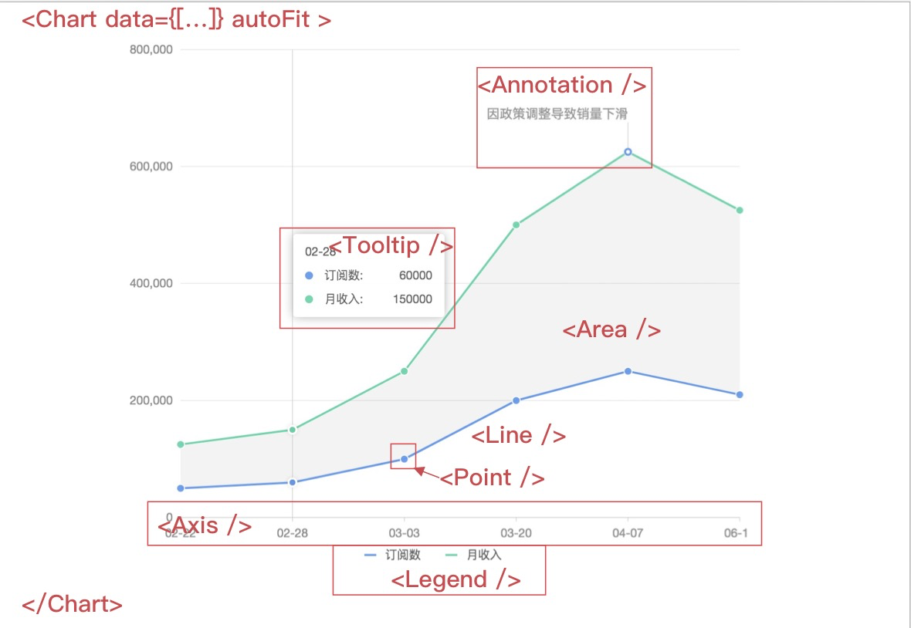
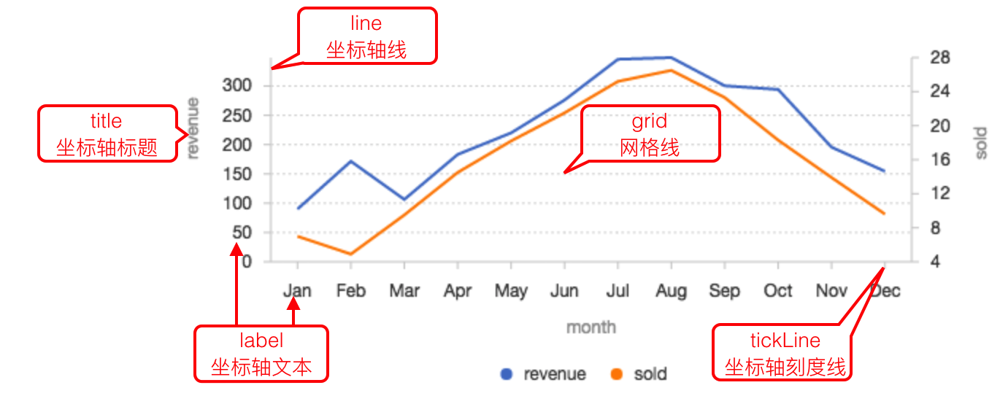
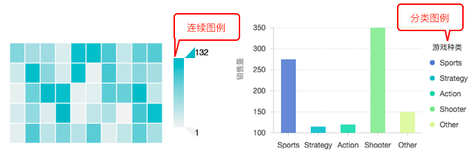

<!--
 * @Date: 2020-08-19 11:05:42
 * @LastEditors: Lq
 * @LastEditTime: 2021-01-06 12:04:27
 * @FilePath: /learnningNotes/charts/index.md
-->
#### 传送门
1. antd pro的[图表使用](https://v2-pro.ant.design/components/charts-cn),数量种类不多，但是很基础的东西都有，可配置性不高。[图表介绍](https://v2-pro.ant.design/docs/graph-cn)
2. BizCharts的[入门文档](https://www.cnblogs.com/xjnotxj/p/12601021.html)
3. BizCharts[官方文档](https://bizcharts.net/product/bizcharts/gallery)


#### 使用bizCharts需要注意的地方

1. padding的使用：如果出现坐标轴、图例等显示不全的情况，那么适当的调整`padding`可以达到显示完全的效果（属性基本和css的padding方式一样）
2. 注意数据的对象数组的属性名是否正确，否则会导致坐标轴错乱
3. 代表数据纵坐标的值一定要是`number`类型，注意不要是字符串的数字，要不然纵坐标好会出现奇怪的现象，如位置错乱，排序出问题等
4. 双y轴坐标统一：scale的配置中两个y轴`min`和`max`相同即可
5. 不希望y轴出现小数：scale中设置`minTickInterval`属性，值为1
6. 为图表加标题直接在`<Chart>`组件前面加标题，就是说`Charts`好像不支持标题

更多可以参考这位掘金大佬的[文章](https://juejin.im/post/6844903965566435336)

#### 独立使用antd pro样式不生效

需要手动导入css文件
> import 'ant-design-pro/dist/ant-design-pro.css';


**********************


### 我的学习笔记

#### 1. 入门

0. 实例

    ```html
    import React from 'react';
    import ReactDOM from 'react-dom';
    import { Chart, Interval } from 'bizcharts'; 

    // 数据源
    const data = [
    { genre: 'Sports', sold: 275 },
    { genre: 'Strategy', sold: 115 },
    { genre: 'Action', sold: 120 },
    { genre: 'Shooter', sold: 350 },
    { genre: 'Other', sold: 150 }
    ];

    ReactDOM.render((
    <Chart height={320} autoFit data={data} >
        <Interval position="genre*sold" />
    </Chart>
    ), mountNode);
    ```

1. 图表必须有`Chart`组件 包裹
2. 图形组件`Interval`按照数据坐标`genre*sold`分布，为必填属性
3. 图形颜色根据`genre`分类显示，颜色是可选属性


#### 2. 组件

分为几种：基础组件、图形组件、扩展组件、G组件

   

##### 1. 基础组件

1. Chart图表

    1. 介绍：是一个图表最外层画布，是一个必要组件

        默认显示图例、Tooltop（提示文字）和坐标轴，如需关闭则使用visible={false}，在Chart的pure模式下默认不开启Legend。

        ```html
        <Chart width={600} height={400} data={data}>
            <Legend visible={false} /> // 关闭Legend
            <Tooltip visible={false} /> // 关闭Tooltip
            <Geom type="bar" position="genre*sold" color="genre" />
        </Chart>
        ```
    
    2. 常用属性

        |属性|意义|类型（默认值）|
        |-|-|-|
        |data|数据源|对象数组|
        |autoFit|图表大小自适应，对外层容器的宽和高都会适应|boolean（false）|
        |width、height|图表宽度和高度||
        |padding|图表内边距(使用类似css的padding)|number/number[]/'auto'|
        |appendPadding|在padding的基础上增加的调整内边距|number/number[]|
        |forceUpdate|是否每次更新都销毁g2实例重新绘制（一般在一些复杂交互后悔缓存一下状态，如更新的内容比较大建议开启）|boolean（false）|
        |placeholder|当data为空的时候的提示内容|boolean/reactNode（默认展示暂无数据）|
        |interaction|内置交互属性，鼠标在图标上移动时，也可以使用Interaction组件|['tooltip','legend-active','legend-filter','continuous-filter']|
        |animate|图表是否展示动画，一旦配置为false会关闭所有动画，如指向关闭图形的动画，请在Gemo组件配置|boolean（true）|
        |filter|图表只会显示过滤后的数据|array/object|
        |scale|配置图表的比例尺，详见[这里](https://bizcharts.net/product/BizCharts4/category/62/page/77#scale)|object|


2. View视图

    1. 介绍：由Chart生成和管理，拥有自己独立的数据源、坐标系和涂层，用于异构数据的可视化以及图表组合，一个Chart有一个或者多个View组成。因此view上的api和chart基本相同

        ```html
        <Chart
            height={400}
            data={dv.rows}
            autoFit
            scale={{
            percent: {
                formatter: (val) => {
                val = `${(val * 100).toFixed(2)}%`;
                return val;
                },
            }
            }}
        >
            <Coordinate type="theta" radius={0.5} />
            <Interval
            position="percent"
            adjust="stack"
            color="type"
            element-highlight
            style={{
                lineWidth: 1,
                stroke: '#fff',
            }}
            label={['type', {
                offset: -15,
            }]}
            />
            <View data={dv1.rows}>
            <Coordinate type="theta" radius={0.75} innerRadius={0.5 / 0.75} />
            <Interval
                position="percent"
                adjust="stack"
                color={['name', ['#BAE7FF', '#7FC9FE', '#71E3E3', '#ABF5F5', '#8EE0A1', '#BAF5C4']]}
                element-highlight
                style={{
                lineWidth: 1,
                stroke: '#fff',
                }}
                label="name"
            />
            </View>
        </Chart>
        ```

    2. 使用场景

        1. 同一个容器中出现两个或者更多不同坐标器的图表，如多层饼图
        2. 同一个容器中的两个图表需要采用不同的数据源，如漏斗图

    3. 常用属性

        |属性|意义|类型（默认值）|
        |-|-|-|
        |region|绘制区域的范围，x和y的取值范围均为0到1，左上角开始，右下角结束|object|
        |data|同chart的data，如果不配置使用父级的chart的data||
        |scale|同chart||
        |padding|同chart||
        |animate|动画|boolean|

3. Axis坐标轴

    1. 介绍：坐标轴的配置，不适用Axis组件则默认不显示所有坐标轴及相关信息（但并不是不显示坐标轴），默认会显示坐标轴，如果不需要可以通过visible=false关闭对应的坐标轴

        ```html
        <Chart width={600} height={400} data={data}>
            <Axis name="sold" /> // 指定坐标轴对应数据源中的字段名
            <Geom type="interval" position="genre*sold" color="genre" />
        </Chart>

        <Chart width={600} height={400} data={data}>
            <Axis name="x" visible={false} /> // 关闭坐标轴
        </Chart>
        ```

        说明：使用Axis组件时，必须指定当前坐标轴对应数据源中的字段名，否则改坐标轴的相关配置信息将不起作用

    2. 组成部分（标题、轴线、刻度线、文本、网格线）

        

    3. 常用属性

        |属性|意义|类型（默认值）|
        |-|-|-|
        |name|坐标轴对应数据源中的字段名，如果不配置则对所有坐标轴生效，但只支持配置visible|string|
        |visible|对应name的坐标轴是否可见|boolean（true）|
        |position|设置当前坐标轴的摆放位置|top/right/bottom/left|
        |title|当前坐标轴标题是否要显示，及其样式配置，默认不显示轴的标题|boolean/object|boolean|
        |line|设置坐标轴线的样式，包括线的颜色、粗细等，如果该属性值为false，表示不展示坐标轴线|boolean/object|
        |tickLine|设置坐标轴的刻度线，如果该属性值为null则不展示|null/object|
        |label|坐标轴文本样式|object/null|
        |gird|坐标轴网格线的样式，网格线和坐标轴垂直|object/null|
        |subTickLine|坐标轴次刻度线样式配置|


4. Tooltip提示信息

    1. 介绍：当鼠标悬停在图表上的某点时，以提示框的形式展示该点的数据，比如该点的值，数据单位等。

        默认开启tooltip，如需关闭使用visible=false来关闭，如果chart是pure模式则相反

        ```html
        <Chart width={600} height={400} data={data}>
            <Tooltip visible={false} /> // 关闭图表tooltip功能
            <Geom type="bar" position="genre*sold" color="genre" />
        </Chart>
        ```

    2. 常用属性

        |属性|意义|类型（默认值）|
        |-|-|-|
        |showTitle|是否展示tooltip的标题|boolean|
        |title|设置tooltip标题内容，如果值为数据字段名，则会展示数据中对应该字段的数值，如果数据中不存在该字段，则会直接展示title值|string|
        |showMarkers|是否展示鼠标所在当前数据的标记|boolean|
        |marker|当前数据标记的样式|object|
        |showContent|是否展示tooltip的内容框|boolean|
        |position|设置该属性值之后，就会在固定位置展示tooltip|top/right/bottom/left|
        |shared|是否展示多条tooltip，默认是一条，建议再图表有多个图形组件的时候开启|boolean（false）|
        |follow|设置tooltip是否跟随鼠标移动|boolean（true）|
        |offset|设置tooltip距离鼠标的偏移量|number|
        |lock|是否允许鼠标进入tooltip|boolean（false）|
        

5. Legend图例

    1. 介绍：只有当Geom组件上有shape、color、size中任意一个属性时，并且将Legend组件属性和这个属性的字段关联上才会显示图例

        |属性|意义|
        |-|-|
        |shape|会根据不同的shape类型生成图例|
        |color|会赋予不同的图例项不同的颜色来区分图形|
        |size|在图例上显示图形的大小|

        图表默认显示图例

        ```html
        <Chart width={600} height={400} data={data}>
            <Legend visible={false} /> // 关闭Legend
            <Geom type="bar" position="genre*sold" color="genre" />
        </Chart>
        ```

        可以指定当前图例对应数据源中的字段名，不指定则默认设置所有图例

        ```html
        <Chart width={600} height={400} data={data}>
            // Geom 组件上必须有 `shape, color, size `中某个属性值为 genre 字段，才会有图例出现。
            <Legend name="genre" position="right" title={null} dx={20} />
            <Geom type="bar" position="genre*sold" color="genre" />
        </Chart>
        ```

        一旦使用Legend，那么所有的图例都会显示，如果需要隐藏某一个图例，将visible参数配置为false

        ```html
        <Chart width={600} height={400} data={data}>
            <Legend name="genre" visible={false} />
            <Legend name="type" visible={true} />
            <Geom type="bar" position="genre*sold" color="genre" />
            <Geom type="line" position="genre*sold" color="type" />
        </Chart>
        ```

    2. 分类：分类图例、连续图例

        

        两种图例分别由对应的参数配置

    3. 常用属性

        分类类型和连续类型的配置有一定的区别，

        1. 共同属性

            |属性|意义|类型（默认值）|
            |-|-|-|
            |name|图例对应到数据源中的字段名，不传则设置所有图例|string|
            |visible|图例是否可见|boolean|
            |position|图例显示的位置，可以设置12个位置|left/left-top/left-bottom/......|
            |offsetX/offsetY|图例x/y方向的偏移值，单位为px|number（0）|
            |layout|图例布局方式|horizontal/vertical|
            |tilte|图例标题的显示样式设置，如果值为null，表示不展示图例标题|boolean/object（null）|
            |background|图例的背景框|object|
            |filter|筛选数据方式，要指定name才能生效|function：(value: any, datum: Datum, idx?: number) => boolean|
            |onChange|连续图例改变时或者分类图例点击图例时，触发事件|function: (e?: IEvent, chart?: Chart) => void|


6. Coordinate坐标系组件

    一般情况下用不到，详见[这里](https://bizcharts.net/product/BizCharts4/category/62/page/82)

7. Annotation图形标注

    1. 介绍：作为图表的辅助元素，主要用于在图表上标识额外的标记注解

    2. 图形标注类型

        用法：通过`<Annotation.xxx />`的方式使用，如<Annotation.Line />

        |组件|描述|
        |-|-|
        |Line|辅助线（可带文本），例如标识平均值或与其分布的直线|
        |Text|辅助文本，指定位置添加文本说明|
        |Image|辅助图片，在图标上添加辅助图片|
        |Region|辅助框，框选一段图区，设置背景，边框等|
        |RegionFilter|区域着色，将图表中位于矩形选区中的图形元素提取出来，重新着色|
        |DataMarker|特殊数据点标注，多用于折线图和面积图|
        |DataRegion|特殊数据点标注，多用于折线图和面积图|

    3. 常用属性

        |属性|意义|类型（默认值）|
        |-|-|-|
        |top|指定annotation是否绘制在canvas最上层|boolean(false)|
        |style|图形样式属性|object|
        |animate|是否进行动画|boolean|
        |offsetX/offsetY|x/y方向上的偏移量|number|
        
        定位方式：

        1. RegionPosition：区域定位

            使用的组件有Image，Line，Arc，Region，DataRegion，RegionFilter

            属性：start、end

            属性说明：开始和结束位置的点在x和y轴的位置

            1. 使用数组：数组内可以使用（min/median/max）关键字，代表原始值的最小值/平均值/最大值，如[0,'min']代表x轴位置数值为0，y轴位置在数值最小值。
            2. 使用回调函数：(xScale, yScale) => []

            注意：主状态水位线绘制建议使用百分比

        2. PointPosition：点定位

            使用PointPosition的组件有Text，DataMarker

            属性：position

            属性使用：同上


8. Slider滚动条

    1. 介绍：当数据量过大的时候可使用缩略轴控制数据窗口

    2. 常用属性和使用见[这里](https://bizcharts.net/product/BizCharts4/category/62/page/109)


9. Interaction内置交互

    1. 介绍：

        |属性|意义|
        |-|-|
        |tooltip|鼠标在chart上移动时显示提示信息|
        |legend-active|鼠标移动到图例选项时，图例项高亮，对应的图形高亮|
        |legend-filter|分类图例的勾选|
        |continuous-filter|连续图例的勾选|

    2. 可以通过Chart组件的配置项defaultinteractions更改内置的交互

    3. 配置交互的两种方法

       1. 在Chart组件上使用交互属性
       2. 使用Interaction组件进行交互

    4. 常用属性

        1. type：交互名称

            |属性|意义|
            |-|-|
            |active-region|鼠标在糊不上移动时对应位置的分类出现背景框|
            |view-zoom|鼠标滚动时，图表内部缩放|
            |element-active|鼠标艺术图表元素（柱状图的柱子，点图的点）时触发active|
            |element-selected|点击选中图表元素，再次点击取消，允许多选|
            |element-single-selected|单选图表元素，下次点击允许取消|
            |element-highlight|图表元素的公安立案那个，一部分高亮，另一部分变暗|
            |element-highlight-by-x|高亮值相同的element，适用于分组的场景|
            |element-highlight-by-color|高亮相同颜色的element，适用于层叠的场景|
            |legend-filter|分类图例的数据过滤|
            |legend-visible-filter|分类图例的图形过滤，点击图例对应的图形隐藏/显示，不会引起坐标轴的变化|
            |continuous-filter|连续图例的数据过滤，会导致坐标轴的变化|
            |continuous-visible-filter|仅过滤图形，而不引起坐标轴的变化|
            |legend-active|图例active，对应的图表元素也active|
            |legend-highlight|图例项高亮，对应的图表元素也高亮|
            |axis-label-highlight|坐标轴文本高亮，对应的图表元素也高亮|
            |element-list-highlight|鼠标触发图表元素高亮，同时对应的列表组件（图例、坐标轴文本）都高亮|
            |brush|框选过滤图形|

        2. config：交互配置项，用于修改交互动作

            参见[这里](https://bizcharts.net/product/BizCharts4/category/62/page/112#%E4%BA%A4%E4%BA%92%E7%8E%AF%E8%8A%82%E9%85%8D%E7%BD%AE%E9%A1%B9%EF%BC%9A)


10. Facet分面

    1. 介绍：将一份数据按照某个维度隔成若干子集


##### 2. 图形组件

1. Line折线图形

    1. 介绍：一般用于绘制折线图，曲线图，雷达图，阶梯图等

        用于映射图形的数据为一维数据

    2. 常用属性

        |属性|意义|类型|
        |-|-|-|
        |position|必填，绘制的图形折点的坐标。“x轴映射的字段*y轴映射的字段”，如“x*y”|string|
        |color|配置折线的颜色，详见[这里](https://bizcharts.net/product/BizCharts4/category/62/page/83#color)|string/array|
        |label|折线的标注，详见[这里](https://bizcharts.net/product/BizCharts4/category/62/page/83#label)|string/array|
        |shape|将数据值映射到图形的形状上的方法|string/array|
        |size|配置线的粗细|string/array/number|
        |tooltip|控制当前Geometry几何标记的tooltip开关|boolean|
        |style|配置几何图形的样式|object/array|
        |animate|开启或关闭动画|boolean|

        shape
        |属性|意义|
        |-|-|
        |line|折线|
        |smooth|平滑曲线|
        |dot|点线|
        |dash|虚线|


2. Interval区间

    1. 介绍

        在直角坐标系下可制作柱状图、条形图、区间图等  
        在极坐标系下可以绘制饼图、玫瑰图、旭日图、仪表盘灯

    2. 常用属性

        同Line，但shape不同

        shape
        |属性|意义|
        |-|-|
        |rect|默认矩形|
        |hollowRect|空心矩形|
        |line/tick|线段|
        |stroke|带边框的矩形|
        |funnel|漏斗图|
        |pyramid|金字塔图|


3. Point点

    1. 介绍：几何标记点，一般用于点图，用于观察数据的相关性

    2. 常用属性

        同Line，单shape不同，参见[这里](https://bizcharts.net/product/BizCharts4/category/62/page/85#shape)

4. Area面积

    1. 介绍：区域图也叫面积图，在折线图的基础上析您构成的，用于表现趋势和关系

    2. 常用属性

        同Line，但shape不同

        shape
        |属性|意义|
        |-|-|
        |area|默认的面积图，边缘是折现的多边形|
        |smooth|边缘平滑的曲面图|
        |line|只有边线的多边形|
        |dotLine|只有虚线边线的多边形|
        |smoothLine|只有平滑边线的多边形|
        |dotSmoothLine|只有平滑需要边线的多边形|

5. Geom通用图形组件

    1. 介绍：几何标记对象，决定创建图表的类型。

        虽然BizCharts没有特定的图表类型概念，但是人基本支持所有传统图表类型的绘制。

    2. 常用属性

        1. 几何标记类型：type
        2. 数据映射相关的属性：position、color、shape、size
        3. 显示辅助信息的属性：style、tooltip
        4. 额外的控制属性：adjust、select、setSelect、active、hide


        type：几何标记类型  
        adjust：声明几何标记对象的数据调整和方式  
        position：位置属性的映射，用于确定由数据哪几个字段来确定数据在平面坐标系的位置。通俗的解释，即确定x轴和y轴的数据字段  
        color：将数据值映射到图形的颜色上的方法  
        shape：将数值映射到图形的形状上的方法  
        label：配置折线的标注  
        size：点图是半径，线图是粗细，柱状图是柱子宽度  
        style：几何图形的样式  
        tooltip：将数据映射到提示信息上


### 小技巧

1. 通过回调改变颜色

    ```js
    // 其中month可以是你的横坐标属性名，也可以是纵坐标属性名
    color={["month", (month: string) => {
        if (month === selectedObj.month) {
            return '#db4c3c';
        }
        return '#744DFE';
    }]}
    ```

2. 通过回调改变样式

    ```js
    // 其中month可以是你的横坐标属性名，也可以是纵坐标属性名
    style={['month',  (month: string) => {
        if (month === selectedObj.month) {
            return {
                lineWidth: 1,
                strokeOpacity: 1,
                fillOpacity: 1,
                opacity: 1,
            }
        }
        return {
            lineWidth: 1,
            strokeOpacity: 1,
            fillOpacity: .5,
            opacity: .5,
        }
    }]}
    ```