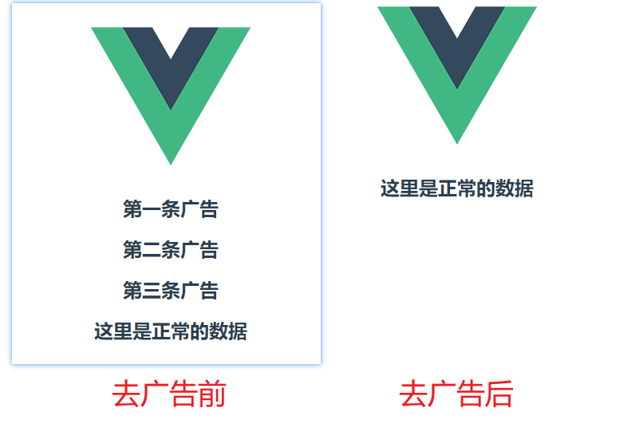

<!--
 * @Date: 2022-08-10 10:06:46
 * @LastEditors: Lq
 * @LastEditTime: 2022-08-10 18:12:11
 * @FilePath: \learnningNotes\chorme\插件开发.md
-->
[toc]

### 这里先插播一条消息

Manifest version 2 is deprecated, and support will be removed in 2023. See https://developer.chrome.com/blog/mv2-transition/ for more details.

MV2版本的chrome插件在2023年停止支持

### chrome插件应该包含哪些文件及文件夹

```
D:.
│  manifest.json
│
├─html
│      index.html
│
├─images
│      icon-128.png
│      icon-16.png
│
├─scripts
│      background.js
│
├─styles
│      main.css
│
└─_locales
    ├─en
    │      messages.json
    │
    └─zh_CN
            messages.json
```

1. html：存放html页面
2. images：存放插件图标
3. scripts：存放js文件
4. styles：存放样式
5. _locales：存放多语言文件
6. manifest.json：用来配置所有和插件相关的配置，作为chrome入口文件，必须放在根目录（`必须存在`）

分析

1. 目录结构像一个web网页，他的本质上就是一个网站类应用，是一个webapp
2. 相对于普通的webapp，还可以调用更多的浏览器层面的api，包括数钱、历史记录、网络请求拦截、截获用户输入等等


### 重要配置说明

manifest.json

额外的配置参见[https://blog.csdn.net/sysuzjz/article/details/51648163](https://blog.csdn.net/sysuzjz/article/details/51648163)

```json
{
    "manifest_version": 3, // 清单版本号，建议使用 版本 3，版本 1和2 是旧的，已弃用，不建议使用
    "name": "first-test-plugin", // 插件名称
    "version": "0.0.1", // 插件版本
    "description": "这里是第一个测试插件", // 描述，可写可不写
    "icons":
    {
        "16": "images/custom/16x16.png",
        "48": "images/custom/48x48.png",
        "128": "images/custom/128x128.png"
    },
    // ！！！browser_action和page_action只能添加一个
    "browser_action": //浏览器级别行为，所有页面均生效
    {
        "default_icon": "images/custom/16x16.png", // 图标的图片
        "default_title": "Hello lanfengqiuqian", // 鼠标移到图标显示的文字
        "default_popup": "html/popup.html" // 单击图标后弹窗页面
    },
    "page_action": //页面级别的行为，只在特定页面下生效
    {
        "default_icon":
        {
            "24": "images/custom/24x24.png",
            "38": "images/custom/38x38.png"
        },
        "default_popup": "html/popup.html",
        "default_title": "Hello lanfengqiuqian"
    },
    "author": "lanfengqiuqian", // 可选填写
    "automation": false, // 是否开启自动化
    "background": // 背景页的脚本路径,一般为插件目录的相对地址
    {
        "scripts": [
            "scripts/background.js",
            "scripts/devtools-page.js"
        ]
    },
    "devtools_page": "html/devtools-page.html", // 在开发工具中的页面
    "content_scripts": [ // 内容脚本一般植入会被植入到页面中, 并且可以控制页面中的dom
        {
            "js": ["js/else-insert.js"], // 这里面的数组都是可以放多个的
            "css": ["css/else-insert.css"],
            "matches": ["<all_urls>"] // 被植入到页面，只在这些站点下 content_scripts会运行
        }
    ],
    "permissions": [ // 安装的时候提示㤇的权限
        "cookies", // 使用cookies
        "webRequest", // 使用web请求
        "http://*", // 可以通过executeScript或者insertCSS访问的网站地址。如： https://*.google.com/
        "management", //
        "storage", // 使用本地存储
        "tabs", // 操作标签
        "contextMenus" //右键菜单
    ]
    "default_locale ": "zh_CN" //默认语言(比如"zh_CN")
}
```

### 开始手撸一个插件

#### 准备工作

##### 创建一个文件夹，如我的叫 extensions （之后说的根目录都是指这个目录下）

##### 文件夹下创建一个 img 目录，用于存放一些logo之类的图片

放入一张图片，如`logo.png`

##### 文件夹下创建一个 html 目录，用于存放html文件

##### 文件夹下创建一个 js 目录，用于存放js文件

这里如果你想先放一个`jquery`文件用于加载也是可以的，我后面为了方便使用的是`script`引入

##### 文件夹下创建一个 css 目录，用于存放css文件

#### 文件夹根目录下创建一个 manifest.json 文件

```json
{
    "manifest_version":3,
	"name":"这是插件名称",
	"version":"0.0.1",
	"description":"这是插件描述",
    "action":{
		"default_title":"这是鼠标移上去时提示文字",
        "default_popup":"html/popup.html"
	},
	"icons":{
		"16":"img/logo.png",
		"32":"img/logo.png",
		"48":"img/logo.png",
		"128":"img/logo.png"
	}
}
```

然后chrome扩展程序【加载已解压的扩展程序】选择刚才创建的`extensions`目录

效果如下


#### pupup部分

1. 在`/html`新建一个`popup.html`文件，然后在`manifest.json`中的`action`配置`popup`的路径

    ```json
    "action":{
        "default_title":"这是鼠标移上去时提示文字",
        "default_popup":"html/popup.html"
    }
    ```

    ```html
    <!DOCTYPE html>
    <html>
    <head>
        <meta http-equiv="Content-Type" content="text/html; charset=utf-8" />
        <link rel="stylesheet" type="text/css" href="../css/popup.css" />
    </head>
    <body>
        <div class="btn">
            测试<input id="TEST" class="checkbtn" type="checkbox" />
        </div>
    </body>
    <script src="https://cdn.bootcdn.net/ajax/libs/jquery/3.6.0/jquery.min.js"></script>
    <script src="../js/popup.js"></script>
    </html>
    ```

2. 在css和js目录中分别新建`popup.css`和`popup.js`文件

    ```css
    /* popup.css */
    .btn{
        width: 100px;
        height: 30px;
        font-size: large;
    }
    ```

    ```js
    //popup.js
    $(".checkbtn").click(function(){
        alert($(this).attr('id'));
    });
    ```

3. 然后重载扩展程序

    点击插件，效果如下

    

4. 待解决问题

    每次勾选的checkbox都会被还原，所以接下来需要做一个本地存储来保存popup的改变


#### background部分

1. 在`manifest.json`中加入`service_worker`的配置路径和`permissions`

    ```json
    "background":{
        "service_worker":"background.js"
    },
    "permissions":["storage"]
    ```

    注意：`service_worker`说明

     1. 这个是一直伴随插件运行的后台脚本
     2. 没有前端页面，不支持dom，所以不能引入jQuery和其他js
     3. 所有需要保持运行的脚本都需要直接卸载`background.js`文件里
     4. 同样也不支持`XMLHttpRequest`，所以需要使用`fetch`来替代xhr请求
     5. 一定要放在`根目录`（扩展文件根目录，不是电脑磁盘根目录），否则在使用的时候会出现`service worker（无效）`提示
     6. 可以在`扩展程序`=>`查看视图`点击弹出的控制台查看输出

2. 在根目录写`background.js`文件

    ```js
    //background.js
    chrome.runtime.onInstalled.addListener(() => {
        DBdata("clear");//清除插件保存的本地数据
    });
    //插件用的数据都存储在storage.local中
    function DBdata(mode,callback,data){//操作本地存储的函数
        if(mode=="set"){//保存本地数据
            console.log('set-LocalDB');
            chrome.storage.local.set({LocalDB: data});
        }else if(mode=="get"){//获取
            chrome.storage.local.get('LocalDB', function(response) {
                typeof callback == 'function' ? callback(response) : null;
            });
        }else if(mode=="clear"){//清空
            chrome.storage.local.clear();
        }
    }
    ```

3. 打开`popup.js`，把原来的点击事件删掉，在其中加入初始化和连接service_worker的脚本

    ```js
    //popup.js
    window.bgCommunicationPort = chrome.runtime.connect();//初始化bgCommunicationPort
    $(".checkbtn").click(function(){
        bgCommunicationPort.postMessage({//发送到bg,键值可以自由设置
            Direct : $(this).attr('id'),//目标
            Content : '测试内容',//内容
            step : 0//步骤
        });
    });
    $(document).ready(function(){//打开popup时触发，读取之前存储的参数
        bgCommunicationPort.postMessage({fromPopup:'getDB'});//向background发送消息
        bgCommunicationPort.onMessage.addListener(function(receivedPortMsg) {//监听background
            console.log(receivedPortMsg);//这是background发来的内容
            if(receivedPortMsg&&receivedPortMsg.Direct){
                $(".checkbtn").prop({'checked': false});//初始化按钮
                $("#"+receivedPortMsg.Direct).prop({'checked': true});
            }
        });
    });
    ```

4. 打开`background.js`，在其中加入监听popup的脚本（这里不要删除原来的哦，加到后面即可）

    ```js
    //background.js
    chrome.runtime.onConnect.addListener(function(port) {//接收到popup
        port.onMessage.addListener(function(receivedMsg) {//监听popup发来的内容receivedMsg
            if(receivedMsg.fromPopup&&receivedMsg.fromPopup=='getDB'){//如果接收到了getDB，这里读取数据并返回相当于初始化popup页面
                DBdata('get',function(res){
                    port.postMessage(res.LocalDB);//发送到popup
                });
            }else{//如果不是，则说明是收到来自popup手动点击设置的数据，存入以用于popup打开时展示
                DBdata('set','',receivedMsg)
            }
        })
    });
    ```

5. 重载插件

    1. 这个时候会发现有两个报错

        

        发现是用`script`引入的`jquery`报跨域
        
        那么就改为文件引入呗

        1. 在js目录下新建`jquery.js`

            到[https://jquery.com/download/](https://jquery.com/download/)去下载`production`版本的js

            然后把他的内容放到`jquery.js`中
            
        2. 修改`popup.html`文件中的jquery引入

            ```html
            <script src="../js/jquery.js"></script>
            ```

    2. 重载插件，发现报错都好了

6. 测试

    每次重置勾选的问题已经好了


#### content部分

content可以注入到浏览的网页，操作dom，所以就可以实现很多功能了

1. `manifest.json`中加入`content`的配置

  ```json
  "content_scripts":[{
      "js":["js/jquery.js","js/content.js"],/*content可以随意引入js，因为其内容会在浏览的网页上直接运行*/
      "matches":["*://localhost/*"],/*在哪些网页上运行*/
      "run_at":"document_end"/* 在页面加载完成时运行 */
  }]
  ```

  注意这里现在只是匹配的`localhost`哦

2. 新建`js/content.js`，在`content.js`中写入

    ```js
    //content.js   manifest匹配地址的页面在刷新时会直接执行这里的代码
    chrome.runtime.sendMessage(chrome.runtime.id, {//当页面刷新时发送到bg
        fromContent: 'getDB'
    });

    chrome.runtime.onMessage.addListener(function(senderRequest, sender, sendResponse) {//接收到bg
        console.log('demo已运行');
        var LocalDB=senderRequest.LocalDB;
        console.log(LocalDB);
        switch(LocalDB.Direct){
            case 'TEST':
                console.log(123123);
                break;
            default:
                break;
        }
        // 不写会报错 Unchecked runtime.lastError: The message port closed before a response was received.
        sendResponse('这里是content返回值');
    });
    ```

3. 然后`background.js`中加入监听`content`的代码

    ```js
    //background.js
    chrome.runtime.onMessage.addListener(function (senderRequest, sender, sendResponse) {//接收到content
        // 不写会报错 Unchecked runtime.lastError: The message port closed before a response was received.
        sendResponse({ msg: '接收到content' });
        console.log(senderRequest);
        if (senderRequest.fromContent && senderRequest.fromContent == 'getDB') {//接收到fromContent:getDB
            DBdata('get', function (res) {//从本地取数据
                if (res.LocalDB) {
                    var LocalDB = res.LocalDB;
                    switch (LocalDB.Direct) {
                        //如果是存入的TEST按钮
                        case 'TEST':
                            chrome.tabs.query({
                                active: true,
                                currentWindow: true
                            }, function (tabs) {
                                chrome.tabs.sendMessage(tabs[0].id, { LocalDB: LocalDB }, function (res) {
                                    console.log('接收content的回调', res);
                                });//发送到content		
                            });
                            break;
                        default:
                            break;
                    }
                }
            });
        }
    });
    ```

     这里注意`sendResponse`这个方法，有的没有在回调中加上这个参数，导致找不到

4. 重载插件

5. 代码执行顺序

    1. 插件初始化阶段
    
       1. 先执行插件初始化监听`background.js`中`onInstalled`，清除本地数据

    2. 手动点击插件图标，勾选插件

        1. 执行`popue.js`的`ready`方法进行初始化
        2. 点击按钮触发`click`方法修改本地数据

    3. 网页刷新阶段

        1. 执行`content.js`的`sendMessage`方法
        2. 执行`background.js`的`onMessage`方法
        3. 读取本地数据
        4. 根据本地数据决定是否`sendMessage`到`content`


#### 去广告插件

说明：这里对于广告的判断是`类名为 .ad `的元素

如我的vue页面

```html
<div>
    <h2 class="ad">第一条广告</h2>
    <h2 class="ad">第二条广告</h2>
    <h2 class="ad">第三条广告</h2>
    <h2>这里是正常的数据</h2>
</div>
```

1. 在`popup.html`中增加一个`去广告按钮`

    ```html
    <div class="btn">
        去广告<input id="removeAD" class="checkbtn" type="checkbox" />
    </div>
    ```

2. 在`background.js`中监听content部分增加对于`removeAD`的判断

    ```js
    //如果是存入的removeAD按钮
    case 'removeAD':
        chrome.tabs.query({active: true, currentWindow: true
        }, function(tabs){
            chrome.tabs.sendMessage(tabs[0].id, {LocalDB: LocalDB});//发送到content		
        });
        break;
    ```

3. 在`content.js`中监听`background.js`部分增加`removeAD`的判断

    ```js
    case 'removeAD':
        //隐藏含有ad的元素，来达到去广告的效果
        $(".ad").hide();
        break;
    ```

4. 重载插件，勾选页面中的`去广告`，然后刷新页面，发现广告已经没有了




#### 页面跳转和cookie

和`popup`一样，`content`关闭之后也不会保存数据，当我们在A页面获取数据之后想要放到B页面上去，在`content`直接跳转是不会把获取到的数据传过去的，所以和`background`链接保存本地数据就派上用场了


### 过程中问题记录

1. Unchecked runtime.lastError: The message port closed before a response was received.

    这个问题通常是由于其他插件引起的，注意排查，找到受影响的插件禁用即可

    大多数人是由于【迅雷】插件或者【油猴】插件引起的

2. 扩展【移除】旁边多了一个【错误】的按钮

    1. 如果有错误提示，根据提示排查即可

    2. 如果没有错误提示，尝试将扩展移除重新加载即可

    3. 检查是否没有把`sendMessage`和`sendResponse`配套使用

        每一个`sendMessage`都需要和`sendResponse`进行呼应

        也就是说，在每一个`chrome.runtime.onMessage.addListener`的回调函数中，需要使用`sendResponse`进行返回

        可以参见[https://blog.csdn.net/m0_37729058/article/details/89186257](https://blog.csdn.net/m0_37729058/article/details/89186257)

3. service worker看不到`content.js`的`console.log`

    原因是因为这个js是嵌入到页面中的，所以需要在使用的网页的控制台查看，而不是`service worker`