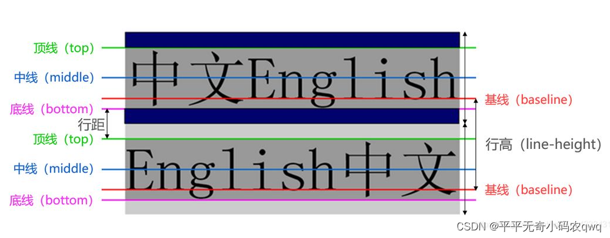
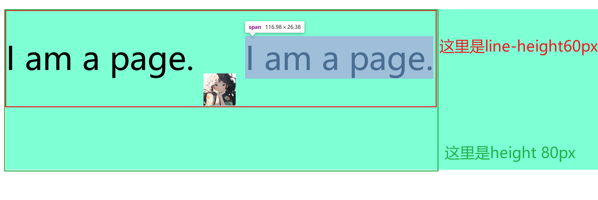

<!--
 * @Date: 2020-09-02 23:35:46
 * @LastEditors: Lq
 * @LastEditTime: 2021-02-20 18:18:56
 * @FilePath: /learnningNotes/css/index.md
-->

### 绘制三角形和梯形

```css
div {
  width: 0px;
  border-top: 100px solid teal;
  border-right: 100px solid transparent;
  border-bottom: 100px solid transparent;
  border-left: 100px solid transparent;
}
```

其中：`transparent`表示透明色，相当于 rgba(0,0,0,0)

如果是梯形的话，将`width`设置为梯形的上底，border 的 width 就是梯形的下底

原理：宽高设置为 0，通过 border 来控制，3 个边框透明，另外一个正常设置即可

2. 文本两端对齐：justify 不生效

   因为`text-align`不会处理被打断的行和最后一行，当文本只占一行时不会有效果。

   1. 使用`text-align-last`属性：但是某些浏览器不支持

   2. 在最后一行人工生成两行文本，然后将第二行隐藏

      使用伪元素是最佳解决方案

   ```css
   // 方案一
   & {
     text-align-last: justify;
   }

   // 方案二
   &::after {
     display: inline-block;
     overflow: hidden;
     content: "";
     width: 100%;
   }
   ```

### 文本超出换行和不换行（不设置默认是换行的）

```css
<!-- 超出换行 -- > div {
  word-wrap: break-word;
  word-break: break-all;
  overflow: hidden;
}

<!-- 超出不换行 -- > div {
  overflow: hidden;
  text-overflow: ellipsis;
  white-space: nowrap;
}
```

### 字体透明度继承问题

如果父级元素的透明度使用`opacity`，那么子元素的字体也会继承父元素的透明度，并且由于透明度是相乘的，所以无法使用覆盖的方式调整子元素的透明度

解决方案：

1.  父元素使用`rgba`的方式来设置透明度
2.  两个元素不使用继承关系，而是使用兄弟关系（不推荐使用）

### boxshadow

demo

```css
// x轴偏移量，y轴偏移量，阴影模糊度，阴影扩展半径，阴影颜色，设置为内阴影（如果不写默认为外阴影）
box-shadow: 1px 2px 3px 4px #ccc inset;
```

比较淡雅美观的阴影

```css
box-shadow: rgba(0, 0, 0, 0.2) 0 1px 5px 0px;
```

### 修改 input 中的 placeholder 样式（含内容样式）

```css
input::placeholder {
  // some code
}
<!-- 其他浏览器兼容 -->
/* - Chrome ≤56,
- Safari 5-10.0
- iOS Safari 4.2-10.2
- Opera 15-43
- Opera Mobile >12
- Android Browser 2.1-4.4.4
- Samsung Internet
- UC Browser for Android
- QQ Browser */
::-webkit-input-placeholder {
  color: #ccc;
  font-weight: 400;
}

/* Firefox 4-18 */
:-moz-placeholder {
  color: #ccc;
  font-weight: 400;
}

/* Firefox 19-50 */
::-moz-placeholder {
  color: #ccc;
  font-weight: 400;
}

/* - Internet Explorer 10–11
- Internet Explorer Mobile 10-11 */
:-ms-input-placeholder {
  color: #ccc !important;
  font-weight: 400 !important;
}

/* Edge (also supports ::-webkit-input-placeholder) */
::-ms-input-placeholder {
  color: #ccc;
  font-weight: 400;
}

/* CSS Working Draft */
::placeholder {
  color: #ccc;
  font-weight: 400;
}
```

### 修改浏览器自动填充密码的背景色和字体

```css
input:-webkit-autofill {
  -webkit-text-fill-color: #ededed !important;
  -webkit-box-shadow: 0 0 0px 1000px transparent inset !important;
  background-color: transparent;
  background-image: none;
  transition: background-color 50000s ease-in-out 0s;
}
input {
  background-color: transparent;
  caret-color: #fff; // 光标颜色
}
```

### 文本超出显示`...`省略号

```css
// 一行文本超出
overflow: hidden;
text-overflow: ellipsis;
white-space: nowrap;

// 多行文本超出
display: -webkit-box;
-webkit-box-orient: vertical;
-webkit-line-clamp: 3;
overflow: hidden;
```

### 修改滚动条样式

隐藏 div 元素的滚动条

```css
div::-webkit-scrollbar {
  display: none;
}
```

其他属性

> div::-webkit-scrollbar 滚动条整体部分  
> div::-webkit-scrollbar-thumb 滚动条里面的小方块，能向上向下移动（或往左往右移动，取决于是垂直滚动条还是水平滚动条  
> div::-webkit-scrollbar-track 滚动条的轨道（里面装有 Thumb  
> div::-webkit-scrollbar-button 滚动条的轨道的两端按钮，允许通过点击微调小方块的的位置  
> div::-webkit-scrollbar-track-piece 内层轨道，滚动条中间部分（除去
> div::-webkit-scrollbar-corner 边角，即两个滚动条的交汇处  
> div::-webkit-resizer 两个滚动条的交汇处上用于通过拖动调整元素大小的小控件注意此方案有兼容性问题，一般需要隐藏滚动条时我都是用一个色块通过定位盖上去，或者将子级元素调大，父级元素使用 overflow-hidden 截掉滚动条部分。暴力且直接。

### 设置背景图片完美填充

```css
// 方案一
margin: 0px;
background: url(images/bg.png) no-repeat;
background-size: 100% 100%;
background-attachment: fixed;

// 方案二
background: url("bg.png") no-repeat;
height: 100%;
width: 100%;
overflow: hidden;
background-size: cover; //或者background-size:100%;

// 方案三
/* 加载背景图 */
background-image: url(images/bg.jpg);
/* 背景图垂直、水平均居中 */
background-position: center center;
/* 背景图不平铺 */
background-repeat: no-repeat;
/* 当内容高度大于图片高度时，背景图像的位置相对于viewport固定 */
background-attachment: fixed;
/* 让背景图基于容器大小伸缩 */
background-size: cover;
/* 设置背景颜色，背景图加载过程中会显示背景色 */
background-color: #464646;
```

### chrome 中文界面下会默认将小于 12px 的文本强制按照 12px 显示

    [https://blog.csdn.net/qq_43687594/article/details/124479693](https://blog.csdn.net/qq_43687594/article/details/124479693)

### css 浏览器前缀

    定义：CSS 的“前缀”（即在 CSS 属性名前面添加特定的字符串）。这些前缀告诉浏览器使用的 CSS 版本，并确保网站在多个浏览器上的正确呈现

    常见浏览器前缀

    ```js
    -webkit- Chrome和Safari浏览器的私有前缀
    -moz-  Mozilla Firefox浏览器的私有前缀
    -ms-   Microsoft Internet Explorer浏览器的私有前缀
    -o-    Opera浏览器的私有前缀
    ```

    在下面的示例中，我们将展示如何在所有浏览器上实现一个渐变背景，包括使用前缀的示例代码：

    ```js
    background: linear-gradient(to bottom, #1e5799 0%, #7db9e8 100%); /* 标准语法，所有现代浏览器都支持 */
    background: -webkit-linear-gradient(top, #1e5799 0%, #7db9e8 100%); /* Chrome 和 Safari */
    background: -moz-linear-gradient(top, #1e5799 0%, #7db9e8 100%); /* Firefox */
    background: -ms-linear-gradient(top, #1e5799 0%, #7db9e8 100%); /* Internet Explorer */
    background: -o-linear-gradient(top, #1e5799 0%, #7db9e8 100%); /* Opera */
    ```

### `last-child`和`:last-of-type`

    关键点：

    1. `last-child`：父元素的最后一个子元素，且这个元素是 css 指定的元素，才可以生效

       说明：如果父元素最后一个不是指定的元素，则不生效

    2. `last-of-type`：一群同选择器的元素中的最后一个

       说明：找相同的符合条件的选择器，然后这里面的最后一个元素

    ```html
    <head>
      <meta charset="utf-8" />
      <title></title>
      <style type="text/css">
        p {
          border-bottom: 1px solid #aaaaaa;
        }
        <!-- 最后一个p元素生效 -- > .p:last-of-type {
          border-bottom-color: #f00;
        }
        <!-- 不生效 -- > .p:last-child {
          color: blue;
        }
      </style>
    </head>
    <body>
      <p class="p">我是第1个p元素的内容</p>
      <p class="p">我是第2个p元素的内容</p>
      <p class="p">我是第3个p元素的内容</p>
      <p class="p">我是最后一个p元素的内容</p>
      <div class="p">我是干扰元素</div>
    </body>
    ```

13. @media print 样式

```css
@media print {
  @page {
    /* 纵向打印 */
    // size: portrait;

    /* 横向打印 */
    size: landscape;

    /* 去掉页眉页脚*/
    margin-top: 0;
    margin-bottom: 0;
  }
  /* 告诉浏览器在渲染它时不要对框进行颜色或样式调整 */
  * {
    -webkit-print-color-adjust: exact !important;
    -moz-print-color-adjust: exact !important;
    -ms-print-color-adjust: exact !important;
    print-color-adjust: exact !important;
  }

  /*打印不显示打印按钮*/
  .print-button-container {
    display: none !important;
  }

  /* 伪类 :first 用于匹配到文档的第一页, 首页上页边距设置为 10cm */
  @page :first {
    margin-top: 10cm;
  }

  /* 通过分别设置左页和右页不同的左右页面距，为装订边留出更多的空间 */
  /**/
  @page :left {
    margin-left: 2.5cm;
    margin-right: 2.7cm;
  }
  @page :right {
    margin-left: 2.7cm;
    margin-right: 2.5cm;
  }
}
```

### 解决 flex 两端对齐的情况下，最后一行无法对齐的情况

1.  方案一：`html`结构上，最后增加一些空元素进行占位（`最实用`）

    稍微多增加一些空元素，设置`height: 0`，这样超出一行不会占据高度，设置`width`为元素宽度

    ```html
    <div class="container">
      <div class="item"></div>
      <div class="item"></div>
      <div class="item"></div>
      <div class="item"></div>
      <div class="item"></div>
      <div class="item"></div>
      <div class="item"></div>
      <div class="item"></div>
      <div class="item"></div>
      <div class="item"></div>
      <div class="item"></div>
      <div></div>
      <div></div>
      <div></div>
      <div></div>
      <div></div>
    </div>
    ```

    缺点：如果每个元素不是定宽的话不适用

2.  方案二：`css`设置`伪元素`

    ```css
    .container::after {
      content: "";
      flex: auto;
      /* 或者flex: 1 */
    }
    ```

    缺点：如果之前元素有间距的话，最后伪元素左间距为空，不美观

3.  方案三：最后一个元素设置`margin-right: auto`

    ```css
    .list:last-child {
      margin-right: auto;
    }
    ```

    缺点：效果同上

4.  抛弃 flex 布局，使用 grid 布局

    ```css
    .container {
      display: grid;
      grid-template-columns: repeat(auto-fill, minmax(150px, 1fr));
      gap: 10px;
      justify-items: center;
      align-items: center;
    }
    .item {
      height: 150px;
      width: 150px;
    }
    ```

### table 设置圆角

背景

1. 如果我们`直接`对 table 设置`border-radius`是不会生效的
2. 因为 table 的默认属性`border-collapse`值为`collapse`。`border-collapse:collapse`和`border-radius`不兼容。
3. 因此，我们需要将`border-collapse`的值设置为`separate`。

方案

可以参考这个[https://juejin.cn/post/6844904175856271374](https://juejin.cn/post/6844904175856271374)

### 设置 2 个圆角

```css
selector {
  border-radius: top-left-radius top-right-radius bottom-right-radius
    bottom-left-radius;
}

/* 设置上面2个角 */
selector {
  border-radius: 10px 20px 0 0;
}
```

### 有序列表和无序列表的序号不展示

原因：`ol`标签`padding-left`属性，需要保留`20px`左右

解决（选其一即可）：

1. 手动设置`ol`的`padding-left`

2. 设置`li`的样式

```css
ol li {
  list-style-type: decimal;
  list-style-position: inside;
}
```

### 识别换行符自动换行

white-space 属性：

1. `normal`：默认属性，会忽略文本中所有的空白、换行符；只有当文本中存在 `<br>` 或文本达到框的约束时，文本才会换行
2. `nowrap`：和 normal 类似，忽略文本中所有的空白、换行符；但是遇到框的宽度约束时不会自动换行，文本只有在有`<br>`时才会换行
3. `pre`：保留文本中的空白、换行符；遇到框的宽度约束时不会自动换行，只有在文本中存在 `<br>` 或文本中有换行符时，文本才会换行
4. `pre-wrap`：和 pre 类似，保留文本中的空白、换行符；文本存在 `<br>` 或文本中有换行符时，或者遇到框的宽度约束时，文本都会换行

### element.style 和 window.getComputedStyle 区别

|          | .style                           | getComputedStyle                                   |
| -------- | -------------------------------- | -------------------------------------------------- |
| 读写支持 | 支持读写                         | 只读                                               |
| 读写范围 | 内联样式                         | 最终样式，包括内联样式、嵌入样式和外部样式         |
| 使用方法 | `const obj: Object = node.style` | `const obj: Object = getComputedStyle(node，伪类)` |

一般来说，用`getComputedStyle`获取样式，然后用`.style`设置样式

### 恢复默认样式

1. inherit（继承）：继承父元素的值

2. initial（初始）：重置为默认值

3. unset（取消设置）：全面重置

   结合了`inherit`和`initial`关键字的功能

   1. 对于非继承属性，类似`initial`，重置为 css 规范中定义的初值
   2. 对于继承属性，类似`inherit`，恢复属性的自然行为，包括从父元素继承值

4. revert（恢复）：回归至浏览器样式

   尊重浏览器的默认样式，恢复为浏览器默认样式表定义的值

### 设置父元素透明

```css
.parent {
  background-color: transparent;
}
```

### 去除 button 边框

```css
.btn {
  padding: 0;
  border: 0;
  &::after {
    outline: none;
    border: none;
  }
}
```

### 去掉`input[type=number]`的步进器

```css
input[type="number"]::-webkit-inner-spin-button,
input[type="number"]::-webkit-outer-spin-button {
  -webkit-appearance: none;
  margin: 0;
}
input[type="number"] {
  -moz-appearance: textfield;
}
```

### input 设置`flex: 1`失败

input 默认有`min-width`，大约在`100px`左右

### 设置文字渐变或者文字只展示背景图片

测试的时候，字数设置多一些，更明显

1. 方案一

```css
/*实现文字颜色从红到黄的线性渐变效果*/
.gradient-text {
  background: linear-gradient(
    to right,
    #ff0000,
    #ffff00
  ); /*设置渐变的方向从左到右 颜色从ff0000到ffff00*/
  -webkit-background-clip: text; /*将设置的背景颜色限制在文字中*/
  -webkit-text-fill-color: transparent; /*给文字设置成透明*/
}
```

2. `SVG`图像实现`text-fill-color`(兼容性不好，不推荐)

```css
/*利用SVG图像实现文字颜色从蓝到白的渐变效果*/
.gradient-color {
  background: url('data:image/svg+xml;utf8,<svg xmlns="http://www.w3.org/2000/svg"><linearGradient id="Gradient"><stop offset="0%" stop-color="blue"/><stop offset="100%" stop-color="white"/></linearGradient><mask id="Mask"><text x="0" y="50%" dy=".35em">Gradients are awesome!</text></mask><rect x="0" y="0" width="100%" height="100%" fill="url(#Gradient)" mask="url(#Mask)"/></svg>');
  -webkit-background-clip: text;
  -webkit-text-fill-color: transparent;
}
```

3. 方案三

```css
/*利用background-clip属性实现文字颜色从绿到白的渐变效果*/
.gradient-color {
  background-image: linear-gradient(to right, green, white);
  background-clip: text;
  -webkit-background-clip: text;
  -webkit-text-fill-color: transparent;
}
```

### 文本垂直对齐方式

```css
/* 水平居中 */
text-align: center;

/* 垂直居中 */
vertical-align: middle;
/* 其他常用属性：top middle bottom */
```

详见<https://developer.mozilla.org/zh-CN/docs/Web/CSS/vertical-align>

说明<https://blog.csdn.net/qq_42667613/article/details/123429515>

### vertical-align 属性详解

关于文字的`顶线`、`中线`、`基线`、`底线`



用来指定行内（`inline`）、行内区块（`inline-block`）、表格单元格(`table-cell`)盒子的垂直对齐方式

`注意`：对块级元素不生效

```css
/* 关键字值 */
/* 相对父元素的值 */

/* 初始值，与父元素基线对齐 */
vertical-align: baseline;
/* 元素的基线与父元素下标基线对齐 */
vertical-align: sub;
/* 元素的基线与父元素上标基线对齐 */
vertical-align: super;
/* 元素的顶部与父元素的字体顶部对齐 */
vertical-align: text-top;
/* 元素的底部与父元素的字体底部对齐 */
vertical-align: text-bottom;
/* 元素的中部与父元素的基线加上父元素x-height的一半对齐 */
vertical-align: middle;
/* 元素及其后代的顶部与整行的顶部对齐 */
vertical-align: top;
/* 元素及其后代的底部与整行的底部对齐 */
vertical-align: bottom;

/* <length> 值 */
vertical-align: 10em;
vertical-align: 4px;

/* <percentage> 值 */
vertical-align: 20%;

/* 全局值 */
vertical-align: inherit;
vertical-align: initial;
vertical-align: revert;
vertical-align: revert-layer;
vertical-align: unset;
```

1. baseline 基线对齐

元素的基线与父元素文本的基线对齐

如果目标元素没有基线，例如`图片、表单输入框或者其他元素`，那么目标元素的底端与父元素的基线对齐

所以，在`span`和`img`并列的时候，图片底端和文本底端有距离

2. 上标和下标（super sub）

通常用于`数学符号`、`物理符号`等场景的上标和下标

设置图片的`vertical-align: sub`，这样的话，图片底端将会与文本底端对齐，`super`同理

注意：这里的`文本底端`和`整行的底端`不同，整行的底端是由`line-height`决定的，文本的底端是指`sub线`



3. top 和 bottom

使元素与整行的顶端或者底端对齐

4. middle 中线对齐

使元素的`中部`与`父元素的基线`向上偏移`0.5ex`处的线对齐（`1ex`等于父元素的`font-size`）

5. text-top 和 text-bottom

使元素的顶部与`父元素`的`字体顶部`对齐，text-bottom 同理

注意：这个是与父元素的字体顶部对齐，即使给子元素设置了不同大小的 font-size，也是按照父元素的字体来对齐

### 导航栏布局内容区域滚动条影响到了整个页面

原先的布局

```html
<!DOCTYPE html>
<html lang="en">
  <head>
    <meta charset="UTF-8" />
    <meta name="viewport" content="width=device-width, initial-scale=1.0" />
    <title>Beautiful Layout</title>
    <style>
      body,
      html {
        margin: 0;
        padding: 0;
        font-family: "Arial", sans-serif;
        background: #f4f4f4;
      }
      .layout {
        height: 100vh;
        display: flex;
        flex-direction: column;
      }
      .head {
        height: 60px;
        background: #333;
        color: #fff;
        display: flex;
        justify-content: center;
        align-items: center;
        font-size: 20px;
      }
      .container {
        flex: 1;
        display: flex;
      }
      .sider {
        width: 200px;
        background: #ddd;
        height: fit-content;
      }
      .content {
        flex: 1;
        padding-left: 20px;
        background: #fff;
        box-shadow: 0 2px 4px rgba(0, 0, 0, 0.1);
        overflow-y: auto;
      }
      .page {
        height: 1100px;
      }
    </style>
  </head>
  <body>
    <div class="layout">
      <div class="head">Header</div>
      <div class="container">
        <div class="sider">Sidebar</div>
        <div class="content">
          <div class="page">
            <h1>Welcome to My Page</h1>
            <p>This is a simple and beautiful layout.</p>
          </div>
        </div>
      </div>
    </div>
  </body>
</html>
```

修改位置

```css
.container {
  flex: 1;
  display: flex;
  /* 加这一行代码 */
  overflow-y: auto;
}
```

### 变形、过渡、动画

1. 变形（transform）

设置一个元素的`旋转（rotate）`、`缩放（scale）`、`倾斜（skew）`或`平移（translate）`

```shell
1. 可以利用 transform 功能来实现文字或图像的 旋转、缩放、倾斜、移动 这四种类型的变形处理
     1. 旋转 rotate
            1. 用法: transform: rotate(45deg);
            2. 提供一个参数 “角度”, 单位 deg 为度的意思, 正数为顺时针旋转, 负数为逆时针旋转, 上述代码作用是顺时针旋转45度
​
     2. 缩放 scale
            1. 用法: transform: scale(0.5)  或者  transform: scale(0.5, 2);
            2. 一个参数时: 表示水平和垂直同时缩放该倍率
            3. 两个参数时: 第一个参数指定水平方向的缩放倍率, 第二个参数指定垂直方向的缩放倍率 。
​
     3. 倾斜 skew
            1. 用法: transform: skew(30deg)  或者 transform: skew(30deg, 30deg);
            2. 一个参数时: 表示水平方向的倾斜角度 。
            3. 两个参数时: 第一个参数表示水平方向的倾斜角度, 第二个参数表示垂直方向的倾斜角度 。
            4. skew 的默认原点 transform-origin 是这个物件的中心点
​
     4. 移动 translate
            1. 用法: transform: translate(45px)  或者 transform: translate(45px, 150px);
            2. 一个参数时: 表示水平方向的移动距离;
            3. 两个参数时: 第一个参数表示水平方向的移动距离, 第二个参数表示垂直方向的移动距离 。
​
2. 基准点 transform-origin
     1. 在使用 transform 方法进行文字或图像的变形时, 是以元素的中心点为基准点进行的 。 使用 transform-origin 属性, 可以改变变形的基准点
     2. 用法: transform-origin: 10px 10px;
     3. 表示相对左上角原点的距离, 单位 px, 第一个参数表示相对左上角原点水平方向的距离, 第二个参数表示相对左上角原点垂直方向的距离;
     4. 两个参数除了可以设置为具体的像素值, 其中第一个参数可以指定为 left、center、right, 第二个参数可以指定为 top、center、bottom。
​
3. 多方法组合变形
     1. 用法: transform: rotate(45deg) scale(0.5) skew(30deg, 30deg) translate(100px, 100px);
     2. 这四种变形方法顺序可以随意, 但不同的顺序导致变形结果不同, 原因是变形的顺序是从左到右依次进行
```

2. 过渡（transition）

过渡可以为一个元素在`不同状态之间切换`的时候定义不同的过渡效果。比如在不同的伪元素之间切换，像是`:hover`，`:active` 或者通过 JavaScript 实现的状态变化。

```css
.content {
  /* property name | duration | timing function | delay */
  transition: margin-right 4s ease-in-out 1s;
}
```

举例，元素 hover 的时候变宽

```css
.center {
  width: 200px;
  /* 这个如果不加 收回的时候闪烁 */
  transition: width 2s;
}
.center:hover {
  width: 300px;
  /* 这个如果不加 展开的时候闪烁 */
  transition: width 2s;
}
```

```shell
1. 语法:
     1. transition: 属性是个复合属性 。
     2. transition: property duration timing-function delay
     3. 默认值为: transition: all 0 ease 0;
​
2. 属性介绍:
     1. transition-property: 规定设置过渡效果的 css 属性名称 。
     2. transition-duration: 规定完成过渡效果需要多少秒或毫秒 。
     3. transition-timing-function: 指定过渡函数, 规定速度效果的速度曲线 。
     4. transition-delay: 指定开始出现的延迟时间 。

3. 子属性详解:
     1. transition-property: none |all |property;
        1. 值为 none 时, 没有属性会获得过渡效果
        2. 值为 all 时, 所有属性都将获得过渡效果
        3. 值为指定的 css 属性应用过渡效果, 多个属性用逗号隔开
        4. css 属性实际使用时的设置:
           1. color: background-color, border-color, color, outline-color ;
           2. length: 真实的数字 如：word-spacing,width,vertical-align,top,right,bottom,left,padding,outline-width,margin,min-width,min-height,max-width,max-height,line-height,height,border-width,border-spacing,
           3. integer: 离散步骤（整个数字）, 在真实的数字空间, 以及使用 floor() 转换为整数时发生 如: outline-offset,z-index 。
           4. number: 真实的（浮点型）数值, 如:zoom, opacity, font-weight 。
           5. rectangle: 通过 x, y, width 和 height（转为数值）变换，如: crop 。
           6. visibility: 离散步骤, 在0到1数字范围之内, 0表示“隐藏”, 1表示完全"显示"; 如: visibility 。
           7. shadow: 作用于 color, x, y 和 blur（模糊）属性; 如：text-shadow 。
           8. background-image: 通过每次停止时的位置和颜色进行变化 。 它们必须有相同的类型（放射状的或是线性的）和相同的停止数值以便执行动画 。
​
     2. transition-duration
        1. transition-duration: time;
        2. 该属性主要用来设置一个属性过渡到另一个属性所需的时间, 也就是从旧属性过渡到新属性花费的时间长度, 俗称持续时间
​
     3. transition-timing-function: linear| ease| ease-in| ease-out| ease-in-out| cubic-bezier(n,n,n,n);
        1. 该属性指的是过渡的 “缓动函数” 。 主要用来指定浏览器的过渡速度, 以及过渡期间的操作进展情况 。
        2.  注意: 值 cubic-bezier(n,n,n,n) 可以定义自己的值, 如 cubic-bezier(0.42,0,0.58,1) 。
        3. 各个子属性详细解析:
                 1. linear: 匀速 (约等于)== cubic-bezier(0,0,1,1) 。
                 2. ease: 慢快慢  (约等于)== cubic-bezier(0.25,0.1,0.25,0.1) 。
                 3. ease-in: 慢速开始的过渡 (约等于)== cubic-bezier(0.45,0.,1,1) 。
                 4. ease-out: 慢速结束的过渡 (约等于)== cubic-bezier(0,0.,0.58,1) 。
                 5. ease-in-out: 慢速开始和结束的过渡 (约等于)== cubic-bezier(0.45,0.,0.58,1) 。
                 6. cubic-bezier(n,n,n,n): 在 cubic-bezier 函数中定义自己的值; 可能的值是0~1之间的数值 。

        4. transition-delay
            1. 这个属性没什么说的了, 就是过渡效果开始前的延迟时间, 单位秒或者毫秒
```

3. 动画（animation）

```html
<!DOCTYPE html>
<html lang="en">
  <head>
    <meta charset="UTF-8" />
    <meta name="viewport" content="width=device-width, initial-scale=1.0" />
    <title>Document</title>
    <style>
      div {
        width: 200px;
        height: 200px;
        background-color: pink;
        animation: 3s linear 0s infinite alternate demo;
      }

      @keyframes demo {
        form {
          width: 200px;
        }
        to {
          width: 800px;
          background-color: limegreen;
        }
      }
    </style>
  </head>
  <body>
    <div></div>
  </body>
</html>
```

```shell
1. 在 CSS3 中创建动画, 您需要学习 @keyframes 规则 。
​
1. @keyframes 规则用于创建动画 。 在 @keyframes 中规定某项 CSS 样式, 就能创建由当前样式逐渐改为新样式的动画效果 。
​
1. 必须定义动画的名称和时长 。 如果忽略时长, 则动画不会允许, 因为默认值是 0。
​
1. 请用百分比来规定变化发生的时间, 或用关键词 "from" 和 "to", 等同于 0% 和 100% 。
​
1. 语法: animation: name duration timing-function delay iteration-count direction;
     1. animation-name    规定需要绑定到选择器的 keyframe 名称*
     2. animation-duration   规定动画完成一个周期所花费的秒或毫秒。默认是 0。
     3. animation-timing-function    规定动画的速度曲线。 默认是 "ease"。
        1. linear   动画从头到尾的速度是相同的。
        2. ease 默认。动画以低速开始，然后加快，在结束前变慢。
        3. ease-in  动画以低速开始。
        4. ease-out 动画以低速结束。
        5. ease-in-out  动画以低速开始和结束。
        6. cubic-bezier(n,n,n,n)    在 cubic-bezier 函数中自己的值。可能的值是从 0 到 1 的数值。
     4. animation-delay    规定动画何时开始 。 默认是 0。
     5. animation-iteration-count    规定动画被播放的次数 (from到to算作一次, to到from算作一次; 注意计算方式) 。
        1. 默认是 1 。
        2. infinite规定动画应该无限次播放。
     6. animation-direction    规定动画是否在下一周期逆向地播放 。 默认是 "normal"; alternate (轮流),。
        1. normal   默认值。动画按正常播放。
        2. reverse  动画反向播放。
        3. alternate    动画在奇数次（1、3、5...）正向播放，在偶数次（2、4、6...）反向播放。
        4. alternate-reverse    动画在奇数次（1、3、5...）反向播放，在偶数次（2、4、6...）正向播放。
        5. initial  设置该属性为它的默认值 。
​
1. 子属性详解
     1. alternate(轮流):
            1. alternate (轮流): 动画播放在第偶数次向前播放, 第奇数次向反方向播放 (animation-iteration-count 取值大于1时设置有效
            2. 语法: animation-direction: alternate;
​
     1. animation-play-state 规定动画是否正在运行或暂停 。 默认是 "running" 播放; paused 暂停播放 。
            1. 语法: animation-play-state: paused;

     2. animation-fill-mode   属性规定动画在播放之前或之后, 其动画效果是否可见; 规定对象动画时间之外的状态; none | forwards | backwards | both 。
            1. none:       不改变默认行为 (默认, 回到动画没开始时的状态) 。
            2. forwards:   当动画完成后，保持最后一个属性值（在最后一个关键帧中定义) (动画结束后动画停留在结束状态) 。
            3. backwards:  在 animation-delay 所指定的一段时间内, 在动画显示之前, 应用开始属性值 (在第一个关键帧中定义) （动画回到第一帧的状态）。
            4. both:       向前和向后填充模式都被应用 （根据 animation-direction 轮流应用 forwards 和 backwords 规则）。
            5. 语法:        animation-fill-mode: forwards
               1. 0% 是动画的开始, 100% 是动画的完成。
```

### 简单对比 background、background-image、background-color

1. `background`是一个简写属性的集合，包括`image`和`color`，同时还包含其他的属性
2. `background-image`用于设置背景图片或者是渐变色的背景
3. `background-color`用于设置单一的背景颜色

### transform 对行元素不生效

需要改为`inline-block`或者`block`

### 边框渐变

```html
<!DOCTYPE html>
<html lang="en">
  <head>
    <meta charset="UTF-8" />
    <meta name="viewport" content="width=device-width, initial-scale=1.0" />
    <title>Document</title>
    <style>
      .border-box {
        border: 4px solid transparent;
        border-radius: 16px;
        background-clip: padding-box, border-box;
        background-origin: padding-box, border-box;
        background-image: linear-gradient(to right, #fff, #fff), linear-gradient(90deg, #8f41e9, #578aef);
      }
    </style>
  </head>
  <body>
    <div class="border-box">
      <div class="content">
        Lorem ipsum dolor, sit amet consectetur adipisicing elit. Iste ratione
        necessitatibus numquam sunt nihil quos saepe sit facere. Alias accusamus
        voluptate accusantium facere fugiat animi temporibus adipisci! Corporis,
        accusamus tempora.
      </div>
    </div>
  </body>
</html>
```

### 缩放 scale 和 zoom

|        | scale                                       | zoom                                                                                                    |
| ------ | ------------------------------------------- | ------------------------------------------------------------------------------------------------------- |
| 兼容性 | 兼容性更好                                  | 不算标准属性，兼容性更差，以前是 IE 的私有玩具，除了 firefox 其他的如 chrome 和移动浏览器已经很好支持了 |
| 值     | 不支持百分比和 normal，只能是数值，支持负数 | 支持百分比和数值和 normal                                                                               |
| 方向   | 能够单独控制 x 和 y 方向                    | 不支持单独控制方向                                                                                      |
| 布局   | 原先的空间仍然存在，能够设置缩放源点        | 原先空间不存在，不需要设置源点                                                                          |
| 性能   | 只重绘，不重排，性能好                      | 会重排，性能差                                                                                          |

```html
<!DOCTYPE html>
<html lang="en">
  <head>
    <meta charset="UTF-8" />
    <meta name="viewport" content="width=device-width, initial-scale=1.0" />
    <title>Document</title>
  </head>
  <body>
    <div class="one">这里是一段文字</div>
    <div class="wrap">
      <div class="two">这里是一段文字</div>
      <div class="two-pro">这里是旁边的文字</div>
    </div>
    <div class="three">这里是一段文字</div>
  </body>
  <style>
    div {
      width: 200px;
      height: 200px;
      border: 1px solid #333;
      font-size: 50px;
    }
    .one {
      transform: scale(0.5);
    }
    .wrap {
      width: auto;
      height: auto;
    }
    .two {
      zoom: 0.5;
    }
    .wrap {
      display: flex;
    }
    .wrap .two-pro {
      width: 50px;
      height: 50px;
      font-size: 10px;
    }
  </style>
</html>
```

### object-fit 属性（一般用于调整图片填充方式）

<https://developer.mozilla.org/zh-CN/docs/Web/CSS/object-fit>

功能：指定`可替换元素`（如``或`<video>`）的内容应该如何适应到其使用的高度和宽度确定的框

取值

1. `contain`：保持宽高比缩放，不匹配的地方加上黑边
2. `cover`：保持宽高比缩放，不匹配的地方被裁剪
3. `fill`：进行拉伸和缩放
4. `none`：保持原有尺寸
5. `scale-down`：内容的尺寸与`none`或`contain`中的一个相同，取决于他们之间谁得到的对象尺寸会更小一点

### object-position 属性（一般用于调整图片位置）

<https://developer.mozilla.org/zh-CN/docs/Web/CSS/object-position>

功能：指定`可替换元素`（如``或`<video>`）的内容应在容器中的位置

取值

```css
/* 关键字值 */
object-position: top;
object-position: bottom;
object-position: left;
object-position: right;
object-position: center;

/* <percentage> 值 */
object-position: 25% 75%;

/* <length> 值 */
object-position: 0 0;
object-position: 1cm 2cm;
object-position: 10ch 8em;

/* 边缘偏移值 */
object-position: bottom 10px right 20px;
object-position: right 3em bottom 10px;
object-position: top 0 right 10px;

/* 全局关键字 */
object-position: inherit;
object-position: initial;
object-position: revert;
object-position: revert-layer;
object-position: unset;
```

### html 中的\n 不会换行

原因：html 中直接使用`\n`渲染时无法换行的，因为`html`不识别`\n`，如果单纯的用`replace`把`\n`换成`<br>`，也无效

解决方案

1. 使用`js`处理，用`innerHTML = ...`或者`v-html`
2. 使用`html`处理，在标签上套一个`<pre></pre>`
3. 设置`css`为`white-space: pre-line`或者`white-space: pre`

### 关于 white-space word-break word-wrap

默认情况

1. `nbsp;`和`<br/>`能正常使用
2. 代码中连续的空格会被缩减成一个
3. 换行符也全都无效
4. 句子超过一行之后会自动换行
5. 长度超过一行的单词会超过边界

   1. white-space: 控制空白字符显示，同时还能控制是否换行

      1. normal
      2. nowrap: 都不换行了
      3. preserve: 保留所有空格和换行符，但是自动换行没了
      4. pre-wrap: 相当于 wrap + preserve 的结合，即有自动换行也保留所有空格和换行符
      5. pre-line: 空格被合并，但是换行符可以发挥作用，相当于 wrap + preserve + newline

   | 是否有效 | 换行符 | 空格 | 自动换行 | `<br/>`、`nbsp;` |
   | -------- | ------ | ---- | -------- | ---------------- |
   | normal   | n      | n    | y        | y                |
   | nowrap   | n      | n    | n        | y                |
   | preserve | y      | y    | n        | y                |
   | pre-wrap | y      | y    | y        | y                |
   | pre-line | y      | n    | y        | y                |

6. word-break: 控制单词如何被拆分换行

7. normal
8. keep-all: 所有单词一律不拆分换行，相当于只有空格可以触发自动换行
9. break-all: 所有单词一律拆分换行

10. word-wrap: 控制单词如何拆分换行

11. normal
12. break-word: 只有当一个单词整行都显示不下的时候，才拆分该单词

### 图片填充文字

```html
<!DOCTYPE html>
<html lang="en">
  <head>
    <meta charset="UTF-8" />
    <meta name="viewport" content="width=device-width, initial-scale=1.0" />
    <title>Document</title>
    <style>
      .text-fill {
        background-image: url("https://avatars.githubusercontent.com/u/438160?v=");
        display: flex;
        justify-content: center;
        align-items: center;
        height: 200px;
        color: transparent;
        -webkit-background-clip: text;
        background-clip: text;
        font-size: 3em;
        font-weight: bold;
        text-align: center;
        width: 100%;
      }
    </style>
  </head>
  <body>
    <div class="text-fill">
      <p>Hello, CSS Magic!</p>
    </div>
  </body>
</html>
```

### css 把图片变为灰白的

适用场景：一些纪念日，或者有重要人物逝世

```css
filter: grayscale(1);
```

可以直接简单粗暴把`body`元素设置，整个网页都有了灰色

为了`兼容` IE8 等其他低版本浏览器，我们可以加上浏览器前缀和 `svg 滤镜`

```css
.gray {
  -webkit-filter: grayscale(1);
  -webkit-filter: grayscale(100%);
  -moz-filter: grayscale(100%);
  -ms-filter: grayscale(100%);
  -o-filter: grayscale(100%);
  filter: url("data:image/svg+xml;utf8,<svg xmlns='http://www.w3.org/2000/svg'><filter id='grayscale'><feColorMatrix type='matrix' values='0.3333 0.3333 0.3333 0 0 0.3333 0.3333 0.3333 0 0 0.3333 0.3333 0.3333 0 0 0 0 0 1 0'/></filter></svg>#grayscale");
  filter: progid:DXImageTransform.Microsoft.BasicImage(grayscale=1);
  filter: grayscale(100%);
}
```

在做紧急置灰网页需求时，上线一段时间往往需要撤掉这个功能，我们还可以在首次上线时添加以下类似的方法，来控制置灰效果的自动上下线时间，这样到达预定时间就可自动撤去，不用走两次施工流程。🤣

```js
(function setGray() {
  var endTime = Date.parse("Apr 06 2077 00:00:01");
  var timestamp = Date.parse(new Date());
  if (timestamp <= endTime) {
    document.querySelector("html").classList.add("gray");
  }
})();
```

### filter 滤镜

将模糊或者颜色偏移等图形效果应用于元素

滤镜通常用于跳帧图像、背景和边框的渲染

1. 函数

当单个 filter 属性具有多个函数时，滤镜将按顺序一辞应用

```css
// 高斯模糊
filter: blur(5px);

// 调整亮度，0%将为全黑，100%不变，大于100%将更明亮
filter: brightness(2);

// 调整对比度，0%变灰，100%不变，大于100%将增强对比度
filter: contrast(200%);

// 阴影效果
filter: drop-shadow(16px 16px 10px black);

// 将图像转为灰度图，100%则完全转为灰度
filter: grayscale(1);

// 色相旋转，0deg则图像无变化
filter: hue-rotate(90deg);

// 反转图像，100%则完全反转
filter: opacity(50%);

// 调整饱和度，0%完全不饱和，100%无变化，大于100%增加饱和度
filter: saturate(200%);

// 转为深褐色，100%则完全深褐色
filter: sepia(100%);
```

2. backdrop-filter 属性

为一个元素后面区域添加图形效果

因为它适用于元素后面的所有元素，为了看到效果，必须使元素或其背景至少部分透明

filter 是作用域当前元素，backdrop-filter 是作用域元素后面的区域

3. 应用场景

1. 电影效果，使用`brightness`，通过调整背景图的明暗度和文字透明度，来模拟电影谢幕效果
1. 毛玻璃：使用`backdrop-filter: blur(5px)`,边缘毛玻璃可以看<https://css-tricks.com/blurred-borders-in-css/>
1. 图片阴影：`filter: drop-shadow(1px 1px 6px rgba(0, 0, 0, 0.8));`注意这种需要是透明图片才有效果，否则阴影会加到边框上
1. 网页置灰：`filter: grayscale(1);`用于不幸的日子
1. 节省空间，提高网页加载速度。同一图片减少亮度和对比度以及色相饱和度之后的体积与原图相比，可以减少很大一部分体积空间，2M 可以减少到 1M 左右，然后在网页中通过滤镜进行还原，可以参考<https://css-tricks.com/contrast-swap-technique-improved-image-performance-css-filters/>

### ::marker 伪元素

1. 是 css 中新出的一种为元素，用来匹配列表项中的`标记盒子`，可以设置`标记盒子`里面的内容与字符显示相关的 UI
2. 可以匹配任意设置了`display: list-item`的元素或伪元素，例如`li`元素就可以直接使用`::marker`改变项目符号颜色、字号字体、甚至内容

```html
<ol>
  <li>111</li>
  <li>222</li>
  <li>333</li>
</ol>
<style>
  ::maker {
    color: deepskyblue;
    font-weight: bold;
  }
</style>
```

> 普通元素想要使用`::marker`，可以设置`display: list-item`
>
> 这里要注意，正常情况是没显示出来的，需要留一点左边距，或者是设置`list-style-position: inside`

```html
<div class="list-item">hell</div>

<style>
  .list-item {
    display: list-item;
    /* margin-left: 1em; */
    list-style-position: inside;
  }
</style>
```

> ::before/::after 中使用::marker
> 文档上说是支持的，但是实际使用没生效，没有匹配到元素

```html
<html>
  <head>
    <meta charset="UTF-8" />
    <meta name="viewport" content="width=device-width, initial-scale=1.0" />
    <title>Document</title>
    <style>
      html,
      body {
        padding: 0;
        margin: 0;
      }
      .target::before {
        content: "左边符号颜色是？";
        display: list-item;
        list-style-position: inside;
        color: deepskyblue;
      }
      .target::before::marker {
        color: red;
      }
      .target::after {
        content: "右边符号颜色是？";
        display: list-item;
        list-style-position: inside;
        color: olive;
      }
      .target::before::marker {
        content: "橙色";
        color: orange;
        direction: rtl;
      }
    </style>
  </head>
  <body>
    <div class="target">一个标签5种颜色</div>
  </body>
</html>
```

### 混合模式 mix-blend-mode

它实现文字智能适配背景颜色和文字镂空效果

计算规则

```
黑底白字：
当前颜色：    255  255  255
父元素：       0    0    0
混合后的颜色：255   255  255

白底黑字：
当前颜色：    255  255  255
父元素：      255  255  255
混合后的颜色： 0    0    0
```

1. 文字智能适配背景颜色

黑色背景显示白色文字，白色背景显示黑色文字，而且是自动的

```html
<style>
  .main {
    width: 600px;
    height: 200px;
    background: linear-gradient(45deg, #000 0, #000 50%, #fff 50%);
    position: relative;
    margin: 100px auto;
  }

  .main::before {
    content: "白雾茫茫丶";
    position: absolute;
    font-size: 50px;
    width: 100%;
    height: 100%;
    top: 40%;
    left: 20%;
    color: #fff;
    mix-blend-mode: difference;
    animation: move 3s infinite linear alternate;
  }

  @keyframes move {
    0% {
      transform: translateX(20%);
    }

    100% {
      transform: translateX(-20%);
    }
  }
</style>
<div class="main"></div>
```

2. 文字镂空效果

```html
<style>
  .parent {
    background-image: url("./images/1.jpg");
    width: 600px;
    height: 400px;
    position: relative;
    margin: 100px auto;
  }

  .parent .child {
    position: absolute;
    top: 50%;
    left: 50%;
    transform: translate(-50%, -50%);
    font-weight: 900;
    font-size: 50px;
    color: #000;
    background-color: #fff;
    mix-blend-mode: screen;
  }
</style>
<div class="parent">
  <div class="child">白雾茫茫丶</div>
</div>
```

### 实现固定宽高比例

1. 可替换元素实现宽高比

如`img`、`video`，他们本身就有宽度和高度的概念

指定宽度或者高度，另外一边自动计算就可以了

```css
width: 100%;
// 不写auto也可以，防止被其他选择器覆盖掉可以主动写一下
height: auto;
```

2. 普通元素实现宽高比

1. padding-bottom 实现普通元素固定宽高比（黑科技不常用）

   `垂直`方向上的内外`边距`使用`百分比`作为单位时，是基于包含块的宽度来计算的

   ```html
   <div class="wrapper">
     <div class="intrinsic-aspect-ratio-container"></div>
   </div>
   <style>
     .wrapper {
       width: 40vw;
     }
     .intrinsic-aspect-ratio-container {
       width: 100%;
       height: 0;
       padding: 0;
       padding-bottom: 75%;
       margin: 50px;
       background-color: lightsalmon;
     }
   </style>
   ```

   但是这样只能实现宽高比，如果里面需要填充内容的话，还需要使用绝对定位来充满元素，而且只能高度随宽度变化，但是无法宽度随高度变化

   ```css
   .wrapper {
     width: 400px;
   }
   .intrinsic-aspect-ratio {
     position: relative;
     width: 100%;
     height: 0;
     padding: 0;
     padding-bottom: 75%;
     margin: 50px;
     background-color: lightsalmon;
   }
   .content {
     position: absolute;
     top: 0;
     right: 0;
     bottom: 0;
     left: 0;
   }
   ```

1. aspect-ratio

   语法：`aspect-ratio: 4/3;`

   ```css
   /* 高度随动 */
   .box1 {
     width: 100%;
     height: auto;
     aspect-ratio: 16/9;
   }
   ```

### 好看的虚线

原理可以看<https://juejin.cn/post/7147983368587018271#heading-7>

```css
.divider {
  height: 1px;
  background: linear-gradient(
    to left,
    transparent 0%,
    transparent 50%,
    #ccc 50%,
    #ccc 100%
  );
  background-size: 10px 1px;
  background-repeat: repeat-x;
}
```

### fit-content 属性

<https://www.zhangxinxu.com/wordpress/2016/05/css3-width-max-contnet-min-content-fit-content/>

让元素尺寸适应内容


### 下划线不紧贴文字

更具体的位置不能调了，如有需要可以使用`border-bottom`

```css
text-decoration: underline;
text-underline-position: under;
```

### 调整文字间距

```css
letter-spacing: 4px;
```

### 文字竖向排列

`writing-mode`属性

horizontal-tb：水平方向自上而下的书写方式。
vertical-rl：垂直方向自右而左的书写方式。
vertical-lr：垂直方向内内容从上到下，水平方向从左到右。
sideways-rl：内容垂直方向从上到下排列。
