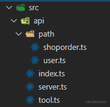

## 统一封装

参考文章：<https://mp.weixin.qq.com/s/DAm-N64rO30zZUHavKREsQ>

1. 目录结构

   

2. 业务处理函数：`src/api/tool.ts`

   ```js
   const handleRequestHeader = (config) => {
     config["xxxx"] = "xxx";
     return config;
   };

   const handleAuth = (config) => {
     config.header["token"] = localStorage.getItem("token") || token || "";
     return config;
   };

   const handleNetworkError = (errStatus) => {
     let errMessage = "未知错误";
     if (errStatus) {
       switch (errStatus) {
         case 400:
           errMessage = "错误的请求";
           break;
         case 401:
           errMessage = "未授权，请重新登录";
           break;
         case 403:
           errMessage = "拒绝访问";
           break;
         case 404:
           errMessage = "请求错误,未找到该资源";
           break;
         case 405:
           errMessage = "请求方法未允许";
           break;
         case 408:
           errMessage = "请求超时";
           break;
         case 500:
           errMessage = "服务器端出错";
           break;
         case 501:
           errMessage = "网络未实现";
           break;
         case 502:
           errMessage = "网络错误";
           break;
         case 503:
           errMessage = "服务不可用";
           break;
         case 504:
           errMessage = "网络超时";
           break;
         case 505:
           errMessage = "http版本不支持该请求";
           break;
         default:
           errMessage = `其他连接错误 --${errStatus}`;
       }
     } else {
       errMessage = `无法连接到服务器！`;
     }
     message.error(errMessage);
   };

   const handleAuthError = (errno) => {
     const authErrMap = {
       10031: "登录失效，需要重新登录", // token 失效
       10032: "您太久没登录，请重新登录~", // token 过期
       10033: "账户未绑定角色，请联系管理员绑定角色",
       10034: "该用户未注册，请联系管理员注册用户",
       10035: "code 无法获取对应第三方平台用户",
       10036: "该账户未关联员工，请联系管理员做关联",
       10037: "账号已无效",
       10038: "账号未找到",
     };
     if (authErrMap.hasOwnProperty(errno)) {
       message.error(authErrMap[errno]);
       // 授权错误，登出账户
       logout();
       return false;
     }
     return true;
   };

   const handleGeneralError = (errno, errmsg) => {
     if (errno !== "0") {
       message.error(errmsg);
       return false;
     }
     return true;
   };
   ```

3. 通用操作封装：`src/api/server.ts`

   ```js
    import axios from 'axios';
    import { message } from 'antd';
    import {
    handleChangeRequestHeader,
    handleConfigureAuth,
    handleAuthError,
    handleGeneralError,
    handleNetworkError
    } from './tools';

    type Fn = (data: FcResponse<any>) => unknown;

    interface IAnyObj {
    [index: string]: unknown;
    }

    interface FcResponse<T> {
    errno: string;
    errmsg: string;
    data: T;
    }

    axios.interceptors.request.use((config) => {
    config = handleChangeRequestHeader(config);
    config = handleConfigureAuth(config);
    return config;
    });

    axios.interceptors.response.use(
    (response) => {
        if (response.status !== 200) return Promise.reject(response.data);
        handleAuthError(response.data.errno);
        handleGeneralError(response.data.errno, response.data.errmsg);
        return response;
    },
    (err) => {
        handleNetworkError(err.response.status);
        return Promise.reject(err.response);
    }
    );

    export const Get = <T,>(url: string, params: IAnyObj = {}, clearFn?: Fn): Promise<[any, FcResponse<T> | undefined]> =>
    new Promise((resolve) => {
        axios
        .get(url, { params })
        .then((result) => {
            let res: FcResponse<T>;
            if (clearFn !== undefined) {
            res = clearFn(result.data) as unknown as FcResponse<T>;
            } else {
            res = result.data as FcResponse<T>;
            }
            resolve([null, res as FcResponse<T>]);
        })
        .catch((err) => {
            resolve([err, undefined]);
        });
    });

    export const Post = <T,>(url: string, data: IAnyObj, params: IAnyObj = {}): Promise<[any, FcResponse<T> | undefined]> => {
    return new Promise((resolve) => {
        axios
        .post(url, data, { params })
        .then((result) => {
            resolve([null, result.data as FcResponse<T>]);
        })
        .catch((err) => {
            resolve([err, undefined]);
        });
    });
    };
    ```

4. 统一调用点：`src/api/index.ts`

    ```js
    import { userApi } from "./path/user"
    import { shoporderApi } from "./path/shoporder"
    export const api = {	...userApi,	...shoporderApi}
    ```

5. 接口：`src/api/path/user.ts` | `src/api/path/shoporder.ts`

    ```js
    import { Get } from "../server"
    export function getUserInfo(id) { ... }
    export function getUserName(id) { ... }
    export const userApi = {	getUserInfo,	getUserName}
    ```

    ```js
    import { Get } from "../server"
    function getShoporderDetail() { ... }
    function getShoporderList() { ... }
    export const shoporderApi = {	getShoporderDetail,	getShoporderList}
    ```

## 知识点

### 监听上传和下载

```js
axios('https://fetch-progress.anthum.com/30kbps/images/sunrise-baseline.jpg', {
  responseType: 'blob',
  onDownloadProgress(e) {
    if (e.lengthComputable) {
      result.textContent = Math.round((e.loaded * 100) / e.total) + '%';
      if (e.loaded === e.total) {
        result.textContent += `，用时：${e.timeStamp.toFixed(0)}ms`;
      }
    }
  },
})


const data = new FormData();
data.append('file', input.files[0]);
data.append('username', 'foo');
// 或者已存在表单元素
// const data = new FormData(form:HTMLFormElement));
axios.post('upload', data, {
  headers: {'Content-Type': 'multipart/form-data;charset=utf-8'},
  onUploadProgress(e) {
    if (e.lengthComputable) {
      result.textContent = Math.round((e.loaded * 100) / e.total) + '%';
      if (e.loaded === e.total) {
        result.textContent += `，用时：${e.timeStamp.toFixed(0)}ms`;
      }
    }
  },
})
```