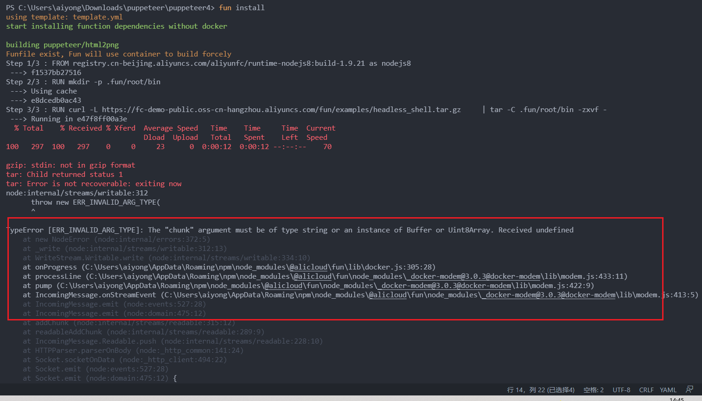
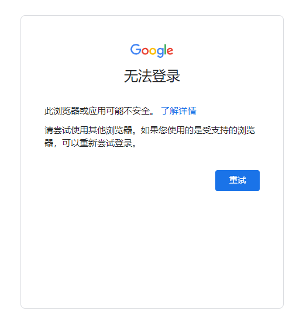
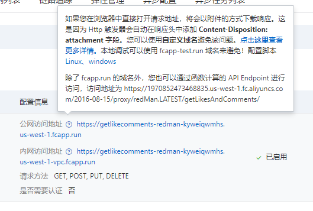

<!--
 * @Date: 2021-06-26 15:04:31
 * @LastEditors: Lq
 * @LastEditTime: 2022-06-16 10:24:50
 * @FilePath: \learnningNotes\puppeteer\index.md
-->
### window安装fun并部署项目到阿里云上

1. 安装`fun`和查看版本
    > npm install @alicloud/fun -g
    > fun --version

    关于fun的介绍：[https://developer.aliyun.com/article/787728](https://developer.aliyun.com/article/787728)

2. 安装`docker`和查看版本

    查看官网(教程)[https://hub.docker.com/editions/community/docker-ce-desktop-windows]

    查看版本：`docker version`

3. 进行`fun`的配置

    > fun config

    需要依次配置：`Account ID`、`Access Key Id`、`Secret Access Key`、 `Default Region Name`。  

    其中 Account ID、Access Key Id 你可以从函数计算控制台首页的右上方获得

    ```shell
    ? Aliyun Account ID 1970852473468835
    ? Aliyun Access Key ID ***********O6z2
    ? Aliyun Access Key Secret ***********mxIJ
    ? Default region name cn-shanghai
    ? The timeout in seconds for each SDK client invoking 2000
    ? The maximum number of retries for each SDK client 5
    ? Allow to anonymously report usage statistics to improve the tool over time? No
    ? Use custom endpoint? No
    ```

    完成 config 操作后，fun 会将配置保存到用户目录下的 `.fcli/config.yaml` 文件中

4. 简单使用，将一个http触发器部署到函数计算上

    参见[文章](https://github.com/alibaba/funcraft/blob/master/docs/usage/getting_started-zh.md?spm=a2c4g.11186623.2.11.16e15124siSIfQ&file=getting_started-zh.md)

5. 将puppeteer部署到函数计算上

    参见[[文章](https://github.com/vangie/puppeteer-example)](https://github.com/vangie/puppeteer-example)


6. 方案一（没有走通）

    我是2022年的时候来做这个的，按照文档中的步骤安装的其实是nodejs8，但是这个时候安装老是报错

    

    在这个仓库的另外一个`readme`中有这么一段话：Funcraft 集成 Puppeteer 的解决方案 Puppeteer 版本比较老，可能最新的 Puppeteer 版本会有些兼容性问题。

    仓库地址：https://github.com/awesome-fc/fc-puppeteer-demo

    然后更换了nodejs10之后成功了，更换的步骤就是

    1. 正常`fun init vangie/puppeteer-example`

    2. 然后进入到`nodejs10`版本的代码中：[https://github.com/awesome-fc/fc-puppeteer-demo/tree/master/nodejs10]

    3. 将这个仓库里面对应到你下载的文件，全部进行更换

    4. 然后继续`fun install -v`

        这个过程相对是比较久的，不过只要控制台没有报错，然后一直有进度就能成功（之前失败的时候刚开始就会失败报错）

    5. 然后继续`fun nas sync`，这里的要求就是需要你之前输入的oss的信息正确

        这个时候你可以发现你的阿里云的函数计算上面已经建了两个服务了，都是和oss相关的

        1. _FUN_NAS_puppeteer-nodejs12

        2. fun-generated-default-service

    6. 然后本地测试：`fun local start`

        控制台报错了：`ExperimentalWarning: The fs.promises API is experimental`

        然后浏览器url调用之后报错为：`Could not find browser revision 800071. Run "PUPPETEER_PRODUCT=firefox npm install" or "PUPPETEER_PRODUCT=firefox yarn install" to download a supported Firefox browser binary.`

        百度的原因是说node版本过低的问题：注意这里不是说你的机器的node版本，而是这个项目的node版本，记得刚才安装的是node10吗

        然后我这边在尝试安装node12的那个版本的

        更换了一段自己写的脚本之后报错：`Could not find browser revision 800071. Run "PUPPETEER_PRODUCT=firefox npm install" or "PUPPETEER_PRODUCT=firefox yarn install" to download a supported Firefox browser binary`、

        ```js
        (async () => {
        const browser = await puppeteer.launch({
            "headless": true,
            defaultViewport: {
                width: 1600,
                height: 800
            }
        });
        const page = await browser.newPage();
        await page.goto('https://www.baidu.com');

        let str = await page.$eval('#hotsearch-content-wrapper > li:nth-child(1) > a > span.title-content-title', el => el.innerText)
        console.log('获取到的数据为', str)

        await page.waitFor(10000);
        
        await page.screenshot({path: 'example.png'});

        await browser.close();
        })().catch(err => {
            response.setStatusCode(500);
            response.setHeader('content-type', 'text/plain');

            response.send(err.message);
        });
        ```

        安装了node12之后还是报错：`"Handler 'handler' is missing on module 'index'",`

        尝试重装puppeteer，然后使用`node ./index.js`这个脚本文件是可以了

            > npm uninstall puppeteer   
            > npm install puppeteer   

        但是使用`fun local start`还是不行

            1. {"errorMessage":"Handler 'handler' is missing on module 'index'","errorType":"Error","stackTrace":["Error: Handler 'handler' is missing on module 'index'"]}   

                这个的原因是由于你需要运行他们的demo的代码，有一个`Handle`入口函数，自己写的代码没有

                ```js
                // demo的代码有这个，需要export一个handeler
                module.exports.handler = function(){}
                ```
        
            2. UnhandledPromiseRejectionWarning: Error: Could not find expected browser (chrome) locally. Run `npm install` to download the correct Chromium revision (991974)

                这个原因是说本地没有符合要求的浏览器版本，参考这篇博客（https://segmentfault.com/a/1190000038243913）修改代码

                然后报错：`await is only valid in async function`

                再更改代码，运行起来后会发现启动要好久（因为他在下载对应版本的浏览器）

                其实在`puppeteer`的`node_modules`中就已经有了这个版本了：`node_modules\puppeteer\.local-chromium\win64-991974\chrome-win`

                ```js
                module.exports.handler = function (request, response, context) {

                    (async () => {
                        browserFetcher.download("991974").then(async (res) => {
                            const browser = await puppeteer.launch({
                                "headless": true,
                                defaultViewport: {
                                    width: 1600,
                                    height: 800
                                }
                            });
                            const page = await browser.newPage();
                            await page.goto('https://www.baidu.com');

                            let str = await page.$eval('#hotsearch-content-wrapper > li:nth-child(1) > a > span.title-content-title', el => el.innerText)
                            console.log('获取到的数据为', str)

                            await page.waitFor(10000);

                            await page.screenshot({ path: 'example.png' });

                            await browser.close();
                        })().catch(err => {
                            response.setStatusCode(500);
                            response.setHeader('content-type', 'text/plain');

                            response.send(err.message);
                        });
                    })
                };
                ```

7. 方案二（走通了）

    这里还有一种项目制的形式的puppeteer的教程，有需要的也可以参考

    > https://developer.aliyun.com/article/602877

    但是我这里是失败了的，里面执行的脚本命令是有些linux的windows不支持，会直接报错，没有成功

    但是之前使用mac是成功了的

    windows参考这个：我来贡献个windows打包代码，首先要下载个7z.exe的压缩工具放在C:\Windows下面。然后替换package.json的scripts内容如下： (https://developer.aliyun.com/article/602877)

    但是我这边还是没有成功，最后用其他人的mac打包好上传到阿里云了

    ```json
    "scripts": {
        "package": "npm run package-prepare && xcopy chrome\\headless_shell.tar.gz dist && cd dist && 7z a -tzip package.zip ",
        "package-nochrome": "npm run package-prepare && cd dist && 7z a -tzip package.zip ",
        "package-prepare": "npm run babel && xcopy package.json dist && xcopy lib\\* dist\\lib /y /e /i /q && cd dist && set PUPPETEER_SKIP_CHROMIUM_DOWNLOAD=1 && npm install --production",
        "babel": "./node_modules/.bin/babel src --out-dir dist",
        "local": "npm run babel && xcopy node_modules\\* dist\\node_modules /y /e /i /q && node dist/starter-kit/local.js"
    }
    ```

    最后还是需要更改`index.js`这个文件，因为这里面的代码过时了，更改后如下

    ```js
    const setup = require('./starter-kit/setup');

    exports.handler = async (request, response, context) => {
        const queries = request.queries;
        const browser = await setup.getBrowser(context);
        exports.run(browser, queries)
            .then(result => {
                return response.send(JSON.stringify(result));
            })
            .catch(err => {
                return response.send(JSON.stringify(err));
            });
    };


    exports.run = async (browser, queries) => {
        console.log('接收到的参数为：', queries)
        
        try {
            const page = await browser.newPage();
            await page.goto('https://weibo.com/u/5821596827');
            await page.waitForSelector('#app > div.woo-box-flex.woo-box-column.Frame_wrap_3g67Q > div.woo-box-flex.Frame_content_3XrxZ > div.Frame_main_3Z_V0 > main > div.Main_full_1dfQX > div > div:nth-child(2) > div:nth-child(1) > div.woo-panel-main.woo-panel-top.woo-panel-right.woo-panel-bottom.woo-panel-left.Card_wrap_2ibWe.Card_bottomGap_2Xjqi > div.woo-box-flex.woo-box-alignStart.ProfileHeader_box1_1qC-g > div.woo-box-item-flex > div.woo-box-flex.woo-box-alignCenter.ProfileHeader_h3_2nhjc > div')
            let nickName = await page.$eval('#app > div.woo-box-flex.woo-box-column.Frame_wrap_3g67Q > div.woo-box-flex.Frame_content_3XrxZ > div.Frame_main_3Z_V0 > main > div.Main_full_1dfQX > div > div:nth-child(2) > div:nth-child(1) > div.woo-panel-main.woo-panel-top.woo-panel-right.woo-panel-bottom.woo-panel-left.Card_wrap_2ibWe.Card_bottomGap_2Xjqi > div.woo-box-flex.woo-box-alignStart.ProfileHeader_box1_1qC-g > div.woo-box-item-flex > div.woo-box-flex.woo-box-alignCenter.ProfileHeader_h3_2nhjc > div', el => el.innerText)
            let fansNum = await page.$eval('#app > div.woo-box-flex.woo-box-column.Frame_wrap_3g67Q > div.woo-box-flex.Frame_content_3XrxZ > div.Frame_main_3Z_V0 > main > div.Main_full_1dfQX > div > div:nth-child(2) > div:nth-child(1) > div.woo-panel-main.woo-panel-top.woo-panel-right.woo-panel-bottom.woo-panel-left.Card_wrap_2ibWe.Card_bottomGap_2Xjqi > div.woo-box-flex.woo-box-alignStart.ProfileHeader_box1_1qC-g > div.woo-box-item-flex > div.woo-box-flex.woo-box-alignCenter.ProfileHeader_h4_gcwJi > a:nth-child(1) > span > span', el => el.innerText)
            let avator = await page.$eval('#app > div.woo-box-flex.woo-box-column.Frame_wrap_3g67Q > div.woo-box-flex.Frame_content_3XrxZ > div.Frame_main_3Z_V0 > main > div.Main_full_1dfQX > div > div:nth-child(2) > div:nth-child(1) > div.woo-panel-main.woo-panel-top.woo-panel-right.woo-panel-bottom.woo-panel-left.Card_wrap_2ibWe.Card_bottomGap_2Xjqi > div.woo-box-flex.woo-box-alignStart.ProfileHeader_box1_1qC-g > div.woo-avatar-main.woo-avatar-hover.ProfileHeader_avatar2_1gEyo > img', el => el.src)
            const result = { nickName, fansNum, avator };
            await browser.close();
            return Promise.resolve({
                code: 200,
                msg: 'success',
                data: result
            })
        } catch (err) {
            return Promise.reject({
                code: 500,
                msg: 'error',
                data: err
            })
        }
    }
    ```


8. 总体来说，大方向上主要有以下几个问题

    1. node版本问题

    2. windows和mac环境的问题

    3. 代码过时了，一些api需要修改


### api使用小技巧

api文档地址：[http://www.puppeteerjs.com/#?product=Puppeteer&version=v14.1.1&show=api-pageselector](http://www.puppeteerjs.com/#?product=Puppeteer&version=v14.1.1&show=api-pageselector)

1. input输入值

    1. 一个一个输入

        > await page.type('#email', 'test@example.com');

    2. 直接全部一起输入

        > await page.$eval('#email', el => el.value = 'test@example.com');

        注意：这里如果需要使用参数的话，需要额外传进去，不能直接使用

        ```js
        let email = 'test@example.com';
        // 会报错
        await page.$eval('#email', el => el.value = email);

        // 正确写法
        await page.$eval('#email', (el, email) => el.value = email, email);
        ```

2. 获取元素的自定义属性

    > el.getAttribute('test-id')

3. 获取某一个元素属性值为xxx的

    > awiat page.$('tp-yt-paper-item.tp-yt-paper-item[role=option]')

4. 设置浏览器为英文

    可参考[https://www.thinbug.com/q/46908636](https://www.thinbug.com/q/46908636)

    第一种方法我是没有成功，使用的是第二种

    ```js
    await page.setExtraHTTPHeaders({
        // en英文 cn繁体中文 zh简体中文
        'Accept-Language': 'en'
    });
    ```

    如需其他语言参考：[https://baike.baidu.com/item/iso%20639/10750664?fr=aladdin](https://baike.baidu.com/item/iso%20639/10750664?fr=aladdin)

5. 将鼠标移动到某一个元素上

    使用场景：某一个dom节点只有hover的状态下才会显示

    ```js
    // 将鼠标移动到元素上
    let pathInfo = await page.evaluate(() => {
        let pathInfo = document.querySelector('div > div:nth-child(1) > div > div.rq0escxv.l9j0dhe7.du4w35lb > div > div > div.j83agx80.cbu4d94t.d6urw2fd.dp1hu0rb.l9j0dhe7.du4w35lb > div._a3gq > section > main > div > div._aa-i > article > div:nth-child(1) > div > div > div > a').getBoundingClientRect();
        // 注意这里面的打印在puppeteer的浏览器的控制台打印的，而不是你的终端
        console.log(pathInfo, '-----------')
        console.log('window.scrollX', window.scrollX);
        console.log('window.scrollY', window.scrollY);
        let left = pathInfo.left + window.scrollX;
        let top = pathInfo.top + window.scrollY;
        return {left, top}
    })
    await page.mouse.move(pathInfo.left, pathInfo.top);
    ```

6. 滚动页面

    ```js
    /* 页面滚动方法 */
    // 一次滚动100像素10次为一个循环，i控制滚动多少个循环
    async function scrollPage(i, page) {
        /*执行js代码（滚动页面）*/
        await page.evaluate((i) => {
            /* 这里做的是渐进滚动，如果一次性滚动则不会触发获取新数据的监听 */
            for (let y = 0; y <= 1000 * i; y += 100) {
                window.scrollTo(0, y)
            }
        }, i)
        return Promise.resolve();
    }
    ```

7. 循环遍历获取元素内容，直到符合某一个条件

    ```js
    async function getArticleIndex() {
        const arr = await page.$$eval(`#react-root > div > div > div.css-1dbjc4n.r-18u37iz.r-13qz1uu.r-417010 > main > div > div > div > div.css-1dbjc4n.r-14lw9ot.r-jxzhtn.r-1ljd8xs.r-13l2t4g.r-1phboty.r-1jgb5lz.r-11wrixw.r-61z16t.r-1ye8kvj.r-13qz1uu.r-184en5c > div > div:nth-child(2) > div > div > section > div > div > div > div > div > div > article > div > div > div > div.css-1dbjc4n.r-18u37iz > div.css-1dbjc4n.r-1iusvr4.r-16y2uox.r-1777fci.r-kzbkwu > div:nth-child(2) > div:nth-child(1) > div > span`, (el) => {
            let arr = [];
            for (let i = 0; i < el.length; i++) {
                arr.push(el[i].innerText);
            }
            return arr;
        });
        allArr = [...new Set([...allArr, ...arr])];
        console.log('allArr', allArr);
        // 判断遍历出来的标题是否有帖子的标题
        if (arr.includes(currentTitle)) {
            needIndx = arr.indexOf(currentTitle);
            return Promise.resolve(arr.indexOf(currentTitle));
        } else {
            await scrollPage((runIndx + 1) * 5, page);
            runIndx++;
            await getArticleIndex();
        }
    }
    await getArticleIndex();
    ```

### 无法登录google账号

现象：点击登录之后页面显示如下



尝试解决方案（虽然我都失败了）

1. https://last2win.com/2020/02/17/chrome-auto/

    这个我尝试打开本地的无头浏览器，然后显示一个错误，然后其他的操作上也没有找到能够手动登录google账号的地方

2. https://www.mianshigee.com/question/130462xqe/   

    跳转到：https://myaccount.google.com/lesssecureapps?pli=1&rapt=AEjHL4MiNvzj47dj53vUjnXPPazpaBcOYEmLPDyU95g5tEoB2XkXbcSworBcLPHmT-BSOFJiYr5LjG6RsLD7iCRrMgEWgfyHnQ

    这个设置在2022-05-30之后失效

### 在函数计算上无法输出catch中的error

> console.log("error", String(error))

### node版本

安装puppeteer模块需要node版本在14以上才行

### 函数计算调用传递参数

函数计算有两种调用方式

1. 设置触发器，https触发器、定时触发器（这种方式我使用GET传参接收不到，还没尝试其他方式）

    > https://getlikecomments-redman-kyweiqwmhs.us-west-1.fcapp.run

2. 通过函数计算的 API Endpoint 进行访问

    