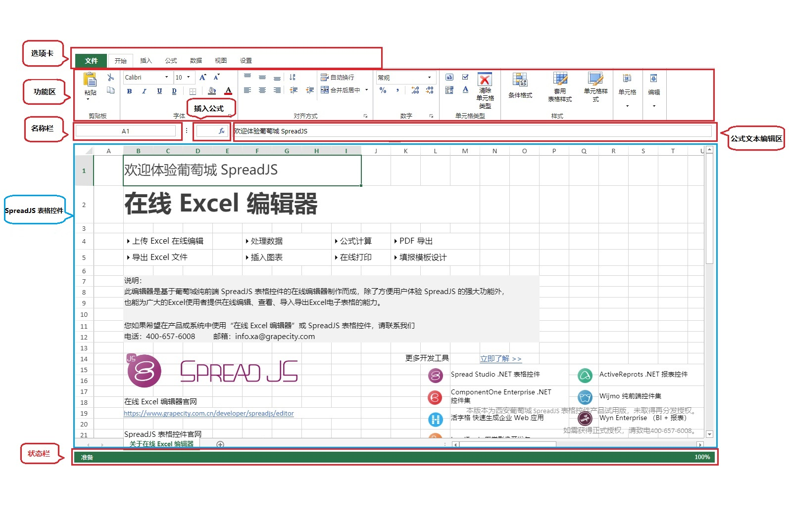

<!--
 * @Date: 2022-03-25 14:44:36
 * @LastEditors: Lq
 * @LastEditTime: 2022-05-20 12:25:47
 * @FilePath: \learnningNotes\spreadjs\index.md
-->
## 起步

### 地址入口

1. [官方网站](https://www.grapecity.com.cn/developer/spreadjs)

2. [新手入门介绍](https://www.grapecity.com.cn/developer/spreadjs/getstart)

3. [学习笔记：强烈推荐！！！](https://gcdn.grapecity.com.cn/forum.php?mod=viewthread&tid=57654&extra=page%253D1)

3. [技术文档](https://demo.grapecity.com.cn/spreadjs/help/docs/)

4. [帮助文档](https://help.grapecity.com.cn/pages/viewpage.action?pageId=5963808)

5. [入门视频](https://www.grapecity.com.cn/developer/spreadjs/learnvideo)

6. [api索引](https://demo.grapecity.com.cn/spreadjs/help/api/index.html)

7. [各种示例集合](https://demo.grapecity.com.cn/spreadjs/SpreadJSTutorial/#/samples)

8. [产品学习计划，从简单到深入的几种路线](https://www.grapecity.com.cn/developer/spreadjs/learningplan)

9. [各种实战demo](https://demo.grapecity.com.cn/spreadjs/gc-sjs-samples/index.html?id=51)

### 介绍

1. 可嵌入您系统的在线Excel

2. 纯前端表格控件，功能布局与 Excel 高度类似

### 辨析几个问题

1. 官网首页的下载的是什么东西？

    1. 下载的是一个表格编辑器的安装包zip文件，里面的结构如下

    > 1. api参考  
    > 2. 中文Docs  
    > 3. SpreadJS 安装程序（运行库+示例+桌面设计器）.msi  （这个客户端的镜像安装文件）  
    > 4. 产品入门必读.pdf （一个如何使用这个客户端的介绍文件）  
    > 5. 一张没用的图片

    2. 然后安装了之后就有了一个软件：SpreadJS Designer，打开之后是类似excel的一个设计器

        默认会给你安装到这个目录下：`C:\Program Files (x86)\SpreadJS\15.0.2`

        其中安装好了之后会有3个目录

        1. Designer 设计器：这个是客户端的设计器目录（是指表格头部的那些功能区域）

        2. Documentation：这个是离线版的文档目录

        3. SpreadJS 表格运行库：这个是设计器的表格目录（功能区域的下面那部分）

    3. 关键：官网下载好的安装包需要安装才会呈现出我们要的代码的源码
        

2. 辨析源码、npm包、html嵌入、官网下载的压缩包

    1. 官网首页下载的压缩包是一个客户端，spreadjs的类似excel的设计器

    2. 还有一个提交申请之后给你下载邮件的地址，这个里面就是源码包（这个入口找不到了，可能是被关闭了，只能通过电话咨询）

    3. 使用npm包安装是免费版本项目中进行集成的方式之一

    4. 源码版本是花钱之后官方给的一个源码包，里面的代码是没有经过压缩混淆的（npm安装的是经过混淆的）

    5. 使用`script`标签的方式是使用html的cdn进行加载，也是项目中的集成方式之一


### 项目中安装

1. 几种安装方式

    1. html
    2. angular
    3. react
    4. vue（我这里以这个为例）

2. 安装模块

    > yarn add @grapecity/spread-sheets-vue @grapecity/spread-sheets

    ps：这两个模块要安装很久（我安装了半个多小时）

    `@grapecity/spread-sheets-vue`：来分发Vue SpreadJS 控件
    
    `@grapecity/spread-sheets`：这个包是功能模块核心

3. 使用demo

    ```html
    <template>
        <div>
            <gc-spread-sheets
            :hostClass="hostClass"
            @workbookInitialized="initWorkbook"
            >
            </gc-spread-sheets>
        </div>
    </template>

    <script>
    import "@grapecity/spread-sheets/styles/gc.spread.sheets.excel2016colorful.css";
    import * as GC from "@grapecity/spread-sheets";
    import "@grapecity/spread-sheets-vue";

    export default {
    name: "App",
    data() {
        return {
        hostClass: "spread-host",
        };
    },
    methods: {
        initWorkbook: function (spread) {
            //initializing
            let worksheet = spread.getActiveSheet();
            },
        },
    };
    </script>

    <style>
    .spread-host {
    width: 100%;
    height: 600px;
    }
    </style>
    ```


### 界面介绍

#### excel工作区结构示意图


#### 在线Excel编辑器介绍




### 一些概念

1. 工作簿：工作簿是由一个或多个表单组成的表格文档（多个sheet）

2. 表单（工作表）：由许多单元格组成，您可以在其中输入和显示数据，分析信息，编写公式，执行计算和审查结果（一个sheet）

3. 脏数据

   1. 只有单元格值的变更才导致其成为脏数据
   2. 如果单元格是脏数据，其所在的行也是脏数据
   3. 如果插入了呀行并为其中一个单元格设置了值，那么这个单元格和行都不是脏数据
   4. 加载绑定数据的项不是脏数据，但是，通过spreadjs修改绑定数据之后，他将变为脏数据
   5. 脏数据的状态不会因为撤销操作而改变


### 小技巧

1. 获取值和设置值

    1. 使用对象数组的方式

        注意：使用这种方式设置的值，只能使用这个方式来获取值
        ```js
            const sheet = this.spread.getActiveSheet();
            const dataSource = [
                { ID: 0, Name: "A", Info1: "Info0" },
                { ID: 1, Name: "B", Info1: "Info1" },
                { ID: 2, Name: "C", Info1: "Info2" },
            ];
            sheet.setDataSource(dataSource);
            const data = sheet.getDataSource();
        ```

        注意：这种方式设置的值，会将整个表单的值设置为这个，表现出来的是页面其他的地方都是空白的，而不是空的单元格

    2. 使用二维数组的方式

        注意：这种方式必须要指定单元格位置，无法做到获取所有数据
        ```js
        const sheet = this.spread.getActiveSheet();
        const dataArray = [
            ["", 'Chrome', 'Firefox', 'IE', 'Safari', 'Edge', 'Opera', 'Other'],
            ["2017", 0.6360, 0.1304, 0.0834, 0.0589, 0.0443, 0.0223, 0.0246],
            ["2018", 0.3260, 0.2638, 0.1828, 0.0367, 0.9721, 0.2732, 0.3762],
        ];
        sheet.setArray(0, 0, dataArray, false);
        // 参数：开始行数，开始列数，获取行数，获取列数，是否返回公式
        const data = activeSheet.getArray(1, 2, 3, 4, false);
        ```

2. 常用的一些api

    ```js
      // 设置网格线
      this.sheet.options.gridline.showVerticalGridline =
        this.options.showGridLine;
      this.sheet.options.gridline.showHorizontalGridline =
        this.options.showGridLine;
      // 设置行列头
      this.sheet.options.rowHeaderVisible = this.options.showRowColHeader;
      this.sheet.options.colHeaderVisible = this.options.showRowColHeader;
      // 设置滚动条
      this.spread.options.showHorizontalScrollbar = this.options.showScrollbar;
      this.spread.options.showVerticalScrollbar = this.options.showScrollbar;
      //   设置状态栏
      this.spread.options.tabStripVisible = this.options.showTabStrip;
      // 滚动条是否对齐最后一列
      // scrollbarMaxAlign: 滚动条是否对齐视图中表单的最后一行或一列。
      // scrollbarShowMax: 是否基于表单全部的行列总数显示滚动条。
      this.spread.options.scrollbarMaxAlign = true;
      this.spread.options.scrollbarShowMax = true;
      // 禁用单元格编辑
      this.sheet.options.isProtected = true;
      // 隐藏表单栏
      this.spread.options.tabStripVisible = false;
    ``


### 小坑总结

1. [官网](https://demo.grapecity.com.cn/spreadjs/help/docs/data-binding.html)步骤2.2中有一处代码错误

    ```js
    //2.1: 使用来自数据源的数据创建表
    function loadTable(ss, data) {
      ss.suspendPaint;
      try {
        var sheet = ss.getActiveSheet;
        //2.2: 添加具有指定数据源的范围表
        var table = sheet.tables.addFromDataSource(
          "Table1",
          0,
          0,
          data,
          GC.Spread.Sheets.Tables.TableThemes.medium2
        );
       } catch (e) {
        alert(e.message);
      }
      ss.resumePaint;
    }
    ```

    其中`ss.getActiveSheet`这个是一个函数，应该进行调用，而不是一个对象，实际使用的时候下面一行会报错，应该改为调用

    ```js
    var sheet = ss.getActiveSheet();
    ```

2. 示例代码中多处使用了`document.getElementById("ss")`来获取`spread`对象，所以需要给组件加上一个id属性

    ```html
    <gc-spread-sheets
        :hostClass="hostClass"
        @workbookInitialized="initWorkbook"
        id="ss"
    >
    ```

    如果是在vue项目中的话，可以在初始化回调中使用传入的参数来获取`spread`对象

    ```js
    initWorkbook: function (spread) {
        this.refresh(spread)
    }
    ```

    说明：这里的`spread`对象就是`workbook`初始化好了的对象

3. 文件导入导出的坑
   
   1. 使用上传导入功能的时候不要使用element-ui的上传组件，因为获取到的文件类型对象类型不适配spreadjs格式要求，需要自己使用原生的html文件上传

    2. 如果是使用html+js+css的web应用开发，导入导出组件不需要授权，只需要对于SpreadJS进行授权即可

        但是如果是使用react/vue等框架进行开发的时候，需要对于导出导出组件`ExcelIO`进行单独授权（`意味着在试用的版本中无法进行测试`)

4. 多人同时编辑功能，spreadjs不提供此类功能，需要自己进行定制化开发

    思路：多人同时编辑时，根据spreadjs 提供的事件或脏数据功能与后台进行接口交互，然后通过websocket通信将数据同步到其他端。

5. 在进行json导入的时候，如果里面有数据源的话，需要额外做一个配置，否则数据出不来

    ```js
    let jsonStr = JSON.stringify(spread.toJSON({
        includeBindingSource: true
    }))
    spread.fromJSON(JSON.parse(jsonStr))
    ```

6. 使用`spread.fromJSON`导入模板之后，`activeSheet`里面的方法都无效，报错

    报错：`TypeError: Cannot read properties of null (reading 'getRowCount')`

    我这里出错的原因是：在导入模板之前存入了`activeSheet`对象，应该需要在重绘之后重新存入一遍

7. 在设计器中做好了图表模板，但是导入到`spreadjs`中的时候，没有渲染出来

    原因是：设计器中使用了`import "@grapecity/spread-sheets-designer"`，这个部分，但是`spreadjs`中没有使用

8. 拉取的表格会自动带上筛选和排序标志，想要去除

    先点击选中一个筛选的标志，然后点击【数据】=>【筛选】，就会消失了

9. resumePaint/repaint/refresh的区别是什么？

    > https://gcdn.grapecity.com.cn/showtopic-99151-1-1.html

10. 在做表格数据绑定的时候是拖拽数据源的表名，而不是字段名