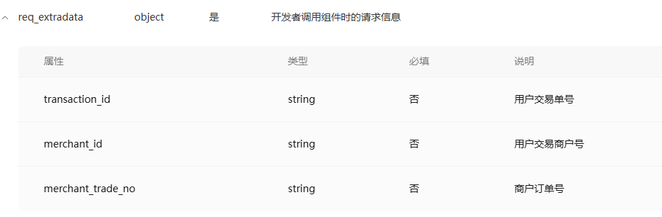

### 开源小程序

1. 充电桩

   <https://github.com/cheinlu/HarmonyOS-groundhog-charging-system>

   一套包含鸿蒙、微信小程序、云平台充电设备管理系统。鸿蒙 App 使用 HarmonyOS 4.0 开发，小程序使用 uniapp 开发；功能涉及：登录、注册、查找充电站和充电站、在线充电、订单查询、个人中心等云平台使用。

   

2. 会员营销

   <https://gitee.com/fuint/fuint-uniapp>

   fuint 会员营销系统是一套开源的实体店铺会员管理和营销系统。前端基于 Uniapp，Element UI，支持小程序、h5。主要功能包含电子优惠券、储值卡、实体卡、计次卡、短信发送、储值卡、会员积分、会员等级权益体系，支付收款等会员日常营销工具。本系统适用于各类实体店铺，如零售超市、酒吧、酒店、汽车 4S 店、鲜花店、奶茶店、甜品店、餐饮店、农家乐等，是实体店铺会员营销必备的一款利器。

   

3. AI 办公

   <https://gitee.com/rocy_wang/aioffice>

   一个 AI 办公小程序，支持 AI 视频、AI 换脸、AI 机器人、AI 文生图、AI 话画、AI 私域、AI 图片识字、AI 抠图、AI 提示词工程、AI PPT、AI WORD、AI 招聘。

   

4. ChatGPT-MP

   <https://gitee.com/smalle/ChatGPT-MP>

   基于 ChatGPT 实现的微信小程序，包含前后台，支持打字效果输出流式输出，支持 AI 聊天次数限制，支持分享增加次数等功能。

   

5. 生鲜商城

   <https://gitee.com/zhengkaixing/kxmall>

   kxmall 生鲜商城使用 uniapp 开发，可同时编译到微信小程序、H5、Android App、iOS App 等多个平台。

   

### hbuild 好用插件整理

1. 命令面板

   > https://ext.dcloud.net.cn/plugin?id=2294

   类似 vscode 的命令面板

2. 自定义快捷键

   > https://ext.dcloud.net.cn/plugin?id=3648

   hbuild 默认没有自定义快捷键的，用这个插件可以可视化定制

3. 代码智能补全

   > https://ext.dcloud.net.cn/plugin?id=15497

   类似 vscode 的 codeium

### 使用技巧

#### 区分环境

如果只需要判断是否是生产环境：`process.env.NODE_ENV === 'development'`

<https://uniapp.dcloud.net.cn/worktile/running-env.html#%E5%BC%80%E5%8F%91%E7%8E%AF%E5%A2%83%E5%92%8C%E7%94%9F%E4%BA%A7%E7%8E%AF%E5%A2%83>

如果需要区分开发、体验、生产、灰度：

> 小程序 当前环境版本：develop开发版、trial体验版、release正式版、gray灰度版（仅支付宝小程序支持）

<https://uniapp.dcloud.net.cn/api/other/getAccountInfoSync.html#getaccountinfosync>

```js
const envConfig = uni.getAccountInfoSync().miniProgram.envVersion;
```

#### uni_module 版本的 mitt

在项目没有使用`npm`的第三方包的时候，想要使用`mitt`的话

<https://ext.dcloud.net.cn/plugin?id=7323>

#### 修改 input 的 placeholder 样式

1. 使用`placeholder-style`直接写行内样式（`这个我没生效`）
2. 使用`placeholder-class`增加类名（`这个可以`）

   1. 只能使用`font-size、font-weight、color`这几个属性
   2. 如果`style`中有`scoped`时，需要在类名前加上`/deep/`或者`::v-deep`

3. 使用原生 css 方法修改（`这个我没生效`）

#### 使用自定义导航栏

官方文档[https://uniapp.dcloud.net.cn/collocation/pages.html#customnav](https://uniapp.dcloud.net.cn/collocation/pages.html#customnav)

不同设备的状态栏高度不一致问题，原因可参考[https://juejin.cn/post/6844903810578513928](https://juejin.cn/post/6844903810578513928)

解决方案：根据[官方文档](https://uniapp.dcloud.net.cn/api/system/info.html#getsysteminfo)中的 api 获取各个地方的高度，然后进行调整

`一定要注意的是`：这里需要用`px`作为单位，因为 api 返沪的是`px`，如果用`rpx`去计算的话会有问题

#### 简单写死顶部区域和底部区域

1. 顶部（`188rpx`）：状态栏 + 胶囊

2. 底部（`40rpx`）：操作条的安全区域

#### 关于计算滚动区域

1. 如果是自定义页面（`顶部`是自己实现的）

> height: calc(100vh - 188rpx - 40rpx - 其他区域高度)

2. 如果是正常页面（`顶部`用的是原生的）

> height: calc(100vh - 40rpx - 其他区域高度)

#### button 中使用图片，修改 button 样式，达到仅展示图片

```css
.btn {
  padding: 0;
  border: 0;
  background-color: transparent;
  width: 108rpx;
  height: 108rpx;

  &::after {
    outline: none;
    border: none;
  }

  .img {
    width: 100%;
    height: 100%;
  }
}
```

#### uniapp 特有的生命周期导入方式

```js
import { onLoad } from "@dcloudio/uni-app";

onLoad(() => {
  console.log(11);
});
```

#### 微信小程序和 uniapp 接入快递 100 查询

没有任何开发成本，直接一键接入

> https://fuwu.weixin.qq.com/service/detail/00008caeab84c07c17dcdabf55b815

使用查询 api 的方式

> https://blog.csdn.net/qq_43382853/article/details/140470767?spm=1001.2014.3001.5501

#### 微信小程序后端域名校验

1. 本地开发模式，可以在【详情】-【本地设置】-【不校验合法域名】
2. 体验版，默认需要配置服务器域名，也可以打开【小程序右上角】-【开发调试】模式，这种情况下也不校验
3. 正式版一定要配置

#### 关于进入到`tabbar`页面触发的生命周期

1. 点击底部的`tabbar`的时候，`onShow`和`onTabItemTap`都会触发
2. 使用`uni.switchTab()`，只会触发`onShow`

PS：`如果没有触发，尝试重新打开微信开发者工具或者重新编译`（我已经踩过这个坑了）

#### image 的 mode 一般使用 aspectFill

保持纵横比缩放图片，只保证图片的短边能完全显示出来

长边会选择中间进行展示

#### 设置 button 为透明无边框

因为小程序中一些功能，需要使用`button`来触发，但是显示内容却是图片或者 icon 之类的

```html
<!-- 小程序或者uniapp有一个属性plain 是设置为透明的，但是只是背景透明了 边框之类的还没 -->
<button plain class="wrap-btn" type="default" open-type="contact">
  <image src="/static/img/customer.png" mode=""></image>
</button>

<style>
  .wrap-btn {
    padding: 0;
    border: none;
    background-color: transparent;
    display: flex;
    border-color: transparent;

    &::after {
      border: none;
    }
  }

  /* boder设置如果不生效的话，需要加上!important */
  button[plain] {
    border: none !important;
    border-color: transparent;
  }
</style>
```

#### 如何配置 vite 或者 webpack

官网 <https://zh.uniapp.dcloud.io/collocation/vite-config.html>

创建的项目默认是没有`vite.config.js`文件的

如果需要手动修改`vite`配置，直接在根目录新建`vite.config.js`，然后重新启动项目（如果没有生效的话，关闭 hbuildx 然后重新打开）

注意：`必须引用 '@dcloudio/vite-plugin-uni' 并且添加到 plugins 中`

```js
import { defineConfig } from "vite";
import uni from "@dcloudio/vite-plugin-uni";

export default defineConfig({
  plugins: [uni()],
});
```

#### 想要在 onShow 中获取到参数

```js
onShow(() => {
  let pageArr = getCurrentPages(); //获取应用页面栈
  let currentPage = pageArr[pageArr.length - 1]; //获取当前页面信息
  console.log("onshow----option:", currentPage.options); //获取页面传递的信息
});
```

#### 使用 props 获取路由参数（Vue3 新增）

官方文档：<https://uniapp.dcloud.net.cn/tutorial/migration-to-vue3.html#url-search-params>

```js
<script setup>
  // 页面可以通过定义 props 来直接接收 url 传入的参数
  // 如：uni.navigateTo({ url: '/pages/index/index?id=10' })
  const props = defineProps({
    id: String,
  });
  console.log("id=" + props.id); // id=10
</script>

<script>
  // 页面可以通过定义 props 来直接接收 url 传入的参数
  // 如：uni.navigateTo({ url: '/pages/index/index?id=10' })
  export default {
    props: {
      id: {
        type: String,
      },
    },
    setup(props) {
      console.log("id=" + props.id); // id=10
    },
  };
</script>

```

#### 使用其他字体

<https://blog.csdn.net/weixin_45803990/article/details/118754518>

#### 修改日历组件样式

默认的`uni-calendar`组件的样式不好看，也没有属性支持修改样式

直接在`/uni_modules/uni-calendar/components/uni-calendar/uni-calendar.vue`文件中修改

我这里提供我简单修改了的样式

#### 修改导航栏标题

```js
uni.setNavigationBarTitle({
  title: "修改的标题",
});
```

#### 设置页面高度 100%

在`app.vue`文件中

```css
page {
  height: 100%;
}
```

然后对应的页面，如`index.vue`

```html
<template>
  <view class="container"></view>
</template>

<style>
  .container {
    padding: 32rpx;
    box-sizing: border-box;
  }
</style>
```

#### 引用 less 全局变量

1. 在`vite.config.js`文件中（`如果没有就根目录新建一个`）配置

   ```js
   import { defineConfig } from "vite";
   import uni from "@dcloudio/vite-plugin-uni";

   let path = require("path");
   let stylePath = path.resolve(__dirname, "common/common.less"); // common/common.less是less的路径

   export default defineConfig({
     plugins: [uni()],
     css: {
       preprocessorOptions: {
         less: {
           javascriptEnabled: true,
           additionalData: `@import "${stylePath}";`,
         },
       },
     },
   });
   ```

2. common.less

   ```less
   @color: #8675ff;
   ```

3. 项目文件使用

   ```html
   <style scoped lang="less">
     .container {
       color: @color;
     }
   ```

注意不要把`@color`写成了`$color`，否则会报错`[plugin:vite:css] Recursive property reference for $color`

我找了好久才找到这个问题。。。

#### 字体压缩

<https://juejin.cn/post/7161359760023879693#heading-2>

#### 查看别人小程序的 appid

小程序`更多资料`中有

<https://blog.csdn.net/qq_59747594/article/details/126639199>

#### uni-list-item 组件使用插槽

一旦使用插槽，那么 3 个插槽需要都使用，否则别的无效

#### uni-list 组件设置圆角

```css
::v-deep .uni-list {
  border-radius: 16rpx;
}

::v-deep .uni-list-item {
  border-radius: 16rpx;
}
```

#### input 组件跟随键盘一起弹出

1. 如果是只有一个`input`组件，那么直接把`input`放到非视口区，就会自动跟随上来

2. 如果是一个`复杂的组合元素`（如有头像+输入框+按钮）

```html
<button @click="test">show input</button>

<view class="comments" :style="{bottom: keyboardHeight}" v-if="focus">
  <image :src="info.avatar" mode=""></image>
  <uni-easyinput
    :adjust-position="false"
    class="input"
    :focus="focus"
    @focus="focusHandle"
    @blur="blurHandle"
    @keyboardheightchange="onKeyboardHeightChange"
    placeholder="写留言"
  ></uni-easyinput>
  <button class="btn" size="mini">发送</button>
</view>
```

```js
const initHeight = "0";
const keyboardHeight = ref(initHeight);
const focus = ref(false);

const test = () => {
  focus.value = true;
};
const focusHandle = (event) => {
  // keyboardHeight.value = event.detail.height + 'px';
};
const blurHandle = () => {
  keyboardHeight.value = initHeight;
  focus.value = false;
};

const onKeyboardHeightChange = (event) => {
  setTimeout(() => {
    keyboardHeight.value = event.detail.height + "px";
  }, 150);
};
```

```less
.comments {
  position: fixed;
  left: 32rpx;
  right: 32rpx;
  display: flex;
  align-items: center;
  background-color: #fff;
  height: 100rpx;

  image {
    width: 60rpx;
    height: 60rpx;
    border-radius: 30rpx;
    margin-right: 20rpx;
  }

  .btn {
    margin-left: 8rpx;
    background: #8675ff;
    color: #fff;
    font-size: 28rpx;
    padding: 16rpx 18px;
    line-height: 36rpx;
  }
}
```

`关键点：`：需要设置`:adjust-position="false"`，否则会出现`键盘先把页面顶上去，然后input再掉下来的奇怪现象`

#### 使用自定义全屏相机拍照

<https://ext.dcloud.net.cn/plugin?id=7962>

#### 类似淘宝的搜索页面

```html
<template>
  <view class="container">
    <view class="search-wrap">
      <uni-search-bar
        class="search-input"
        placeholder="请输入您想搜索的内容"
        radius="100"
        @confirm="search"
        v-model="keyword"
        cancelButton="none"
      >
      </uni-search-bar>
      <view class="btn" @click="searchHandle"> 搜索 </view>
    </view>
    <view class="search-view" v-if="!showResult">
      <view class="search-view mar-both">
        <view class="search-view search-title">
          <text class="search-text big-title hot">当前热搜</text>
          <uni-icons
            type="eye"
            size="20"
            color="#b3b3b3"
            v-if="!hide"
            @click="hide=!hide"
          ></uni-icons>
          <uni-icons
            type="eye-slash"
            size="20"
            color="#b3b3b3"
            v-else
            @click="hide=!hide"
          ></uni-icons>
        </view>
        <view class="search-view search-item-container" v-if="!hide">
          <view
            class="search-view grey-btn-text"
            v-for="(find,index) in finds"
            :key="index"
          >
            <text
              class="search-text text-ellipsis item-text"
              @click="doFind(find)"
              >{{find}}</text
            >
          </view>
        </view>
        <div class="search-view hide-tip-container" v-else>
          <span class="search-text hide-tip">当前搜索发现已隐藏</span>
        </div>
        <view class="search-view search-title" v-if="historys.length>0">
          <text class="search-text big-title">搜索历史</text>
          <uni-icons
            type="trash"
            size="20"
            color="#b3b3b3"
            @click="del"
          ></uni-icons>
        </view>
        <view
          class="search-view search-item-container"
          v-if="historys.length>0"
        >
          <view
            class="search-view grey-btn-text"
            v-for="(his,index) in historys"
            :key="index"
          >
            <text
              class="search-text text-ellipsis item-text"
              @click="doFind(his)"
              >{{his}}</text
            >
          </view>
        </view>
        <div class="search-view area-buffer" v-if="historys.length>0"></div>
      </view>
    </view>
    <view class="result-page" v-else>
      <view class="tab">
        <view
          class="tab-item"
          :class="{active: active == 1}"
          @click="active = 1"
          >剧目</view
        >
        <view
          class="tab-item"
          :class="{active: active == 2}"
          @click="active = 2"
          >活动</view
        >
        <view
          class="tab-item"
          :class="{active: active == 3}"
          @click="active = 3"
          >资讯</view
        >
        <view
          class="tab-item"
          :class="{active: active == 4}"
          @click="active = 4"
          >商品</view
        >
      </view>
      <view class="list-wrap"> </view>
    </view>
  </view>
</template>
<script setup>
  import { ref } from "vue";

  const historys = ref(["三国演义", "水浒传"]);
  const finds = ref([
    "红楼梦",
    "梁山伯与祝英台",
    "金瓶梅",
    "天仙配",
    "西游记",
    "老人与海",
  ]);
  const hide = ref(false);
  const keyword = ref("");
  const del = () => {
    uni.showModal({
      //title: '提示',
      content: "确认删除全部历史记录?",
      success: function (res) {
        if (res.confirm) {
          console.log("用户点击确定");
          that.historys = [];
        } else if (res.cancel) {
          console.log("用户点击取消");
        }
      },
    });
  };
  const doFind = (key) => {
    common(key);
  };
  const search = (e) => {
    common(e.value);
  };
  const common = (key) => {
    //省略查询api接口,只处理搜索组件本身的逻辑
    //1、传值给search-bar进行查询
    keyword.value = key;
    //2、本次搜索加入历史记录中(查询过先删除再加入)
    const index = historys.value.indexOf(key);
    // 如果已经存在，则先删除
    if (index !== -1) {
      historys.value.splice(index, 1);
    }
    historys.value.unshift(key);
  };

  const showResult = ref(true);

  const searchHandle = () => {
    showResult.value = true;
  };

  const active = ref("1");
  const list = ref([]);
</script>

<style scoped lang="less">
  .container {
    padding: 32rpx;

    .search-wrap {
      display: flex;
      align-items: center;
      justify-content: space-between;
      margin-bottom: 32rpx;

      .search-input {
        flex: 1;

        ::v-deep .uni-searchbar {
          padding: 0;
        }
      }

      .btn {
        line-height: 44rpx;
        font-size: 32rpx;
        margin-left: 20rpx;
        color: #333;
      }
    }

    .tab {
      display: flex;

      &-item {
        flex: 1;
        line-height: 76rpx;
        font-weight: 600;
        text-align: center;
        font-size: 14px;
        color: #9ba5c4;
      }

      .active {
        color: @color;

        &::after {
          content: "";
          display: block;
          width: 44rpx;
          height: 4rpx;
          background-color: @color;
          border-radius: 4rpx;
          margin-left: calc(50% - 22rpx);
          transform: translateY(-10rpx);
        }
      }
    }

    .search-view {
      align-content: flex-start;
      border: 0 solid #000;
      box-sizing: border-box;
      display: flex;
      flex-direction: column;
      flex-shrink: 0;
      margin: 0;
      min-width: 0;
      padding: 0;
    }

    .search-text {
      box-sizing: border-box;
      display: block;
      font-size: 28rpx;
      white-space: pre-wrap;
    }

    .big-title {
      margin-bottom: 20rpx;
      margin-top: 40rpx;
      font-weight: bold;
    }

    .hot {
      color: #ff3e00;
      margin-top: 0rpx;
    }

    .search-title {
      align-items: center;
      display: flex;
      flex-direction: row;
      justify-content: space-between;
      margin-top: 20rpx;
    }

    .area-buffer {
      height: 30rpx;
    }

    .grey-btn-text {
      background-color: #f8f8f8;
      border-radius: 50rpx;
      height: 60rpx;
      line-height: 60rpx;
      margin: 15rpx 15rpx 0 0;
      padding: 0 24rpx;
    }

    .search-item-container {
      display: flex;
      flex-direction: row;
      flex-wrap: wrap;
    }

    .item-text {
      font-size: 24rpx;
      color: rgb(102, 102, 102);
    }

    .text-ellipsis {
      max-width: 650rpx;
      overflow: hidden;
      text-overflow: ellipsis;
      white-space: nowrap;
    }

    .hide-tip-container {
      align-items: center;
      display: flex;
      justify-content: center;
      margin-top: 30rpx;
    }

    .hide-tip {
      color: #b3b3b3;
      font-size: 24rpx;
    }
  }
</style>
```

#### 预览 pdf 和跳转公众号

<https://developers.weixin.qq.com/miniprogram/dev/component/web-view.html>

1. 创建一个放`webview`页面

```html
<template>
  <web-view :src="url"></web-view>
</template>

<script setup>
  import { ref } from "vue";
  import { onLoad, onShow } from "@dcloudio/uni-app";

  const url = ref("");

  onLoad((options) => {
    url.value = options.url;
    console.log(url.value);
  });
</script>
```

2. 跳转并传参

```js
uni.navigateTo({
  // 这里填写h5的链接或者是pdf的网络链接
  url: `/pages/webview/webview?url=xxxx`,
});
```

3. 注意

实际使用中，如果校验合法域名的情况下会无法使用，提示：`无法打开该页面，不支持打开`

原因是没有配置合法域名，这个需要再微信开发者后台配置，并且在该域名下还需要放置校验文件

另外一个解决方案是`公众号关联小程序`：需前往小程序后台，在`设置`->`关注公众号`中设置要展示的公众号。注：`设置的公众号需与小程序为同主体或关联主体`。

如果是预览pdf的话：可以使用`pdfjs`来实现：<https://blog.csdn.net/qq_34025774/article/details/136009594>

#### 小程序右上角分享功能

默认情况下是没有的，需要调用`uni.showShareMenu`，同理`uni.hideShareMenu`也可以主动隐藏

其他的分享方式: <https://developers.weixin.qq.com/community/develop/article/doc/000e26b685c950ff976ba374e51c13>

#### 判断 h5 打开的浏览器环境

```js
function detectBrowserInfo() {
  const userAgent = navigator.userAgent.toLowerCase();

  // 判断是否为微信浏览器
  const isWechat = /micromessenger/i.test(userAgent);
  // 判断是否为企业微信（即微信工作版）
  const isWechatWork = /wxwork/i.test(userAgent);

  // 判断是否为钉钉内置浏览器
  const isDingTalk = /dingtalk/i.test(userAgent);

  // 飞书内置浏览器可能包含 "lark" 关键字，但请核实最新版本 UA 以确保准确性
  const isFeishu = /lark/i.test(userAgent);

  return {
    isWechat,
    isWechatWork,
    isDingTalk,
    isFeishu,
  };
}

const browserInfo = detectBrowserInfo();
if (browserInfo.isWechat) {
  console.log("当前环境是微信内置浏览器");
} else if (browserInfo.isWechatWork) {
  console.log("当前环境是企业微信内置浏览器");
} else if (browserInfo.isDingTalk) {
  console.log("当前环境是钉钉内置浏览器");
} else if (browserInfo.isFeishu) {
  console.log("当前环境可能是飞书内置浏览器");
} else {
  console.log("当前环境不是以上提及的内置浏览器");
}
```

#### 如果在微信浏览器的话隐藏 uniapp 自带的导航栏

如果不需要判断环境，直接都隐藏的话，直接设置`pages.json`文件中`globalStyle.navigationStyle = custom`即可

`PS`：这个属性也可以去作用于某个特定的页面

如果需要判断环境的话，在`App.vue`文件中

1. 在`onShow`生命周期中
2. 判断当前是否是微信浏览器环境
3. 如果是的话，通过`dom`操作把`uni-page-head`标签进行隐藏

```js

navTitle(){
  let navTitle = document.getElementsByTagName('uni-page-head');
  navTitle[0].style.display = 'none'
}
is_weixin(){
  return String(navigator.userAgent.toLowerCase().match(/MicroMessenger/i)) === "micromessenger";
}


onShow(() => {
  if(nar.is_weixin()) {
    app.navTitle()
  }
})
```

#### ocr 文件识别案例

```html
<template>
  <view class="cameraBg">
    <camera
      device-position="back"
      flash="auto"
      style="width: 100%; height: 100vh"
    >
      <cover-view class="back-wrap">
        <uni-icons type="left" color="#fff" size="25" @click="back"></uni-icons>
      </cover-view>
      <!-- <cover-image src="@/static/image/scan.png" class="scan-img"> </cover-image> -->
      <!-- <cover-view class="scanBtn" v-if="scanShow"> -->
      <cover-view class="scanBtn">
        <cover-view class="beat" @click="scan">
          <cover-image
            class="beatImg"
            src="@/static/image/album.png"
          ></cover-image>
          <cover-view> 相册 </cover-view>
        </cover-view>
        <cover-view class="album" @click="takePhoto">
          <cover-image
            class="albumImg"
            src="@/static/image/beat.png"
          ></cover-image>
          <cover-view> 拍照 </cover-view>
        </cover-view>
      </cover-view>
    </camera>
  </view>
</template>

<script>
  import { env } from "/config/env.js";
  export default {
    mounted() {
      this.id = setInterval(this.takePhoto, 2000);
    },
    data() {
      return {
        scanShow: true,
        id: "",
        times: 0,
      };
    },
    methods: {
      back() {
        uni.navigateBack();
      },
      // 相册
      scan() {
        // 选择图片
        uni.chooseImage({
          count: 1,
          sizeType: ["original", "compressed"],
          sourceType: ["album"],
          success: (res) => {
            this.compress(res.tempFilePaths[0]);
          },
        });
      },
      // 启动图片压缩
      compress(tempFilePaths) {
        const vm = this;
        uni.showLoading({
          title: "智能识别中...",
        });
        this.ocrApi(tempFilePaths);
        // uni.compressImage({
        // 	src: tempFilePaths,
        // 	quality: 80,
        // 	success: (imageRes) => {
        // 		console.log('imageRes: ', imageRes);
        // 		// 获取类型
        // 		uni.getImageInfo({
        // 			src: imageRes.tempFilePath,
        // 			success(imageInfo) {
        // 				console.log('imageInfo: ', imageInfo);
        // 				// 转base64
        // 				uni.getFileSystemManager().readFile({
        // 					filePath: imageRes.tempFilePath,
        // 					encoding: 'base64',
        // 					success: (base) => {
        // 						// 返回base64格式
        // 						const base64Str = 'data:image/' + imageInfo.type +
        // 							';base64,' + base.data
        // 						vm.camera64(base64Str)
        // 					},
        // 					fail: (err) => {
        // 						console.log(err)
        // 					}
        // 				})
        // 			}
        // 		})
        // 	}
        // })
      },
      ocrApi(filePath) {
        uni.uploadFile({
          url: env.base_host + "/member/ocr/ocrExplain",
          filePath: filePath,
          name: "file",
          header: {
            memberToken: (uni.getStorageSync("loginInfo") || {}).token || "",
          },
          success: (res) => {
            const data = JSON.parse(res.data);
            console.log("data", data);
            if (data.code === "200") {
              uni.showToast({
                title: "识别成功",
              });
            } else {
              uni.showToast({
                icon: "error",
                title: data.data || data.message,
              });
            }
            // this.camera64(res.data)
            uni.hideLoading();
          },
          fail: (err) => {
            console.log("err: ", err);
          },
        });
      },
      // 拿到图片开始进行识别
      camera64(base64Str) {
        // 拿到base64,不需要base64  就把上层的转换去掉
        this.scanShow = true;
        uni.hideLoading();
        uni.showToast({
          title: "已识别到图片，看console",
          duration: 2000,
        });
        console.log(base64Str, "base64Str图片");

        // 此处为后端接口 传base64图片 进行ocr识别
      },
      // 拍照
      takePhoto() {
        this.scanShow = false;
        const ctx = uni.createCameraContext();
        ctx.takePhoto({
          quality: "high",
          success: (res) => {
            this.scanShow = true;
            this.compress(res.tempImagePath);
          },
        });
        this.times++;
        if (this.times === 5) {
          clearInterval(this.id);
        }
      },
      error(e) {
        console.log(e.detail);
      },
    },
  };
</script>

<style lang="scss" scoped>
  .cameraBg {
    width: 100%;
    height: 100vh;
    position: fixed;

    .back-wrap {
      position: absolute;
      top: 80rpx;
      left: 0rpx;
      z-index: 99999;
      width: 100rpx;
      height: 100rpx;
      display: flex;
      flex-direction: column;
      justify-content: center;
      align-items: center;
    }

    .scan-img {
      width: 120rpx;
      height: 120rpx;
      z-index: 1;
      position: absolute;
      left: 50%;
      top: 50%;
      transform: translate(-50%, -50%);
    }

    .scanBtn {
      width: 100%;
      z-index: 99999;
      position: fixed;
      bottom: 100rpx;
      display: flex;
      flex-direction: column;
      justify-content: center;
      align-items: center;

      .beat {
        position: absolute;
        bottom: 0rpx;
        left: 100rpx;
        display: flex;
        flex-direction: column;
        justify-content: center;
        align-items: center;
        font-size: 24rpx;
        font-weight: 400;
        color: #ffffff;

        .beatImg {
          width: 88rpx;
          height: 88rpx;
          margin-bottom: 30rpx;
        }
      }

      .album {
        display: flex;
        flex-direction: column;
        justify-content: center;
        align-items: center;
        font-size: 24rpx;
        font-weight: 400;
        color: #ffffff;

        .albumImg {
          width: 120rpx;
          height: 120rpx;
          margin-bottom: 30rpx;
        }
      }
    }
  }
</style>
```

#### 动态设置 tabbar

在`App.vue`中的`onShow`中设置（主要是我尝试 onLoad 的时候没有触发生命周期）

```js
uni.setTabBarItem({
  index: 0,
  text: "首页1",
  iconPath: "http://xxxx.png",
  selectedIconPath: "[static/image/mine-active.png](http://xxxx.png)",
  success() {
    console.log("首页图标设置成功");
  },
  fail(e) {
    console.log("首页图标设置失败", e);
  },
});
```

#### 长按图片功能

`image`标签设置`show-menu-by-longpress`为`true`

只有微信自己的码能自动识别，其他的图片只能保存、转发等

<https://developers.weixin.qq.com/miniprogram/dev/component/image.html#%E6%94%AF%E6%8C%81%E9%95%BF%E6%8C%89%E8%AF%86%E5%88%AB%E7%9A%84%E7%A0%81>

#### 小程序、h5、App 相互跳转

<https://juejin.cn/post/7415776780076040243>

#### 打开地图选点及获取省市区

可参见<https://juejin.cn/post/7108897905712300040>

### 问题

#### 微信小程序开发者工具 [error] Error: Fail to open IDE

一般是项目的 appid 对应的小程序，微信开发者工具的账号没有开发者权限

1. 把项目的 appid 去掉
2. 到开发者后台把此用户添加到开发者名单
3. 当然最好也检查一下是否开启了服务端口

#### onTabItemTap 钩子函数在真机上不触发，在微信开发者工具正常触发

我看 2018 年的时候提出了[https://developers.weixin.qq.com/community/develop/doc/000646fbf9c3b0d660bae531e56800](https://developers.weixin.qq.com/community/develop/doc/000646fbf9c3b0d660bae531e56800)，但是我现在`2024`还是有这个问题

需要使用真机调试`2.0`才可以

#### 关于获取用户头像昵称的 api

参见[https://developers.weixin.qq.com/community/develop/doc/00022c683e8a80b29bed2142b56c01](https://developers.weixin.qq.com/community/develop/doc/00022c683e8a80b29bed2142b56c01)

不要再使用`getUserProfile`和`getUserInfo`接口了，而是使用`button`的`open-type`属性为`chooseAvatar`和`nickname`进行触发

#### 引入模块 module 'xxx.js' is not defined, require args

1. 检查微信开发者工具的`详情 本地设置 将js编译成es5`是否开启
2. 尝试重新打开项目（hbuildx 和微信开发者工具都重启一下）
3. 将`import和export`改为`require和module.export`

我最终是使用方法 2 好的（但是每次改动都需要重新打开微信开发者工具，很不方便）

后来又发现 2 种黑科技方式

1. 把引入的文件名首字母改为大写，（不需要修改文件名本身，只需要修改 import 语句中的路径即可）
2. 把`@`去掉，改为根目录`/`
3. 不要在项目根目录下写文件，而是放到如`config`目录种

```js
// 原先写法
import { env } from "@/env.js";

// 改写为
import { env } from "@/Env.js";

// 或者改为
import { env } from "/env.js";

// 改写为
import { env } from "/config/env.js";
// 或者
import { env } from "@/config/env.js";
```

#### picker 组件不展示

slot 需要使用内容进行占位，要不然无法点击到组件的话无法触发

#### 微信小程序背景图片不展示

小程序本身不支持使用本地图片作为背景图片

1. 放到服务器使用`http`资源的形式
2. 使用`base64`
3. 使用`<image />`

注意：如果要上正式版，或者是使用电脑打开小程序的话，需要使用`https://域名`的方式才行

#### 控制台警告 `已经存在分包EM ad`

不影响使用，如果要关掉的话`基础库调到3.4.7`即可

【设置】-【项目设置】-【本地设置】-【调试基础库】

#### 导入 uni-ui 的 popup 组件之后，提示 Cannot read property ‘open‘ of undefined

重新打开微信开发者工具运行一下就好了

#### 使用`v-show`不生效

原因：

1. uniapp 中使用`v-show`实际上是给元素加一个`hidden`属性（`view[hidden]`），样式值为`display: none`
2. 但是如果本身对于这个元素设置了其他的`display`属性的话，会被覆盖（这里是 css 选择器权重问题）

解决方案

1. 在原先的元素外层在包裹一个不应用`display`的标签
2. 使用`v-if`

#### Error: 系统错误，错误码：80051,source size 2642KB exceed max limit 2MB

资源太大，超过`2MB`，小程序体积不能超过`2MB`

具体哪部分超过需要看`代码质量`部分

#### 运行报错：uni-app 编译器下载失败

尝试通过管理员身份运行程序

如果还是不行的话，查看日志：`【帮助】 => 查看运行日志`

#### 使用`uni.navigateTo`跳转`TabBar`报错`navigateTo:fail can not navigateTo a tabbar page`

要跳转的话需要使用`navigator`组件，而且需要设置属性`open-type="switchTab"`

或者使用`uni.switchTab`api 也可以

PS：如果不设置的话无论使用组件跳转还是函数跳转都无效

PS：跳转到`tabbar`页面的话无法传递参数，只能使用页面通信的方式，如`setStorage`

#### 富文本`rich-text` 超出显示横向滚动条了

```css
<view class="rich-text-wrap">
	<rich-text :nodes="info.detail"></rich-text>
</view>

/* 文本的处理 */
.rich-text-wrap {
  width: 100%;
  overflow-wrap: break-word;
}
```

```js
/* 图片的处理 */

// 这个我实际没生效，查资料说微信小程序不支持设置img标签的style
content.replace(/ https://zh.uniapp.dcloud.io/component/input.html#type

但是实际没有用，最后使用`type=number`+`maxLength=11`替换的

如果一定要用`tel`的话，考虑下面两种思路

```js
this.$refs.input.forEach((input) => {
  if (input.$attrs.ntype === "tel") {
    input.$el.getElementsByTagName("input")[0].type = "tel";
  }
});
```

```js
typeChange(){
  var controls = document.getElementsByTagName('input');
    for(var i=0; i<controls.length; i++){
      if(controls[i].type=='number'){
      controls[i].type='tel';
    }
  }
}
```

#### 在 scroll-view 中的 fixed 元素会被遮挡一部分

参见这个帖子

> https://developers.weixin.qq.com/community/develop/doc/000e8032ef872854cacb097285b800

解决方案：不要把`fixed`放到`scroll-view`中即可

#### 切换页面的时候 onShow 方法有时候不触发

微信开发者工具有时候确实不触发，尝试使用`真机调试`

#### 接口请求本地模拟器可以调通，但是真机调试和体验版都不行

1. 如果是使用的服务器 ip 的形式的话，本地和真机调试要打开`不校验合法域名`，体验版要打开`开发调试`功能
2. 如果是使用的域名的话
   1. 需要在`开发者后台`配置`request合法域名`
   2. 域名必须要`A级`的`https`域名

检测域名是否是 A 级：<https://myssl.com/>

具体可以查看<https://blog.csdn.net/qq_38377190/article/details/131410439>

我这边遇到的问题是，配置服务器的人把`1个ssl证书应用到了2个域名`，导致解析出问题

#### 小程序真机调试调用本地后端接口失败

苹果手机微信本地网络隐私权限没开，隐私-本地网络-微信

可查看<https://developers.weixin.qq.com/community/develop/doc/0002e656d80df8574e9d884325c800>

#### MiniProgramError {"errMsg": "hideLoading: fail: toast can't be found"}

<https://developers.weixin.qq.com/community/develop/doc/0008e440e6cb58d4050a4b7e451c00?_at=1619083932616>

#### 微信开发者工具使用原生导航栏字体没有加粗

这个不用调整，是开发者工具显示问题，真机调试和体验版都是正常加粗的

#### uni-pupop 组件底部有一部分透明

使用`uni-pupop`组件的`background-color`属性，比如设置为`#fff`

#### uni-popup 滚动穿透问题

<https://uniapp.dcloud.net.cn/component/uniui/uni-popup.html#%E5%BE%AE%E4%BF%A1%E5%B0%8F%E7%A8%8B%E5%BA%8F-app>

```html
<template>
  <page-meta :page-style="'overflow:'+(show?'hidden':'visible')"></page-meta>
  <view class="container">
    <!-- 普通弹窗 -->
    <uni-popup ref="popup" background-color="#fff" @change="change">
      <!-- ... -->
    </uni-popup>
  </view>
</template>
<script>
  export default {
    data() {
      return {
        show: false,
      };
    },
    methods: {
      change(e) {
        this.show = e.show;
      },
    },
  };
</script>
```

#### text 组件中使用 image 不显示

```html
<text>
  <image />
</text>
```

如上这么使用`image`是无法展示出来的，检查`dom`的时候会一直在页面左上角，宽高为 0，无论怎么修改样式都不行

官方 <https://uniapp.dcloud.net.cn/component/text.html#%E5%AD%90%E7%BB%84%E4%BB%B6> 说了，`text`组件只能嵌套`text`组件

#### 有些元素点击事件不触发

一般都是元素层级被遮挡了

1. 有可能是`定位元素`
2. 也有可能是其他元素超出范围了，但是由于没有内容，所以看不出来
   1. 比如我这次遇到的就是兄弟元素的一个子元素`height: 100%; padding: 16px;`导致高度超出预期

#### 地图收费了

改用`天地图`

<https://blog.csdn.net/qq285744011/article/details/125162871>

#### 微信小程序调定位失败或提示

`chooseLocation:fail the api need to be declared in the requiredPrivateInfos field in app.json/ext.json`

1. manifest.json的mp-weixin节点

  > "requiredPrivateInfos": ["getLocation", "chooseLocation"],

2. 搜索`微信公众平台`进入之后点击开发下面的`开发管理`点击`接口设置`开通你所用到的api，如`wx.chooseLocation`

3. 然后就可以使用了，有时候可能会有些延迟导致定位还是不能使用。耐心等待即可

#### 选择头像、手机号 api 报错

`getPhoneNumber:fail api scope is not declared in the privacy agreement,errno:112`

需要在开发者后台开通权限
<https://mp.weixin.qq.com/cgi-bin/announce?action=getannouncement&announce_id=11691660367cfUvX&version=&lang=zh_CN&token=>

PS：注意，这里填写了之后可能还是会报错，可能有这几个原因

可以参见<https://developers.weixin.qq.com/community/develop/article/doc/0006e28bddcdd89ff7208d2e06bc13?page=3#comment-list>

1. 审核时间问题（虽然后台通知说通过了，但是我各种尝试之后都不行，然后过了 2 个小时再尝试就可以了）
2. 重启微信开发者工具
3. 微信开发者工具切换版本库

#### `new Date(""YYYY-MM-DD hh:mm:ss")` 在部分 iOS 下无法正常使用

在较新版本的安卓和 ios 上都正常，但是`iphone xr`上确实复现了

```js
new Date("YYYY-MM-DD hh:mm:ss".replace(/-/g, "/"));
```

#### image 图片存在边距

2 个方案都可

1. 将`image`设置为`display: block`
2. 设置父级元素`font-size: 0`

#### 富文本中 img 宽度超出的问题

富文本标签设置`font-size: 0`

将富文本的`img`标签添加`class`

```js
data.replace(/\

我这个是 h5 的

```css
:deep(.uni-swiper-dot) {
  height: 3px;
  width: 3px;
  border-radius: 1px;
  background: rgba(0, 0, 0, 0.2) !important;
  margin-right: 5px !important;
}

:deep(.uni-swiper-dot-active) {
  background: rgba(0, 0, 0, 0.35) !important;
  width: 12px !important;
}
```

#### 下载编译工具失败，请重新运行

如果是 windws 可能是文件夹没有权限，查看`帮助 => 运行日志`

如果是 mac 的话尝试重新打开`hbuildx`软件

#### wx6885acbedba59c14 插件未授权使用

更换了小程序 appid 之后，提示这个

之前的小程序用了一个插件，换了新小程序之后没有添加该插件
如果是 mac 的话尝试重新打开`hbuildx`软件

#### cover-view 和 cover-image 嵌套问题

`cover-view`中只能使用`cover-view`和`cover-image`组件，如果使用其他的组件将会无效，比如`icon`

#### 为什么有的小程序还能使用 getUserProfile 来获取信息

#### 为什么有的小程序还能使用 getUserProfile 来获取信息

参考<https://developers.weixin.qq.com/community/develop/doc/00022c683e8a80b29bed2142b56c01>官方文档中说明了，在生效期之前发布的不受影响，能正常使用

#### 安卓设备无法访问字体

在 ios 设备和开发者工具都正常，但是在安卓设备上无法正常显示字体

1. 需要在开发者后台配置字体文件的服务器位置
2. 需要配置 nginx，字体需要设置 cors
3. 还需要对应的网站是 https+域名的

```shell
location / {
    add_header 'Access-Control-Allow-Origin' '*';
    add_header 'Access-Control-Allow-Methods' 'GET, POST, OPTIONS';
    add_header 'Access-Control-Allow-Headers' 'Origin, X-Requested-With, Content-Type, Accept, Authorization';

    # 如果是字体文件目录，可以单独为字体文件设置CORS
    location ~* \.(ttf|ttc|otf|eot|woff|woff2)$ {
        add_header Access-Control-Allow-Origin "*";
    }

    # 其他配置...
}
```

参考<https://developers.weixin.qq.com/community/develop/doc/00022c683e8a80b29bed2142b56c01>官方文档中说明了，在生效期之前发布的不受影响，能正常使用


#### web-view中的click不生效

当时我的代码大概如下（样式的代码去掉了）

判断当前链接是否支持直接打开h5，如果不支持，那么显示引导页面，点击按钮复制链接

```html
<template>
	<!-- 根据canOpenH5判断显示web-view还是引导页面 -->
	<web-view v-if="canOpenH5" :src="url"></web-view>
	<view v-else class="guide-container">
		<button class="copy-btn" @click="copyUrl">点击复制链接</button>
		<text class="guide-text">请复制链接后在手机浏览器中打开查看</text>
		<image class="guide-image" src="/static/image/scan-active.png" mode="widthFix"></image>
	</view>
</template>

<script setup>
	import {
		ref
	} from "vue";
	import {
		onLoad,
		onShow
	} from "@dcloudio/uni-app";

	const url = ref("");
	const canOpenH5 = ref(true);

	onLoad((options) => {
		url.value = options.url;
		// 获取是否可以打开H5的参数，默认为true
		canOpenH5.value = options.canOpenH5 !== 'false';
		console.log(url.value);
	});

	// 复制链接方法
	const copyUrl = () => {
		uni.setClipboardData({
			data: url.value,
			success: () => {
				uni.showToast({
					title: '链接已复制',
					icon: 'success'
				});
			}
		});
	};
</script>
```

最后发现是web-view的问题，因为即使没有显示web-view组件，但是也是不生效的，虽然显示没问题

所以我把整个挪到另外一个pages中了就可以正常使用了

#### uni.navigate传递参数本身带有url的参数，则会丢失

如下方示例中，正常获取只能获取到`https://weixin.polyt.cn/thh5/#/home`，后面的`?theaterId=2709`则会丢失

使用`encodeURIComponent(JSON.stringify(url))`

```js
const url = 'https://weixin.polyt.cn/thh5/#/home?theaterId=2709';

uni.navigateTo({
  url: `/pages/order/confirm?data=` + encodeURIComponent(JSON.stringify(url))
})

// 使用
url.value = JSON.parse(decodeURIComponent(options.url));
```


#### video组件在微信开发者工具无法播放，真机调试正常

我尝试了下面好几种方案都没生效

1. 修改微信开发者工具基础库版本，调高或者调低都不行（尝试了清除缓存、重启项目）
2. 更新开发者工具到最新的稳定版本
3. 有的也说是视频链接太长包含太多中文和符号