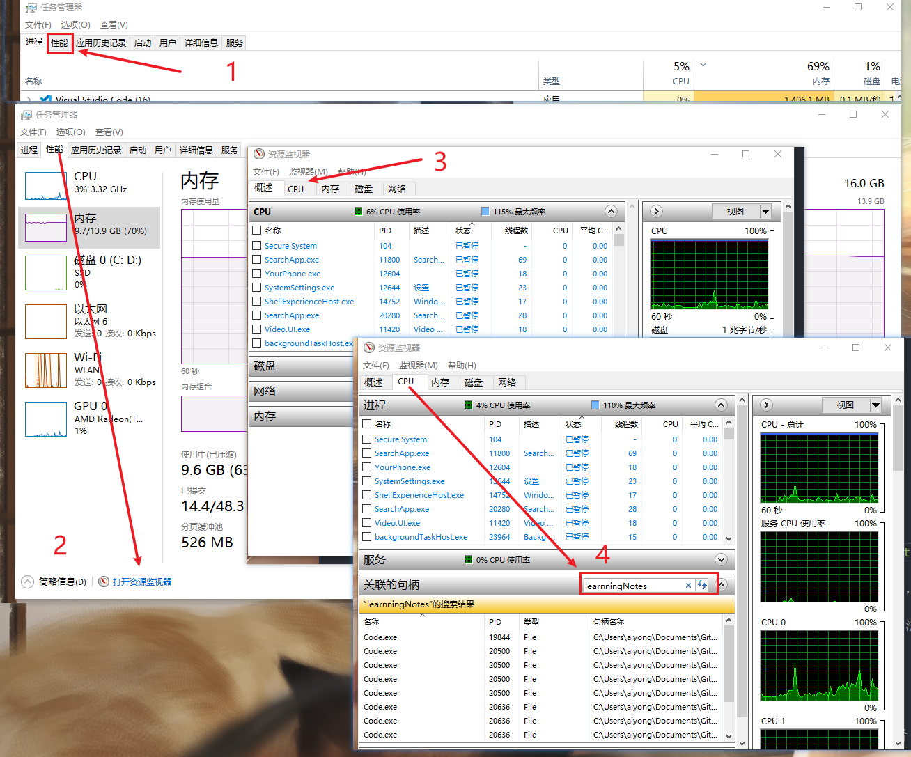

<!--
 * @Date: 2021-06-12 18:31:22
 * @LastEditors: Lq
 * @LastEditTime: 2022-08-22 16:12:03
 * @FilePath: \learnningNotes\windows\index.md
-->

#### windows 安装 puppeteer

1. 更换国内 Chromium 源

   > set PUPPETEER_DOWNLOAD_HOST=https://storage.googleapis.com.cnpmjs.org

2. 安装 cnpm

   > npm install -g cnpm --registry=https://registry.npm.taobao.org

3. 安装 puppeteer

   > cnpm i puppeteer

4. 在当前目录创建一个`index.js`文件，测试

   ```js

   const puppeteer = require('puppeteer');

   (async () => {
   const browser = await puppeteer.launch({headless: false})
   const page = await browser.newPage();
   await page.goto('https://baidu.com');
   await page.screenshot({path: 'example.png'});

   await browser.close();
   ```

   会自动打开一个无头浏览器，程序跑完之后会在当前目录生辰一张截图

5. 删除`nodemodules`

   > npm install -g rimraf  
   > cd xxx[include node_modules folder]  
   > rimraf node_modules

#### 查看本机的内网和外网 ip

1. 内网 ip

   > win+R：cmd，然后输入 ipconfig  
   > 其中 ipv4 的那个就是内网 ip 了

2. 外网 ip

   > 百度输入：ip 查询，就能够有了  
   > 或者直接打开地址栏：www.ip138.com

3. 命令行查询外网 ip

   ```shell
   命令行查询(详细):
   UNIX/Linux:#curl cip.cc
   Windows:>telnet cip.cc
   >ftp cip.cc
   命令行查询(纯ip):
   UNIX/Linux/Windows:#curl ip.cip.cc
   ```

#### win10 使用恶意软件删除工具

> https://jingyan.baidu.com/article/4ae03de351484e7efe9e6b2f.html

### win10 开始菜单栏位置

> C:\Users\aiyong\AppData\Roaming\Microsoft\Windows\Start Menu\Programs

### CHERRY 键盘 win 键被锁住了

使用`Fn+F9`组合键

其他键盘使用`Fn+F12`组合键

达尔优 A87：`Fn + win`组合键

### 开始菜单栏程序快捷方式存放位置

> C:\ProgramData\Microsoft\Windows\Start Menu\Programs

### 搭建了 vpn 之后，cmd 使用代理命令

1. windows

   需要修改的只是 vpn 对应的端口号即可

   1. 临时修改

      ```shell
      set http_proxy=socks5://127.0.0.1:10808
      set https_proxy=socks5://127.0.0.1:10808
      ```

   2. 或者尝试这种

      ```
      git config --global https.proxy http://127.0.0.1:7890
      git config --global https.proxy https://127.0.0.1:7890
      git config --global http.proxy 'socks5://127.0.0.1:7891'
      git config --global https.proxy 'socks5://127.0.0.1:7891'
      ```

      参见[文章]](https://gist.github.com/why168/9b30f542ff6008d1f66297474a2844de)

   3. 永久修改，见[博客](https://www.jianshu.com/p/1c37903dd09d)

      ```
      export http_proxy=http://127.0.0.1:7890;
      export https_proxy=http://127.0.0.1:7890;
      ```

2. linux

   ```shell
   export ALL_PROXY=socks5://127.0.0.1:1086
   ```

3. 检测方法

   终端输入如下命令，如果有结果返回的话，说明成功了

   ```shell
   curl www.google.com
   ```

### win10 查看端口情况

    1. 查看所有端口使用情况

        > netstat -aon

    2. 查看某一个端口的使用情况

        > netstat -aon|findstr "8080"

        ```
        TCP    0.0.0.0:8080           0.0.0.0:0              LISTENING       35360
        TCP    192.168.2.125:57753    14.215.158.119:8080    TIME_WAIT       0
        TCP    [::]:8080              [::]:0                 LISTENING       35360
        ```

        上面顺序依次是：【协议】、【本地地址】、【外部地址】、【状态】、【PID】

    3. 查看这个pid对应的应用程序

        > tasklist|findstr "35360"

        ```
        java.exe                     35360 Console                    1    716,960 K
        ```

        这里也可以使用【任务管理器】进行查看：在【任务管理器】-> 【详细信息】 -> 根据PID进行排序找到对应的pid，如果详细信息中没有的话，也可能在【服务】中找一下

    4. 然后，可以用taskkill语句结束进程，这里大概需要管理员权限才能正常的结束语句；

        > taskkill /f /t /im java.exe

        这个时候再看就没有该端口占用了

        > netstat -aon|findstr "8080"

### 百度搜索高级技巧

    1. filetype-专业文档搜索

        > 软件开发 filetype:pdf

    2. 精确匹配：双引号和书名号

        > "蓝枫秋千"

    3. intitle-搜索范围限定在网页标题

        > csdn博客 intitle:蓝枫秋千

    4. site-搜索范围限定在特定站点中

        > 微信公众号开发 site:www.csdn.net

    5. inurl-搜索范围限定在url链接中

        > inurl:www.csdn.net

    6. +包含特定查询词、-不包含特定查询词

        > 软件开发+Java
        > 手机 -iphone

    7. 『』查找论坛模块

    8. 没有广告的百度搜索链接

    > https://www.baidu.com/?pu=sz%401321_480&wpo=btmfast

### windows 配置 wsl2

    > https://zhuanlan.zhihu.com/p/438255467

### windows 商店打不开

是否挂了 vpn，如果挂载了的话退出再试试

### 将 7z 配置到命令行可以使用

> https://www.likecs.com/show-829595.html

### 运行的软件忽然不显示窗口了

描述：一个软件是在运行的，但是点击任务栏图标或者`alt + tab`选中它都出不来

解决方案：是用上面描述中的方法，让这个软件处于选中的状态，然后使用`alt + 空格`，然后会弹出一个`窗口设置选项`，选择最大化，就能够出来了

原因：一般是因为笔记本外接了显示器导致的，如果上述办法无法解决，可以尝试先拔掉外接的显示器，解决之后再使用

### 删除文件权限问题

1. 提示需要管理员权限，进行授权即可

   有时候管理员授权弹窗不会直接弹出来，在任务栏的地方看一下有没有一个授权的程序在闪，打开授权即可

2. 在管理员授权的情况下，有需要当前用户的授权

   这是因为上面是使用管理员的身份执行，如果这个文件或者目录是当前用户的，有可能会弹出这个

   解决方案：如果是删除的话，将这个文件夹移动到当前用户目录下面，然后在删除

3. 提示文件已经在另一个程序中打开了，但是找不到在哪

   1. `ctrl + shift + esc`打开资源管理器（如果是简略信息版，需要切换到详细信息版）

   2. 点击性能选项，在最下方的`简略信息`右边有一个`打开资源管理器`的功能

   3. 默认是`概述`的选项，切换到`CPU`选项

   4. 第 3 栏有一个`关联的句柄`搜索，搜索你要操作的文件名或者目录名即可

   5. 然后找到进行，将他们结束即可

   

### 查找端口号并结束进程

    1. netstat -aon|findstr "8080" 查找暂用端口的进程ID

    2. taskkill /pid 21248 杀掉进程ID, 不行就加-f

### 进入休眠模式快捷键 Win

win + x 进入快捷方式菜单列表 => u > x

说明：win + l 是锁定计算机，但是不会进入休眠模式

### Memory Compression 内存压缩占用内存多

### 修改 hosts 文件之后如何生效

> ipconfig/displaydns // 查看 dns  
> ipconfig/flushdns // 刷新 dns

### 系统镜像下载

1. 稳定且快

   > https://www.xitongzhijia.net/win10/202302/279978.html

2. 官方地址

   > https://www.microsoft.com/zh-cn/software-download/windows10ISO

3. 有迅雷的话可以考虑这个

   > https://msdn.itellyou.cn/

### 连接耳机之后，选择播放设备有两个选项

1. stereo=立体声（音质好，只能听歌）
2. hands-free=免提（音质差，可用麦克风）

### 和 microsoft 商店相关的卡住

解决方案：检查网络，关闭代理，基本上可以 ok

### Program Files 和 Program Files（x86）有什么区别

windows 系统现在有 32 位和 64 位两种

在 64 位系统下，为了`更好的兼容32位程序`，在安装一些 32 位程序（PS：某些程序只有 32 位），windwos 系统会默认安装到`program files(x86)`这个文件夹下，大多数还是安装到`program files`文件夹下的

在其他方面两个意义都差不多

### windows 终端美化（类似 mac 的 oh my zsh）

oh my posh

> https://blog.sunguoqi.com/posts/oh-my-posh/
