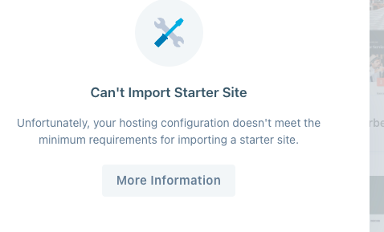

## 文档

[中文官网](https://cn.wordpress.org/)

## 搭建（宝塔版）

可以参考[https://blog.naibabiji.com/an-zhuang-wordpress](https://blog.naibabiji.com/an-zhuang-wordpress)

前置条件
1. `php7.0`以上
2. `mysql5.7`以上

步骤
1. 创建站点（如果用80端口可以省略这一步）
2. 下载wp压缩包并上传服务器
3. 把解压之后的文件放到对应站点的根目录下
4. 访问对应的站点，能出来wp的欢迎页面即可
5. 然后配置数据库和登录wp的用户名密码
6. 根据给的链接连接wp（http://xxxxx/wp-admin/edit.php）


## 配置

### 导入测试数据

下载：<https://github.com/WordPress/theme-test-data?tab=readme-ov-file>

这个也可以（更全）：<https://github.com/manovotny/wptest/archive/master.zip>

### 重置wordpress数据

<https://cloud.tencent.com/developer/article/2071782>

安装插件：WP Reset

## 通过 rest api 获取数据

参考[https://www.195440.com/1423](https://www.195440.com/1423)


### 访问接口404

先参考[https://blog.csdn.net/my466879168/article/details/107169245/](https://blog.csdn.net/my466879168/article/details/107169245/)

如果不行的话再再参考[https://blog.csdn.net/hyh19962008/article/details/108959834?spm=1001.2101.3001.6650.6&utm_medium=distribute.pc_relevant.none-task-blog-2%7Edefault%7EBlogCommendFromBaidu%7ERate-6-108959834-blog-90085058.235%5Ev43%5Econtrol&depth_1-utm_source=distribute.pc_relevant.none-task-blog-2%7Edefault%7EBlogCommendFromBaidu%7ERate-6-108959834-blog-90085058.235%5Ev43%5Econtrol&utm_relevant_index=10](https://blog.csdn.net/hyh19962008/article/details/108959834?spm=1001.2101.3001.6650.6&utm_medium=distribute.pc_relevant.none-task-blog-2%7Edefault%7EBlogCommendFromBaidu%7ERate-6-108959834-blog-90085058.235%5Ev43%5Econtrol&depth_1-utm_source=distribute.pc_relevant.none-task-blog-2%7Edefault%7EBlogCommendFromBaidu%7ERate-6-108959834-blog-90085058.235%5Ev43%5Econtrol&utm_relevant_index=10)

`提示`：需要注意的是`nginx配置文件配置`

这边我用的是宝塔，nginx配置文件虽然根配置在`软件商店=>已安装=>nginx=>配置文件`

但是，分配了站点之后，该站点的配置文件位置其实在`网站=>站点设置=>配置文件`


### 获取数据401未授权

在登陆过后，浏览器地址栏直接输入接口数据是可以访问到的

但是你如果在前端进行请求的话，会发现是401未授权

```json
{
    "code": "rest_cannot_create",
    "message": "抱歉，您不能为此用户创建文章。",
    "data": {
        "status": 401
    }
}
```

原因：
1. `REST API`的`GET`请求是不需要授权的，但是`POST`请求需要
2. 有可能你已经登陆过了，所以自动会带上授权信息，但是你的项目中没有登陆

可以使用3种授权方式

1. 请求头中增加`Authorization`，值是用户名密码

```js
fetch('http://yourdomain.com:82/wp-json/wp/v2/posts', {
  method: 'POST',
  headers: {
    'Authorization': 'Basic ' + btoa('username:application_password')
  }
})
.then(response => response.json())
.then(data => console.log(data))
.catch(error => console.error('Error:', error));
```
2. Cookie 认证：用于用户登录后的请求。
3. OAuth：需要额外的插件支持。

### 提示：如果你的需求只是需要获取展示数据的话，那么不需要考虑授权，直接`GET`一把梭就好了

## 小技巧

### 查找wordpress安装位置

如果是手动安装的，直接在【网站】中找安装目录即可

如果是通过软件商店或者是docker安装的，使用命令

```shell
find / -name wp-config.php

# /www/dk_project/dk_app/dk_wordpress/html/wp-config.php
```

### 手动安装wordpress

<https://www.xiaolikt.cn/4%E7%A7%8D%E6%96%B9%E6%B3%95%E4%B8%BAwordpress%E5%AE%89%E8%A3%85%E6%8F%92%E4%BB%B6/>

## 遇到的问题

### 站点打不开
   1. 需要开放对应的端口（如果不是80的话）

### 输入站点，是直接下载一个index.php，而不是出现页面
   1. 没有解析php文件，需要配置站点的php解析器

### 配置数据库部分失败
    1. 这里不是创建数据库，而是链接数据库创建表，所以需要你本身有数据库
    2. 数据库没有启动
    3. 账号密码错误之类的

### 上传主题报错 The uploaded file exceeds the upload_max_filesize directive in php.ini.

超过文件大小限制

在`.htaccess`文件中设置，保存重新上传即可

文件在`/www/dk_project/dk_app/dk_wordpress/html`中，如果是用的宝塔的`软件商店安装的话`

```shell
php_value upload_max_filesize 64M
php_value post_max_size 64M
php_value memory_limit 128M
```

或者是修改同级的`wp-config.php` 文件也可以

```shell
@ini_set( 'upload_max_filesize' , '64M' );
@ini_set( 'post_max_size', '64M');
@ini_set( 'memory_limit', '128M' );
```

### 导入子主题报错



原因参考: <https://creativethemes.com/blocksy/docs/troubleshooting/starter-site-import-stuck-at-xx/>

大概率是php的配置限制没修改

文件在`/www/dk_project/dk_app/dk_wordpress/html`中，如果是用的宝塔的`软件商店安装的话`

```shell
@ini_set('max_execution_time', '300');
@ini_set('max_input_time', '300');
```


### 如何检查配置的php环境变量生效了

在根目录下`/www/dk_project/dk_app/dk_wordpress/html`创建一个`phpinfo.php`文件，然后去访问他，里面找对应的变量

文件内容

```php
<?php phpinfo();
```

如访问`域名/phpinfo.php`

### 站点url修改错了导致无法访问了

* 方案一

`wordpress`安装目录下`wp-config.php`文件

如果没有这个配置说明配置在数据库中

```php
define('WP_HOME', 'http://your_server_ip');
define('WP_SITEURL', 'http://your_server_ip');
```


* 方案二

1. 使用数据库管理工具（如phpMyAdmin）登录你的WordPress数据库。
2. 找到wp_options表（表名可能因前缀不同而有所变化）。
3. 在wp_options表中，找到siteurl和home两个选项，将它们的值分别修改为http://your_server_ip。

关于方案二补充

我的wp是直接用docker创建的，所以数据库也是在docker中的一个服务

这里面描述了数据库的配置，我的如下

```shell
MYSQL_DATABASE	wordpress_db
MYSQL_USER	wordpress
MYSQL_PASSWORD	wordpress
```

然后使用ssh的方式连接上服务器使用命令行登录（因为我尝试用客户端登陆不上）

```shell
# 运行以下命令，进入数据库容器
docker exec -it dk_wordpress-db-1 bash

# 运行以下命令登录到MySQL
mysql -u wordpress -p
# 输入密码
wordpress

# 选择数据库：
USE wordpress_db;
# 查看当前站点URL配置：
SELECT * FROM wp_options WHERE option_name IN ('siteurl', 'home');
# 修改站点URL配置：
UPDATE wp_options SET option_value = 'http://your_server_ip' WHERE option_name = 'siteurl';
UPDATE wp_options SET option_value = 'http://your_server_ip' WHERE option_name = 'home';
```

#### 排查wordpess后台加载慢的问题

<https://blog.2dm.top/archives/1087>

#### 忘记管理员密码了

<https://blog.csdn.net/cljdsc/article/details/132768542>

进入到主题所在目录下的`function.php`文件

在`<?php`之后添加`wp_set_password( 'password', 1 );`

说明：`password`就是新密码，`1`是指第一个用户，一般就是管理员

登录上去之后，到个人信息里面重新设置新密码，然后把修改的代码删掉


#### 添加站点的时候提示数据库添加失败

1. 查看数据库是否有同名的数据库了
2. 查看站点和反向代理是否重名了