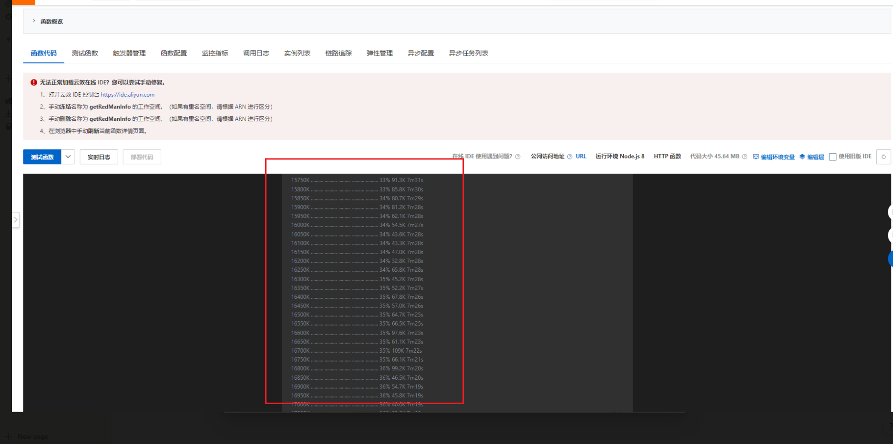

<!--
 * @Date: 2022-05-31 16:56:32
 * @LastEditors: Lq
 * @LastEditTime: 2022-05-31 17:01:34
 * @FilePath: \learnningNotes\函数计算\index.md
-->
### 函数计算冷启动优化

> https://help.aliyun.com/document_detail/140338.html

### 关于函数计算编辑器无法加载并报错

尝试了重新刷新页面、删除函数并重新创建，都是不行

1. 原因

    我这次的情况是因为代码包太多或者太大了

    本身是一个puppeteer的一个项目，使用zip包上传，里面包含了node_modules

2. 方案

    使用老版编辑器能够正常打开，就是很慢，保存和部署代码需要大概5，6分钟的样子