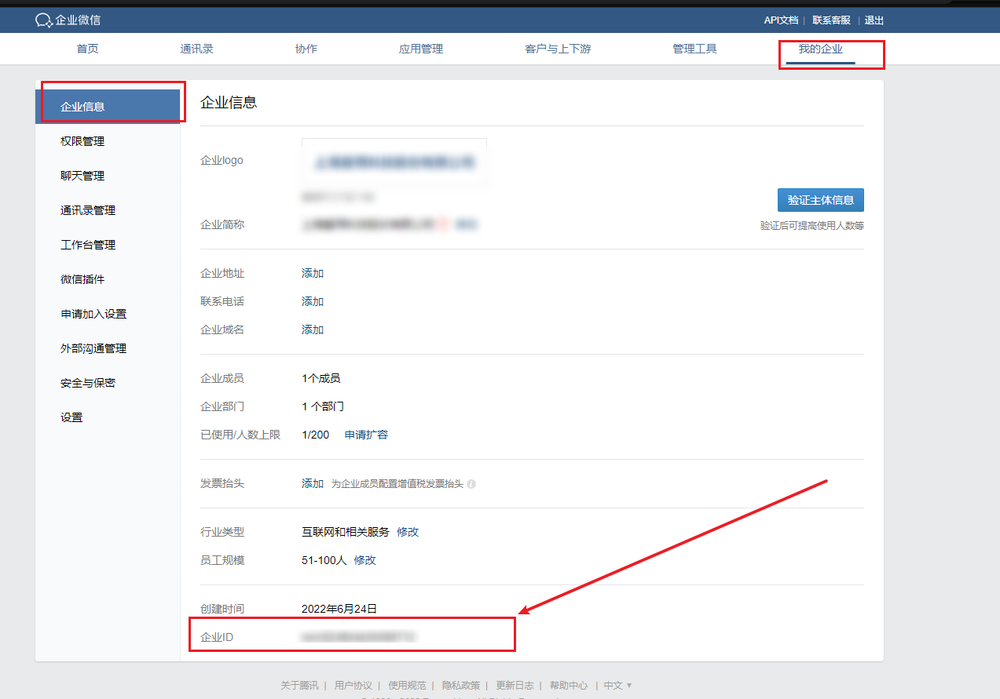

<!--
 * @Date: 2022-06-24 15:48:16
 * @LastEditors: Lq
 * @LastEditTime: 2022-06-24 16:27:52
 * @FilePath: \learnningNotes\腾讯企业邮箱接入\index.md
-->
## 准备工作

1. api文档：[https://exmail.qq.com/qy_mng_logic/doc#10001](https://exmail.qq.com/qy_mng_logic/doc#10001)

2. 注册企业邮箱

    1. 这里我填写的就是公司全称

    2. 绑定的管理员是我自己的微信

3. 下载手机企业微信和电脑企业微信，并登录自己的微信（因为上面就是绑定的自己的微信）

4. 获取企业邮的CorpID和CorpSecret：企业邮管理员通过启用应用，获取CorpID和CorpSecret

    关于`CorpID`和`CorpSecret`介绍：[https://developer.work.weixin.qq.com/document/path/90665#corpid](https://developer.work.weixin.qq.com/document/path/90665#corpid)

    企业id获取方式：开发者管理后台 -> 我的企业 -> 企业信息 -> 企业ID

    

    邮箱应用秘钥获取方式：开发者管理后台 -> 协作 -> 邮件 -> 邮箱管理 -> 邮件API

    这里好像提示需要升级专业版才能够使用邮件API

    <img src="./img/corpSecret-get.png"

### 开始业务

1. 参考博客

   1. [https://blog.csdn.net/qq_21389711/article/details/125007392](https://blog.csdn.net/qq_21389711/article/details/125007392)

   2. [https://blog.csdn.net/qq_41563912/article/details/109292073?utm_medium=distribute.pc_relevant.none-task-blog-2~default~baidujs_baidulandingword~default-0-109292073-blog-125007392.pc_relevant_multi_platform_whitelistv1&spm=1001.2101.3001.4242.1&utm_relevant_index=2](https://blog.csdn.net/qq_41563912/article/details/109292073?utm_medium=distribute.pc_relevant.none-task-blog-2~default~baidujs_baidulandingword~default-0-109292073-blog-125007392.pc_relevant_multi_platform_whitelistv1&spm=1001.2101.3001.4242.1&utm_relevant_index=2)
