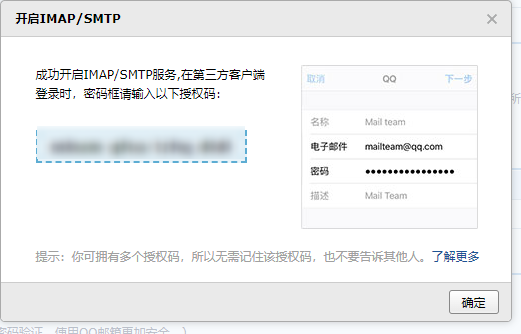

<!--
 * @Date: 2022-02-21 17:22:26
 * @LastEditors: Lq
 * @LastEditTime: 2022-06-27 16:13:50
 * @FilePath: \learnningNotes\一些软件小技巧\软件小技巧.md
-->
1. iphone手机绑定qq邮箱（含开启SMTP服务验证）

    1. 在手机【设置】=> 邮件中添加账户

        报错：imap不支持密码鉴定

        1. 登录pc端的qq邮箱
        2. 进入【设置】=>【账户】=>【POP3/IMAP/SMTP/Exchange/CardDAV/CalDAV服务】
        3. 开启【IMAP/SMTP服务】（如果原来是开启的，重新关闭在开启一下）
        4. 这个时候有一个密保手机验证
        5. 验证成功之后出现如下
            
        6. 这里保存密码之后需要把弹框关闭

    2. 然后重新回去手机设置中添加就可以了

    附：`gmail`邮箱的获取授权码，[https://www.chenweiliang.com/cwl-27998.html](https://www.chenweiliang.com/cwl-27998.html)

2. 使用中国手机号申请google账号

    核心：把浏览器语言设置为英文然后重新开启浏览器进行注册

    > https://www.chenweiliang.com/cwl-1893.html